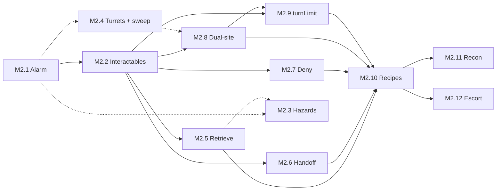

# Phase 2.5 Plan — Meatspace depth (pre–Cyberspace)

Living plan for the post–Phase 2 slice of Kernel Panic: **contract objectives**, **richer Meatspace combat and economy**, and **breaching / map memory** — building the Meatspace foundations that Phase 3 (campaign arc, Cyberspace, the Decker) will layer onto. **Target release: `v0.2.5`.** See [phase-2-plan.md](phase-2-plan.md) for the completed Phase 2 milestone set (M0–M8), [phase-3-plan.md](phase-3-plan.md) for the campaign arc and Cyberspace design, [kernel-panic-v1-blueprint.md](kernel-panic-v1-blueprint.md) for the overall design vision, and [game-overview.md](game-overview.md) for the elevator pitch.

## Current status

| Milestone | Status |
|---|---|
| M1 — Contract objectives (label-driven run variety) | ✅ Done |
| M2 — Richer combat mechanics (objectives + pressure) | ✅ Complete |
| M2.1 — Alarm cadence & feedback | ✅ Done |
| M2.2 — Interactables & terminal slice | ✅ Done |
| M2.3 — Environmental hazard tiles | ✅ Done |
| M2.4 — Corp stationary hostiles + sweep quota | ✅ Done |
| M2.5 — Retrieve pickup objectives | ✅ Done |
| M2.6 — Handoff contact objectives | ✅ Done |
| M2.7 — Deny / destroy objectives | ✅ Done |
| M2.8 — Dual-site sync objectives | ✅ Done |
| M2.9 — `turnLimit` objective gating | ✅ Done |
| M2.10 — Contract recipe generator | ✅ Done |
| M2.11 — Recon / exhaustive mapping objectives | ✅ Done |
| M2.12 — Escort / extract NPC objectives | ✅ Done |
| M3 — Campaign history / chronicle | ➡️ Deferred to Phase 3 |
| M4 — Salvage revision + typed salvage + field consumables | 🚧 In progress |
| M4.1 — Drone corpse removal on salvage | ✅ Done |
| M4.2 — Typed salvage (Scrap / Chips / Bio / Data) | 🔲 Planned |
| M4.3 — Field consumables (smoke / stim / incendiary) | 🔲 Planned |
| M5 — Hub, economy, Rep, crew tuning | 🔲 Planned |
| M6 — Locked doors & access gating | 🔲 Planned |
| M7 — Breaching, map mutation, location memory | 🔲 Planned |

**Phase 2.5** is complete when:

1. Every milestone in the table above is ✅ except M3 (deferred). M2 rolls up automatically when M2.1–M2.12 are all ✅.
2. Full campaign loop from Phase 2 remains playable offline on iOS Safari + Chrome desktop: Hub → contract selection → job deployment → combat → extract or flatline → return to Hub, with Finn shop, Rep meter, recruitment, and new systems (objectives, salvage types, shop tabs, breaching, etc.) integrated per milestone specs.
3. Phase 3 foundations in place: M2.10 recipe context supports future arc-awareness; M5 rep tiers leave room for Decker recruitment gating; M7 location schema accommodates a designated "Score target" site.
4. `v0.2.5` tagged in git.

## Milestones — detail

### M1 — Contract objectives (label-driven run variety) ✅

**Goal:** Each contract already rolls a **label**, **difficulty**, and **reward**; add a **randomly assigned objective** (or objective *family*) so the same tactical map loop supports different completion pressures. Labels stay flavor-first; the Curator rolls an `objective` (and optional parameters) alongside `seed` / tier so saves stay deterministic. UI (`<contract-select>`, `<run-briefing>`) surfaces objective text, not only `// label`.

**Out of scope for this milestone’s spec:** exact AP costs, failure modes, and Rep hooks — those land when mechanics are implemented (see M2 / shop tuning). This section records **design intent** and label → objective mapping.

#### Objective families (how they play)

| Family | Player-facing loop | Reuses existing systems |
|--------|---------------------|-------------------------|
| **Retrieve** | Enter → find interactable **pickup** (cache, dossier, crate) → carry or “secured” flag → **exit** | Space interact, LOS, `loot`-style flags |
| **Handoff** | Enter → locate **faction-tagged contact** (neutral fence, fixer, dead-letter box as NPC) → interact to deliver / receive → **exit** | Hub-style interact; NEUTRAL / authored spawns |
| **Terminal / slice** | Enter → reach **one or more terminals** → interact (maybe multi-tick or alarm on fail) → **exit** | Interact, optional `alarm` tie-in |
| **Deny / destroy** | Enter → **destroy marked object(s)** or eliminate a quota → **exit** | Combat, possibly non-drone props |
| **Sweep / clear** | Enter → **clear threats** or tagged “nodes” (antennas, relays) before extraction counts | Drone count, optional secondary entities |
| **Dual-site / sync** | Enter → complete **A then B** (or either order) within same floor — e.g. mirror payroll | Two interactables; routing puzzle |
| **Recon / map** | Enter → exhaustively reveal the location map → **exit** | Fog-of-war, `VisionField`, location memory |
| **Escort / extract** | Enter → find and activate an allied NPC → keep them following → leave with them at the exit | Interact, player aftermath turn, allied pathing |
| **Timed pressure** (optional modifier) | Any family + **turn budget** or escalating spawns | Telemetry / shell timer; ties to difficulty |

#### Current `CONTRACT_LABELS` → suggested default objective

Labels are **suggestive**, not 1:1 locked forever — the table is the default thematic read so the first implementation can map `label` → `objectiveKind` without a second RNG if desired.

| Label | Natural read | Suggested objective family | In-game sketch |
|-------|----------------|---------------------------|-----------------|
| **Sublevel 3 cache** | Buried data stash | **Retrieve** | A **cache** interactable (sublevel tile cluster or hidden room); must **pick up / secure** before exit counts as clean completion (or gates full pay). |
| **Vuong Holdings server farm** | Corp data center | **Terminal / slice** | One or more **server racks / terminals** to interact with (“slice”); higher tiers could arm **CorpCivilian** alarm pressure. |
| **Black market dropoff — Pier 9** | Physical handoff | **Handoff** | Spawn a **named neutral contact** (or static “drop box” entity with contact flavor); **interact adjacent** to complete package transfer; exit. |
| **Gassed clinic data dump** | Salvage from a hit site | **Retrieve** (+ hazard flavor) | **Medical records** or **samples** pickup in a **risky zone** (smoke, broken LOS, or gas clouds as palette); retrieve then exit. |
| **Spinning Fox warehouse** | Logistics / storage | **Retrieve** or **Deny** | Either **lift a crate** (retrieve) or **torch/disable shipment** (destroy interactable); tier picks weight. |
| **Matsuda payroll mirror** | Finance + redundancy | **Dual-site / sync** | **Two mirrors**: interact **payroll terminal** + **off-site mirror** (or two pads); order-free or “sync window” for critical tier. |
| **Transit authority dead drop** | TA blind handoff | **Retrieve** | **Dead drop** prop (concealed tile); **find + interact** once; then exit — same mechanical skeleton as cache, different fiction. |
| **Harbor node sweep** | Security sweep language | **Sweep / clear** | **All drones** or **N relay nodes** must be cleared; extraction allowed only when quota met (contrast with pure stealth exit). |

#### Additional label ideas (same pool style)

Additional `CONTRACT_LABELS` / families to build out:

- **Ransomware sinkhole — District 4** — Terminal / slice (isolate payload).
- **Cryo convoy manifest** — Retrieve (manifest pickup) or Handoff (deliver to journalist NPC).
- **Sentinel maintenance window** — Timed modifier + Terminal / slice (quiet window expires).
- **Yutani water table tap** — Dual-site (two sampling bores) or Retrieve.
- **Ghost auction ledger** — Retrieve (ledger) + optional Handoff exit contact.
- **Basement floodgate override** — Deny / destroy (valve or pump) or Terminal sequence.
- **Skybridge relay blind** — Sweep (relay entities) or Retrieve (blind drop on bridge).
- **Northstar site survey** — Recon (map the whole floor before extracting).
- **Clinic witness extraction** — Escort / extract (activate an allied NPC and bring them to the exit).

#### Acceptance (when implemented)

- `Contract` carries `objective` beyond `reach-exit` (enum or tagged union), serialised in run snapshots.
- `generateContracts` assigns objective **deterministically** from `rng` + label (or explicit joint roll).
- Briefing + job board show **objective line**; completion logic in `Run` / shell respects objective before payout (exact rules refined in M2).
- Tests: Curator snapshot shape + persistence round-trip for new objective fields; at least one golden-path objective test per family (as mechanics land).

#### Implementation notes

- Contracts now carry `objective: { kind, title, briefing, params? }` instead of a flat objective string; old `"reach-exit"` saves migrate at restore.
- `Curator.generateContracts` maps each current label deterministically to an objective family, and throws if a future label lacks a mapping.
- `<contract-select>` shows the short objective title; `<run-briefing>` shows the longer briefing line.
- `Run` now gates extraction through `isObjectiveSatisfied(contract)`, currently permissive for all M1 families so M2 can replace it with family-specific state.

---

### M2 — Richer combat mechanics (objectives + pressure) ✅

**Goal:** Build on M1 contract objectives with Meatspace systems called out in the pitch and blueprint: **noise / alarm cadence**, **terminal-slice tension**, **environmental hazards**, **new corp hostiles**, and **access gating** that sets up M6 breaching.

**M2 is complete when M2.1–M2.12 are all ✅.** Infrastructure slices (M2.1–M2.4) and objective-family slices (M2.5–M2.8, M2.11–M2.12) can interleave after their dependencies; **M2.9** lands after the family owner for any contract that ships with `params.turnLimit` (see below). **M2.10** replaces the fixed label registry with typed recipes and compatible token pools; **M2.11–M2.12** extend that recipe layer with two additional objective families. See dependency notes per slice.

#### `OBJECTIVES.*` ownership (Curator kinds → M2 slice)

Each row is the **owner** for replacing the permissive `isObjectiveSatisfied` branch and shipping at least one golden-path test. Slices may add optional params (hazards, doors) without owning the kind.

| `OBJECTIVES` kind | Owner slice | Notes |
|-------------------|-------------|-------|
| `terminal-slice` | **M2.2** ✅ | Slice + alarm; `turnLimit` enforced by **M2.9** |
| `retrieve` | **M2.5** | Pickup / `secured` loop; M2.3 adds hazard *flavor* only |
| `handoff` | **M2.6** | Contact or drop-box interact; M6 optional `doorId` gating |
| `deny` | **M2.7** | Destroy or disable marked prop(s) |
| `sweep` | **M2.4** | Drone quota and/or relay-node entities; documents quota types after ship |
| `dual-site` | **M2.8** | Two objective interactables (`params.count`); M6 optional routing |
| `recon` | **M2.11** | Exhaustively reveal the playable location before extract |
| `escort-extract` | **M2.12** | Activate an allied NPC, have them follow during player aftermath, extract together |
| `reach-exit` | — | **Not in label pool**; save migration only — no M2 slice |

#### Param modifiers (not separate kinds)

| Param | Owner slice | Applies when |
|-------|-------------|--------------|
| `turnLimit` | **M2.9** | `contract.objective.params.turnLimit` is a positive number (e.g. **Sentinel maintenance window** → `terminal-slice` with `turnLimit: 15` in `Curator.ts`) |
| `hazardFlavor` | **M2.3** | Retrieve labels with risky-zone fiction |
| `doorId` / `requiresUnlock` | **M6** | Routing for M2.5–M2.8 and M2.11–M2.12 contracts |

| Slice | Delivers | Objective kinds owned |
|-------|----------|-------------------------|
| **M2.1** | Tunable alarm pressure + feedback | (ambient — all families) |
| **M2.2** | `Interactable` base; **terminal-slice** loop | `terminal-slice` |
| **M2.3** | Hazard tiles on the grid | (modifier for `retrieve` + hazard params) |
| **M2.4** | Corp turrets + **sweep** completion | `sweep` |
| **M2.5** | Pickup / cache / dead-drop retrieve | `retrieve` |
| **M2.6** | Neutral contact handoff | `handoff` |
| **M2.7** | Deny / destroy interactables or props | `deny` |
| **M2.8** | Dual-site pads / mirrors | `dual-site` |
| **M2.9** | **`turnLimit` deadline** on combat turns | (modifier — any kind with `params.turnLimit`) |
| **M2.10** | Typed contract recipes + mad-libs label generation | (Curator generation layer — no new kind) |
| **M2.11** | Exhaustive mapping / recon completion | `recon` |
| **M2.12** | Allied NPC activation, following, and extraction | `escort-extract` |

**Cross-cutting rule:** Each **owner** slice replaces the matching **permissive** branch in `isObjectiveSatisfied` (M1 placeholder returns `true`) when its mechanics land — avoid a single end-loaded “objectives” PR. M2.3 may tighten retrieve further via hazard params; M6 (doors) may tighten handoff / dual-site / recon / escort via routing params — but neither satisfies M2 rollup without the owned objective slices. **M2.9** layers on top of family owners: when `turnLimit` is present, satisfaction also requires the objective to be complete **before** the budget expires (see M2.9).

**Remember for every subtask:** When you add new combat glyphs, add them to the key help overlay as well, so players know what to look for.

**Out of scope for M2.1–M2.12:** breaching charges, destructible walls, location-keyed map reuse (**M7**); exact Rep/AP economy tuning (**M5**); broad label-pool expansion beyond the recipes needed to prove the shipped objective families.

---

#### M2.1 — Alarm cadence & feedback ✅

**Goal:** Turn the M5 **binary alarm latch** into a **tunable pressure layer**: cooldowns, clearer escalation / de-escalation, and player-facing feedback — without yet requiring new map props.

**Scope:**

- Extend `world` alarm state beyond `alarmActive` boolean (e.g. level, cooldown ticks, or “quiet window” counter — pick one model at implementation).
- Corp turn / civilian behaviour respects the new model (drones still ENGAGE on alert; define whether partial de-escalation reduces spawn pressure or only UI).
- Log and/or diagnostics surface transitions (`> ALERT: …`, status bar, existing CRT tint hooks).

**Acceptance:**

- Unit tests for raise → hold → cool-down / deactivate transitions and snapshot round-trip.
- Pre-M5 saves still restore with safe defaults.
- No new procgen entities required in this slice.

**Implementation notes:**

- `World.alarm` now tracks `quiet → alert → cooldown → quiet`; `alarmActive` remains as a legacy/readability alias for the active alert phase.
- The cadence ticks once per full player/corp round from `TurnQueue.endTurn`: 2 rounds alert hold, then 2 rounds cooldown.
- `World.raiseAlarm()` suppresses duplicate alarms during the alert hold so Rep penalties do not stack every civilian tick; a new alarm can fire after the cadence returns quiet.
- Run snapshots persist the full alarm state and still migrate legacy `alarmActive` saves.
- Shell feedback now shows `[ALERT:n]` / `[COOL:n]` in combat status and logs alarm cooldown / quiet transitions.

---

#### M2.2 — Interactables & terminal slice ✅

**Depends on:** M2.1 (terminals should hook a real alarm model, not only the old latch).

**Goal:** Shared **interactable** entity type for objective props; first full loop for **Terminal / slice** contracts.

**Scope:**

- `Interactable` (or equivalent) base: adjacency interact, AP cost, serialised state (`secured`, `sliced`, `armed`, etc.).
- **Terminal** variant: interact can **raise alarm** (per M2.1 rules); **deactivate** via second terminal, slice completion flag, or timed quiet window (pick per prefab/objective params).
- At least one **prefab or procgen** placement tied to a `terminal-slice` contract golden path.
- Wire `OBJECTIVES.TERMINAL_SLICE` in `isObjectiveSatisfied` to real state (not permissive `true`).

**Acceptance:**

- Golden-path test: start terminal-slice contract → interact → objective satisfied only when slice rules met; alarm side effects assertable.
- Snapshot includes interactable ids + flags; restore round-trip.
- Handoff / retrieve / deny / dual-site families are covered by **M2.5–M2.8**; later objective families (`recon`, `escort-extract`) are covered by **M2.11–M2.12**.

**Implementation notes:**

- Added `Interactable` base plus `Terminal` variant with adjacency checks, AP cost, serialised state (`sliced`, `armed`, `raisesAlarm`), and player-facing result copy.
- Terminal-slice contracts now place a deterministic but varied `terminal-0` objective prop during `Run.enterCombat`, biased away from spawn and extraction when the map allows it.
- Combat `Space` interaction still prioritises salvage, then adjacent interactables; terminal interaction slices the prop, trips the M2.1 alarm cadence, and can auto-advance on AP exhaustion.
- Combat status now includes the active objective title and `[TODO]` / `[DONE]` completion marker; blocked extraction logs a “complete objective first” message instead of silently refusing.
- `Run.isObjectiveSatisfied(contract, world)` now gates `OBJECTIVES.TERMINAL_SLICE` on sliced terminal count; other M1 objective families remain permissive until their slices land.
- Run snapshots round-trip terminal state and legacy/non-terminal saves remain unaffected.

---

#### M2.3 — Environmental hazard tiles ✅

**Depends on:** M2.1 recommended (hazards may tick alarm or block “quiet” windows); can ship in parallel with M2.2 / M2.4.

**Goal:** Grid tiles (or tile-attached state) that change **LOS**, **movement cost**, and/or **damage** — supports M1 “risky zone” fiction (e.g. Gassed clinic).

**Scope:**

- Hazard representation on `Grid` / `World` (persistent vs turn-scoped — at least one).
- Integration with pathfinding, LOS, and optional end-of-turn damage.
- One hazard type in a **prefab or procgen** cluster (smoke, “glass” debris palette, or hot zone — name at implementation).
- At least one **retrieve** contract with `hazardFlavor` (or equivalent param) places a hazard cluster near the pickup (see **M2.5** for pickup placement). Does **not** own `OBJECTIVES.RETRIEVE` satisfaction — that is **M2.5**.

**Acceptance:**

- Tests: movement cost / LOS / damage on a fixed mini-map fixture.
- Snapshot hazard tile state; migration default for old saves = no hazards.
- Renderer shows hazard distinctly (glyph or tint) on at least one golden path.
- Golden path pairs with M2.5: retrieve pickup in a hazard-adjacent tile cluster (can land in same PR if both slices ready).

**Implementation notes:**

- `TILE.HAZARD = 5` — passable, does not block LOS; serializes as part of the grid's `Uint8Array` so old saves (no value 5 in tile data) default to no hazards with no migration.
- `HAZARD_DAMAGE = 1` constant (tuneable); glyph `▓` in `#d45a3a` (orange-red, distinct from smoke `░`). Added to `<key-help>` combat tile legend.
- Hazard damage resolves during **player aftermath** (Phase 3 of `runPlayerAftermathSteps`, after turrets and civilian reactions): every live entity on a `TILE.HAZARD` cell takes flat damage. Emits `ENTITY_DAMAGED` (source: `'hazard'`, attacker: `null`) for Run death-detection, plus a new `HAZARD_DAMAGE` event for presentation.
- `HazardAftermathStep` added to the `PlayerAftermathStep` union; log formatting and LOS-gated visibility follow the same patterns as turret autofire.
- `placeHazardCluster(world, center, rng)` stamps a 5–9 tile diamond/cross of HAZARD onto FLOOR-only unoccupied tiles. Called from `Run.#placeObjectiveInteractables` when `contract.objective.params.hazardFlavor` is present (today: “Gassed clinic data dump”). M2.5 will co-locate a retrieve pickup at or near this cluster.
- A* pathfinding (`Pathfinding.ts`) and LOS (`LineOfSight.ts`) needed no changes — `Grid.isPassable` already drives both, and HAZARD was added to the passable set.
- 19 new unit tests in `tests/unit/game/hazard.test.ts`: grid passability, LOS transparency, movement, damage per turn, kill, events, dead-entity skip, multi-entity, log formatting, visibility gating, cluster placement (including wall/entity/edge-of-map guards), snapshot round-trip, and palette glyph.

---

#### M2.4 — Corp stationary hostiles + sweep objectives ✅

**Depends on:** M2.1 recommended (turret fire may respect alarm); can ship in parallel with M2.2 / M2.3. **Owns** `OBJECTIVES.SWEEP`.

**Goal:** **Corp-aligned stationary turrets** (distinct from player Tech deployables), minimal AI surface, and a real **sweep / clear** completion loop for contracts that use `sweep` (Harbor node sweep, Skybridge relay blind, etc.).

**Scope:**

- `CorpTurret` (or equivalent): fixed facing or sector LOS, corp faction, damage on player turn or corp turn (match existing turret cadence conventions).
- Placement in at least one **prefab** (e.g. server-farm / security checkpoint) or procgen rule.
- **Sweep quota model** (document after ship): at minimum one of —
  - **Drone quota:** all corp drones on the map eliminated before extract; or
  - **Relay nodes:** tagged interactable or destructible props (`params.target`, e.g. `relay-node`, `skybridge-relay`) cleared per count.
- Turret destruction counts toward sweep when `params` say so; otherwise turrets are pressure only.
- Wire `OBJECTIVES.SWEEP` in `isObjectiveSatisfied` to the chosen quota (not permissive `true`).
- Procgen or prefab placement for at least one `sweep` label golden path.

**Acceptance:**

- Unit tests: LOS, firing, destruction, blocks pathing if designed as blocking.
- `ARCHETYPE_FACTORY` + snapshot round-trip; drones do not treat turrets as civilians.
- One playtest map where alarm + turret pressure coexist without soft-lock.
- Golden-path test: `sweep` contract → quota met only after clears → extract allowed; partial clear blocks extract.
- Post-ship doc note in this section: which quota types exist (`drone-all`, `relay-count`, `turret-count`, etc.).

**Implementation notes:**

- **`CorpTurret`** (`src/game/entities/CorpTurret.ts`): Extends `Hostile`, CORP faction, glyph `$`. Fires during the **corp turn** via `takeTurnSteps` (same corp turn driver as drones). Stationary — only acquires targets and fires, never moves. Uses `acquireTarget` (inherited from Hostile) for LOS + range checks, `resolveRanged` for shots. Constants: `CORP_TURRET_RANGE = 4`, `CORP_TURRET_DAMAGE = 1`, `CORP_TURRET_HP = 2`. Placed by `Run.#placeSweepTargets` for sweep contracts, and as ambient pressure.
- **`RelayNode`** (`src/game/entities/RelayNode.ts`): Extends `Entity` (not Hostile), CORP faction, glyph `~`. Destructible target for relay-node sweep quotas. `RELAY_NODE_HP = 1` — one shot takes it down. Player can target with ranged or melee attacks (CORP faction is a valid fire target via `canFireRanged`). Not targeted by player turrets (turrets only fire at `Hostile` instances).
- **Sweep quota types** (all three shipped):
  - `drone-all`: All `CorpDrone` entities on the map must be dead. Default fallback when `params.target` is unrecognized or absent.
  - `relay-node`: All `RelayNode` entities dead (or `params.count` if specified). Triggered by `params.target` = `'relay-node'` or `'skybridge-relay'`.
  - `turret`: All `CorpTurret` entities dead (or `params.count` if specified). Triggered by `params.target` = `'turret'` or `'corp-turret'`.
- **`isObjectiveSatisfied`**: `OBJECTIVES.SWEEP` case now dispatches to `isSweepSatisfied` which reads `sweepQuotaType(contract)` to select the correct quota check. No longer permissive.
- **Placement**: `Run.#placeSweepTargets` places entities based on quota type: relay-node → 3 RelayNodes + 1 CorpTurret; turret → 2 CorpTurrets; drone-all → 1 CorpTurret (drones already placed by `enterCombat`). Uses `findInteractableAnchor` for placement (same bias-away-from-spawn/exit logic as terminals).
- **Snapshot**: `RunEntitySnapshot` gains `corpTurret?: { range, attackDamage }` and `relayNode?: { label }`. `ARCHETYPE_FACTORY` entries for `'corp-turret'` and `'relay-node'` in `persistence.ts`.
- **Entity labels**: `kindFromId` recognizes `corp-turret-*` → `'Turret'` and `relay-node-*` → `'Relay'`. Combat log shows `[Corp]Turret` and `[Corp]Relay`.
- **Key help**: `$` (corp turret) and `~` (relay node) added to combat tile legend in `<key-help>`.
- 41 new unit tests in `CorpTurret.test.ts` and `sweep.test.ts`: construction, targeting, LOS, firing, destruction, snapshot round-trip, entity labels, all three sweep quota types (drone-all, relay-node, turret), count params, golden-path extract gating.

---

#### M2.5 — Retrieve pickup objectives ✅

**Depends on:** M2.2 (`Interactable` base, combat `Space` interact). M2.3 optional for hazard-flavored retrieve labels.

**Goal:** Full loop for **`OBJECTIVES.RETRIEVE`**: find pickup prop → interact to **secure** → extract. Covers Curator labels mapped to retrieve (cache, clinic records, dead drop, auction ledger, etc.) via `params.target`.

**Scope:**

- **Pickup** interactable variant (or `Interactable` with `secured` semantics): adjacency interact, AP cost, serialised `secured` flag; distinct glyph from terminals.
- `Run.enterCombat` places objective pickup from contract `params.target` (deterministic placement like `terminal-0`, biased away from spawn/extract when possible).
- Wire `OBJECTIVES.RETRIEVE` in `isObjectiveSatisfied`: satisfied when required pickup(s) secured (support `params.count` if ever > 1).
- At least one golden-path label (e.g. **Sublevel 3 cache** or **Transit authority dead drop**).

**Acceptance:**

- Golden-path test: retrieve contract → interact pickup → `[DONE]` only after secured → extract allowed.
- Snapshot pickup id + `secured`; restore round-trip.
- M1 acceptance: one golden-path test for **retrieve** family (closes deferred M1 bullet).
- New combat glyph in key help if pickup uses a new glyph.

**Implementation notes:**

- Added `Pickup` interactable variant with `!` glyph, adjacency/AP interaction, `secured` / `armed` state, repeat-interact guard, neutral entity label, and combat key-help legend entry.
- Retrieve contracts now place deterministic objective pickups during `Run.enterCombat`; `params.count` places and requires multiple pickups, while `params.target` drives the pickup label.
- `Run.isObjectiveSatisfied` now gates `OBJECTIVES.RETRIEVE` on secured `Pickup` count instead of the old permissive M1 branch; extraction remains blocked until the retrieve loop is complete.
- Hazard-flavored retrieve contracts co-locate the hazard cluster around the first pickup anchor, preserving the M2.3 risky-zone flavor while making the pickup the center of the play loop.
- Run snapshots serialize pickup label / secured / armed state and restore them as `Pickup` entities.
- New `tests/unit/game/retrieve.test.ts` covers construction, interaction, objective count gating, golden-path extraction gating, hazard adjacency, entity label, and persistence round-trip.

---

#### M2.6 — Handoff contact objectives ✅

**Depends on:** M2.2. M6 optional for door-gated contacts.

**Goal:** Full loop for **`OBJECTIVES.HANDOFF`**: locate neutral **contact** or drop-box entity → interact to complete transfer → extract. Covers Pier 9, Cryo convoy manifest, etc.

**Scope:**

- **Contact** interactable or thin NEUTRAL NPC, based on contract details: adjacency interact sets `handoffComplete` (or equivalent); may consume a carried item flag if retrieve+handoff chains are added later — out of scope unless a label requires it.
- Placement from `params.contact` / `params.target`; golden path for at least one handoff label.
- Wire `OBJECTIVES.HANDOFF` in `isObjectiveSatisfied` (not permissive `true`).

**Acceptance:**

- Golden-path test: handoff contract → interact contact → objective satisfied → extract.
- Snapshot contact state; restore round-trip.
- M1 acceptance: one golden-path test for **handoff** family.
- Key help entry if contact uses a new glyph.

**Implementation notes:**

- Added `Contact` interactable variant with `&` glyph, adjacency/AP interaction, `handoffComplete` state, repeat-interact guard, neutral entity label, and combat key-help legend entry.
- Handoff contracts now place deterministic neutral contacts during `Run.enterCombat`; `params.contact` supplies authored contact names and `params.target` is used as a fallback label source.
- `Run.isObjectiveSatisfied` now gates `OBJECTIVES.HANDOFF` on completed contact handoff count instead of the old permissive M1 branch; extraction remains blocked until the transfer is complete.
- Run snapshots serialize contact label / `handoffComplete` / armed state and restore them as `Contact` entities.
- New `tests/unit/game/handoff.test.ts` covers construction, interaction, objective count gating, Pier 9 golden-path extraction gating, target-derived labels, entity label, and persistence round-trip.

---

#### M2.7 — Deny / destroy objectives ✅

**Depends on:** M2.2 and/or combat damage on props. M2.4 optional if deny targets are turret-like.

**Goal:** Full loop for **`OBJECTIVES.DENY`**: find marked object → **destroy or disable** (interact or reduce HP to zero) → extract. Covers Spinning Fox shipment, Basement floodgate, etc.

**Scope:**

- **Deny target** prop: destructible interactable or entity with HP; interact may arm alarm (per M2.1) on some prefabs.
- `isObjectiveSatisfied` checks destroyed/disabled state from `params.target` (and `params.count` if multiple).
- At least one golden-path deny label in prefab or procgen.

**Acceptance:**

- Golden-path test: deny contract → disable/destroy target → extract gated until complete.
- Snapshot deny-target state; restore round-trip.
- M1 acceptance: one golden-path test for **deny** family.
- Key help if new deny-target glyph.

**Implementation notes:**

- Added `DenyTarget` destructible CORP-faction objective prop with `X` glyph, 2 HP, no AP/AI, and zero melee dodge so the existing combat rules can destroy it without a neutral-prop attack exception.
- Deny contracts now place deterministic deny targets during `Run.enterCombat`; `params.target` supplies the label and `params.count` places / requires multiple targets.
- `Run.isObjectiveSatisfied` now gates `OBJECTIVES.DENY` on destroyed `DenyTarget` count instead of the old permissive M1 branch; extraction remains blocked until the target is destroyed.
- Run snapshots serialize deny target labels and restore live/dead deny targets as `DenyTarget` entities.
- Added `X` to the combat key-help legend.
- New `tests/unit/game/deny.test.ts` covers construction, combat targetability, destruction, objective count gating, golden-path extraction gating, entity label, and persistence round-trip.

**Out of scope:** breaching charges / wall demolition (**M7** extends deny fiction only).

---

#### M2.8 — Dual-site sync objectives ✅

**Depends on:** M2.2. M6 optional for routing between sites. M2.4 optional if a “site” is a relay node.

**Goal:** Full loop for **`OBJECTIVES.DUAL_SITE`**: interact **N** objective pads (`params.count`, default 2, order-free unless params specify sequence) → extract. Covers Matsuda payroll mirror, Yutani water table tap, etc.

**Scope:**

- Multiple objective interactables (`mirror-0`, `mirror-1`, …) placed per contract seed; shared `params.target` flavor.
- `isObjectiveSatisfied` counts secured/completed pads vs `params.count`.
- Golden path for at least one dual-site label.

**Acceptance:**

- Golden-path test: dual-site contract → both pads complete (any order unless param says otherwise) → extract.
- Snapshot all pad ids + flags; restore round-trip.
- M1 acceptance: one golden-path test for **dual-site** family.
- Key help if pad glyph differs from pickup/terminal.

**Implementation notes:**

- Added `SyncPad` interactable variant with `§` glyph, adjacency/AP interaction, `synced` / `armed` state, repeat-interact guard, neutral entity label, and combat key-help legend entry.
- Dual-site contracts now place deterministic sync pads during `Run.enterCombat`; `params.count` places and requires N pads, while omitted `count` defaults to 2 for the family.
- `Run.isObjectiveSatisfied` now gates `OBJECTIVES.DUAL_SITE` on synced `SyncPad` count instead of the old permissive M1 branch; extraction remains blocked until every required pad is synced. Pad order is free-form.
- Hazard-flavored dual-site contracts co-locate the hazard cluster around the first sync pad, matching the existing retrieve hazard pattern.
- Run snapshots serialize sync pad label / `synced` / `armed` state and restore them as `SyncPad` entities.
- New `tests/unit/game/dualSite.test.ts` covers construction, interaction, objective count gating, Matsuda golden-path extraction gating, hazard adjacency, entity label, and persistence round-trip.

---

#### M2.9 — `turnLimit` objective gating ✅

**Depends on:** M2.2 (combat turn pipeline + `isObjectiveSatisfied` integration). For each contract label that ships with `params.turnLimit`, also depends on that label’s **family owner** slice (M2.2 for **Sentinel maintenance window** today; M2.5–M2.8 or M2.11–M2.12 if future labels add `turnLimit` to retrieve, dual-site, recon, escort, etc.).

**Goal:** Enforce M1 **timed pressure** for contracts that set `objective.params.turnLimit`: the player must complete the family-specific objective within the budget; expiry **blocks** clean objective completion but still permits extraction as an incomplete run.

**Scope:**

- **Turn counter:** Persist combat **rounds elapsed** (or player turns — pick one at implementation and document in implementation notes; count must match player-facing “turns left” copy).
- Start budget from `contract.objective.params.turnLimit` when present and finite; omit param = no timer (unchanged behaviour).
- **`isObjectiveSatisfied`:** For timed contracts, return `false` if the family-specific checks fail **or** if the budget is exhausted before the family checks first become true. Once satisfied within the budget, remain satisfied for the rest of the run (wandering after completion does not re-arm the timer).
- **Extract / shell:** Status shows remaining budget (e.g. `[TURN:n]` alongside `[TODO]` / `[DONE]`); on expiry log a clear line (e.g. maintenance window closed) and allow extraction as incomplete — expired timed contracts cannot be “completed” retroactively.
- **Failure outcome on expiry:** Default = objective permanently failed for that run (extract allowed, no full contract payout/recruit/clean-completion reward). Escalating spawns on expiry are **out of scope** unless trivial to hook from M2.1 alarm — document if deferred.
- Golden path: **Sentinel maintenance window** (`terminal-slice`, `turnLimit: 15`) — slice before limit → extract allowed; fixture test that simulates limit+1 rounds without slice → `isObjectiveSatisfied` false.
- When a non–terminal-slice label gains `turnLimit` in `Curator.ts`, add a matching golden-path test in the same PR as that label’s family owner (M2.5–M2.8, M2.11–M2.12) or in M2.9 if the family owner is already ✅.

**Acceptance:**

- Unit tests: under budget + family met → satisfied; over budget without family met → false; family met before expiry → still satisfied after expiry.
- Snapshot includes turn counter / expiry flag (or derivable rounds elapsed); restore round-trip; pre-M2.9 saves default to no timer.
- Briefing or contract-select surfaces turn limit when param present (one line, e.g. “Window: N rounds”).
- M1 **Timed pressure** row satisfied for at least one shipped label.

**Out of scope:** Rep penalties for slow jobs (**M5**); new `turnLimit` labels beyond the existing Curator pool (**M1**).

**Implementation notes:**

- Turn budget is counted in full combat rounds using `TurnQueue.turnNumber`: turn 1 starts with the full budget, and a `turnLimit: 15` window expires when the queue returns to player control on turn 16 without completion.
- `Run` now owns persisted `objectiveTimer` state (`completedWithinLimit`, `expired`, completion/expiry turn, and one-shot expiry announcement flag). Pre-M2.9 saves restore to a fresh timer state.
- `Run.isObjectiveSatisfied()` wraps the family-specific objective checks with timer gating. Completion inside the window latches clean success; expiry before completion latches failure, so later interaction cannot complete the contract retroactively.
- Expiry emits `objective:timer-expired`; the shell logs a clear “WINDOW CLOSED” line and then allows extraction with `objectiveComplete: false`, skipping contract payout, recruit reward, and clean-completion Rep bonus. Escalating spawns remain deferred.
- Job board and briefing copy surface timed windows, and combat status shows `[TURN:n]` while a timed objective is still pending.
- New `tests/unit/game/turnLimit.test.ts` covers remaining-turn math, pure timed satisfaction, under-budget completion persistence, post-expiry retroactive denial, expiry event emission, and snapshot/restore for completed and expired timer states.

---

#### M2.10 — Contract recipe generator ✅

**Depends on:** M1 objective shape; M2.5–M2.9 recommended so every generated recipe can point at a non-permissive objective family. Can start earlier behind tests if recipes initially cover only already-shipped families.

**Goal:** Replace fixed one-off `CONTRACT_LABELS` / exact label lookup with a typed, deterministic **recipe + lexicon** generator: `[Faction/Location] + [System/Asset] + [Action/Anomaly]`. Example reads: **Matsuda payroll mirror**, **Block 9 community power siphon**. The generated label is flavor; the recipe remains the source of objective mechanics.

**Principle:** Do **not** parse the final string back into gameplay. Generate the label, briefing, objective kind, and params from the same typed recipe context, then validate the resulting contract. Silent fallback is a bug: if a recipe cannot build a valid objective, `Curator` should throw in development/tests rather than ship a corrupt run.

**Scope:**

- Add a `ContractRecipe` layer in or near `Curator.ts` with objective kind, allowed token groups, params builder, title/briefing renderers, and optional difficulty/tier weights.
- Add a small `ContractLexicon` with tagged token pools:
  - actor/location tokens: corp, district, faction, infrastructure, street-level site.
  - system/asset tokens: payroll, clinic records, community power, transit relay, dead drop, water table, auction ledger.
  - action/anomaly tokens: mirror, siphon, blind, override, sinkhole, cache, handoff, burn.
- Generate contracts by deterministic pipeline: roll difficulty → pick compatible recipe → pick compatible tokens → build objective params → render label/title/briefing → assemble reward/threat as today.
- Store enough structured `context` metadata in the generated contract to make tests and future chronicle / arc copy inspectable without reverse-parsing `label`.
- Keep Curator board uniqueness: no duplicate rendered labels in one draw; if the pool is exhausted, fail loudly in development/tests and use a documented production strategy.

**Acceptance:**

- Unit tests cover every recipe: generated label is non-empty and unique within a seeded board; objective kind is valid; params pass existing objective validation; title and briefing render without unresolved template slots.
- Determinism test: same seed + same campaign state yields identical contracts; different seeds produce varied but compatible token combinations.
- Persistence compatibility: recipe-generated contracts snapshot/restore with required `context`; no `flavor` field migration shim is needed before release.
- Test at least one example per shipped objective family, including **Matsuda payroll mirror** for `dual-site` and **Block 9 community power siphon** or equivalent for a non-retrieve family.
- Curator registry sync tests are replaced or extended so adding a recipe without objective coverage fails the suite.

**Phase 3 awareness:** The recipe context (`ContractRecipe` + `ContractLexicon`) should accept an optional **campaign phase** or **arc stage** input so Phase 3 can bias contract generation toward the Score target site and arc-relevant objectives without rewriting the generator. M2.10 does **not** implement arc logic — it exposes the hook.

**Out of scope:** Large content expansion, Rep-tier economy tuning, arc-driven contract steering (Phase 3), and string-parsing gameplay inference. M2.10 may add enough tokens to prove the generator, but M5 owns access/tier gating and later phases can add deeper faction/location corpora.

**Implementation notes:**

- `Curator.generateContracts` now builds new jobs from `CONTRACT_RECIPES` plus `CONTRACT_LEXICON` token pools instead of fixed label → objective lookup. Rendered labels are flavor only; objective kind, title, briefing, and params all come from the typed recipe context.
- Recipe context axes are split into **principal** (corp / civic authority / rival faction), optional **site**, optional **site state**, **asset**, and **action**. This keeps labels like `Gassed clinic records recovery` from pretending the damaged clinic is an actor.
- Generated contracts carry required `context` metadata (`recipeId`, principal/site/siteState/asset/action token refs with ids, labels, and groups; `tags`; optional `arcStage`) so future chronicle / Phase 3 arc logic can inspect structured context without parsing `label`.
- The lexicon now includes additional corp principals (Kestrel Dynamics, Sable-Kline Systems, HelioDyne Combine, Orchid Vector, Northstar Civic, Marrowgate Logistics) plus civic / rival principals (Bayline Transit Authority, District Water Board, Civic Grid Office, Port Warden Bureau, Chrome Choir, Redline Union, Null Saints).
- The recipe context accepts `arcStage` today and preserves it in generated contract context. M2.10 does not bias on arc stage yet; Phase 3 owns that behavior.
- Board generation enforces unique rendered labels per visit and throws if the recipe/token pool cannot produce enough unique labels. `assertLabelObjectiveRegistryInSync()` now validates recipe coverage for every shipped non-`reach-exit` objective kind.
- Tests cover deterministic boards, token variation across seeds, one fixture per objective family, the named `Matsuda payroll mirror` and `Block 9 community power siphon` examples, incompatible-token failure, and generated context persistence through campaign snapshot/restore.

---

#### M2.11 — Recon / exhaustive mapping objectives ✅

**Depends on:** M2.10 (recipes and structured context). Uses the existing fog-of-war / `VisionField` model; M7 location memory can later persist the value of recon across repeat visits, but M2.11 must stand alone on a single run.

**Goal:** Full loop for **`OBJECTIVES.RECON`**: enter a location, reveal the required map area through normal exploration, then extract. This makes information itself the objective and gives stealth / movement builds a contract family that is not just "touch the prop."

**Scope:**

- Add an objective kind such as `recon` and at least one compatible Curator recipe / token path (e.g. **Northstar site survey**, **Port Warden blind map**, **Sublevel 3 layout trace**).
- Define "exhaustively map" in code as a deterministic percentage over eligible map cells, not as a vague visual state. Recommended baseline: all passable, non-hub combat cells that can reasonably be discovered by player LOS; walls may count only if they have been seen, but unreachable sealed voids must not soft-lock the contract.
- Track recon progress from `VisionField.seen` or a run-level equivalent and expose a stable `reconMapped/required` counter for tests and UI.
- Wire `OBJECTIVES.RECON` in `isObjectiveSatisfied`: satisfied only when the required coverage threshold is met. Default threshold should be 100% of eligible cells for the "exhaustive" family; lower thresholds can be a future param if playtesting proves full clear too fussy.
- Surface progress in combat status and briefing copy (`MAP n/m` or equivalent) so the player can tell whether a dark corner still matters.
- Recipe context should carry enough site / asset metadata for future Phase 3 casing payoffs without parsing the rendered label.

**Acceptance:**

- Unit tests define eligible-cell counting on fixed maps: floors count, unreachable / non-playable voids do not, and seen-cell changes update progress deterministically.
- Golden-path test: recon contract → reveal all required cells → objective `[DONE]` → extraction grants normal completion.
- Partial-path test: reveal less than required coverage → extraction is incomplete or blocked according to the current objective-gating rule.
- Snapshot / restore preserves enough map knowledge to continue recon progress exactly after reload.
- Curator recipe tests include at least one recon fixture, and registry sync fails if `recon` exists without recipe coverage.

**Out of scope:** Campaign-level site intelligence bonuses and persistent casing benefits. M7 / Phase 3 can consume recon data later, but M2.11 only proves the objective family inside one job.

---

#### M2.12 — Escort / extract NPC objectives ✅

**Depends on:** M2.2 (interact/activation), M2.10 (recipes and structured context), and M2.11 recommended so the recipe pool already handles post-M2.10 objective additions. May reuse pathfinding from hostile AI, but the escorted NPC is player-aligned, not neutral or corp.

**Goal:** Full loop for **`OBJECTIVES.ESCORT_EXTRACT`**: locate a player-aligned NPC, activate them through interaction, keep them alive, and extract while they are at or adjacent to the exit with the player.

**Scope:**

- Add an objective kind such as `escort-extract` and at least one compatible Curator recipe / token path (e.g. **Clinic witness extraction**, **Transit whistleblower pickup**, **Redline courier exfil**).
- Add a new crew-aligned NPC entity (name TBD, e.g. `EscortNpc`, `AllyContact`, or `Extractee`) with:
  - PLAYER or crew-aligned faction semantics so corp hostiles can target them and player attacks do not treat them as an objective prop.
  - `activated: boolean` so they remain in place until the player interacts.
  - Serialised state for label, activation, HP/alive, and any follow target / last-known position fields needed after restore.
- Activation uses adjacency + `Space` interaction. Before activation, the NPC is stationary and does not follow; after activation, they act during the **player aftermath turn**.
- Follow behavior runs after the player's committed action and before corp turns: the NPC attempts to move one step toward a valid follow position near the player, using passable unoccupied tiles and existing pathfinding. If no legal step exists, they wait loudly enough for tests/logging to notice; no teleporting or silent fallback.
- Extraction requires both player and activated living NPC to be on, or adjacent to, the exit according to a documented rule. If the NPC dies, the objective cannot be completed retroactively.
- Wire `OBJECTIVES.ESCORT_EXTRACT` in `isObjectiveSatisfied`: satisfied only when the NPC is activated, alive, and in extraction position with the player / exit state.

**Acceptance:**

- Unit tests for construction, activation, non-follow before activation, follow-after-activation during player aftermath, blocked-path waiting, hostile targetability, death failure, and snapshot/restore.
- Golden-path test: escort contract → find NPC → activate → NPC follows across several turns → player reaches exit with NPC → objective complete.
- Failure-path test: player reaches exit without activated NPC or with NPC too far away → objective incomplete; NPC death makes completion impossible.
- Key help / tile legend includes the new allied NPC glyph if it is visually distinct.
- Curator recipe tests include at least one escort/extract fixture, and registry sync fails if `escort-extract` exists without recipe coverage.

**Open design choice:** Whether the escort NPC blocks the player's movement like a normal entity or allows a swap / "make room" action. Default should be normal occupancy until playtesting proves escorts are too sticky; if swap is added, it needs explicit tests.

---

**M2 rollup acceptance (when all subs ✅):**

- Every **owner** row in the `OBJECTIVES.*` ownership table is ✅ (all kinds in the Curator pool except `reach-exit` have non-permissive `isObjectiveSatisfied` + golden-path test).
- **M2.9** ✅ for every Curator label that currently sets `params.turnLimit` (today: **Sentinel maintenance window**).
- **M2.10–M2.12** ✅: Curator uses typed recipes + compatible token pools for new contract generation, with tests proving determinism, objective validity, and recipe coverage for recon and escort/extract.
- Infrastructure: alarm cadence (M2.1), hazards in at least one prefab (M2.3), corp turrets (M2.4). (Locked doors ship separately in M6.)
- Snapshot-safe state for interactables (all variants), hazards, turrets, recon map progress, escort NPCs, doors, per-kind objective flags, and turn-limit state.

---

### M3 — Campaign history / chronicle ➡️ Deferred to Phase 3

**Deferred.** The chronicle is the campaign’s narrative memory — it doesn’t pay off until the campaign has a narrative arc (acts, the Score, win/loss conditions). Moved to [Phase 3](phase-3-plan.md) as **P3.M6 — Chronicle**. Original scope preserved there.

Phase 2.5 milestones that follow (M4–M7) retain their original numbering for continuity.

---

### M4 — Salvage revision + typed salvage + field consumables 🚧

**Goal:** Align salvage with **spatial honesty** and **blueprint economy depth** ahead of Phase 3, and widen **combat pickups** beyond the Hub-bought inventory alone.

**M4 is complete when M4.1–M4.3 are all ✅.** Slices ship in order so each builds on the last (typed salvage migration runs before consumables, since consumable drops/sales will use the typed schema).

| Slice | Delivers |
|-------|----------|
| **M4.1** | Drone corpse removal on salvage |
| **M4.2** | Typed salvage (Scrap / Chips / Bio / Data) + one-time migration |
| **M4.3** | Field consumables: smoke bomb, stim, incendiary |

**Out of scope:** Breaching charges (ship with **M7** alongside wall mutation); Finn-shop UI tabs (**M5**); crafting recipes (Phase 3+).

---

#### M4.1 — Drone corpse removal on salvage ✅

**Goal:** **Salvaging a drone corpse removes it from the map** (no “phantom” tile once stripped). Closes the kaizen item on **corpse memory / lootability** for the post-salvage case (the pre-salvage memorised-corpses navigation problem remains M3 scope).

**Scope:**

- `Crew.collectSalvage` (or equivalent) removes the looted entity from `World.entities` after transferring loot, instead of leaving a zero-loot corpse on the tile.
- **Walk-onto-corpse auto-salvage:** Moving onto a tile that holds a lootable corpse triggers `collectSalvage` automatically as part of the move intent. Sets up the M4.3 walk-onto pickup pattern (consumables will reuse the same shape). If the player can't afford INTERACT AP after the move, the corpse stays and a hint is logged — Space-interact remains available next turn.
- Renderer and pathfinding see the tile as floor immediately on the next frame (no stale glyph, no blocking).
- Snapshot round-trip: salvaged corpses are absent from restored runs (already true if removed from `entities`).

**Acceptance:**

- Unit tests: salvage adjacent drone corpse → entity gone from `World.entities`, tile passable, renderer/log doesn't surface the corpse anymore.
- No regressions in existing corpse-based tests (e.g. damage-after-death already throws — corpse no longer accessible to that path).
- Kaizen entry updated/closed.

**Implementation notes:**

- After transferring loot and zeroing `targetEntity.loot.salvage`, `Crew.collectSalvage` now calls `world.removeEntity(targetEntity.id)`. The corpse JS object survives in the caller's scope (so any post-call assertions on the local reference still resolve) but the world map no longer indexes it — `anyEntityAt`, `lootableCorpseAt`, and the renderer all see the tile as empty.
- No changes needed in `lootableCorpseAt` (already filters by `loot.salvage > 0`) or in pathfinding (corpses never blocked movement). The only observable behavior change is the renderer no longer drawing the stripped corpse glyph and the tile being immediately available for another entity to step into.
- `applyIntent.doMove` now runs an auto-salvage step after a successful (non-EXIT) move: if the destination tile holds a lootable corpse and the player can afford `AP_COST.INTERACT`, `collectSalvage` runs and a `salvages +N` log line is emitted. If AP is insufficient, the corpse stays and a "stands on salvage" hint is logged so the player knows to wait or end turn. Space-interact via the shell still works for the lazy/explicit case.
- Two new tests in `tests/unit/game/Crew.test.ts` cover the removal invariant and the "freed tile can be moved into" follow-up; two new tests in `tests/unit/input/applyIntent.test.ts` cover walk-onto auto-salvage (success path) and the low-AP defer path.
- Existing Crew tests still pass — `loot.salvage = 0` zeroing happens before removal, so prior assertions on the local corpse reference are unaffected. Full suite: 894/894 green.

---

#### M4.2 — Typed salvage (Scrap / Chips / Bio / Data) 🔲

**Goal:** Replace the single numeric `salvage` field with four typed buckets so Finn (M5) and later crafting hooks can price/spend distinct components.

**Scope:**

- **Types:**
  - **Scrap** — generic mechanical parts. Default drop from drones, turrets, breached props.
  - **Chips** — electronics. Drops from terminals (when sliced + salvaged), relay nodes, corp turrets.
  - **Bio** — organic samples. Drops from clinic/bio-flavor retrieve pickups and any future organic targets.
  - **Data** — informational. Drops from dossier/dead-drop retrieve, ledger handoffs, terminal slices.
- **Schema:** `TypedSalvage = { scrap: number; chips: number; bio: number; data: number }`. Replaces the single `salvage: number` on `Crew.inventory`, `Campaign`, and entity `loot`. Each is a non-negative integer.
- **Loot config:** `Entity.loot` carries a `TypedSalvage` (or partial — missing fields default to 0). Drones drop `{ scrap, chips }` mix; pickups carry context-specific types based on contract `params.target` or recipe action token.
- **Migration:** One-time conversion on campaign load. Old numeric `salvage: N` → `{ scrap: N, chips: 0, bio: 0, data: 0 }`. Member `inventory.salvage: N` similarly. Migration runs in `Campaign.fromSnapshot` / `Crew` restore; old snapshots without typed buckets convert deterministically and are saved back in the new shape on next persist. Crashes loudly if the legacy field is malformed (per CLAUDE.md — silent fallback is a bug).
- **Sell path:** `Campaign.sellSalvage` becomes type-aware (sell N of a given type); existing fixed price stays as default per-type until M5 sets distinct rates.
- **UI:** Status / Hub copy shows totals per type (compact, e.g. `S:12 C:3 B:0 D:1`). Real shop tabs land in M5.

**Acceptance:**

- All existing salvage tests updated; new tests for: type-aware `collectSalvage`, sell-by-type, migration from legacy numeric snapshot, snapshot round-trip preserves all four buckets, drone drops produce expected mix.
- Migration test: a saved campaign from before M4.2 loads, converts to typed, and re-snapshots in the new shape.
- No `salvage: number` remains on hot paths; `grep -r "salvage: number" src/` returns only the migration shim/types file.

---

#### M4.3 — Field consumables (smoke / stim / incendiary) 🔲

**Depends on:** M4.2 (typed salvage so pickup drops can grant typed components if/when consumables are also salvageable; pickup itself is an item, not salvage). M2.3 (hazards) for incendiary tile reuse.

**Goal:** **Spawn-on-map** consumable pickups usable in the job: **smoke bomb**, **stim**, **incendiary bomb**. Widens combat pickups beyond Hub-bought inventory.

**Scope:**

- **Consumable items:** existing `Crew.inventory.consumables: Item[]` slot already exists — extend with three types:
  - **Smoke bomb:** thrown at a target tile (range TBD, e.g. 4). Stamps a 5–9 tile cluster of **temporary smoke** that blocks LOS but not movement. Decays over N rounds (e.g. 3). Reuses M2.3 placement primitives (`placeHazardCluster`) inverted — new `TILE.SMOKE` or smoke-as-tile-overlay (pick at impl).
  - **Stim:** self-use, no target. Costs `AP_COST.INTERACT` (or new `AP_COST.USE_ITEM`). Restores HP up to a cap (e.g. +2 HP) or grants temporary AP — pick one at impl and document.
  - **Incendiary bomb:** thrown at a target tile. Stamps a HAZARD cluster (reuses M2.3 directly), persistent for the rest of the run.
- **Map pickups:** Combat maps can spawn consumable pickups (`Interactable` variant or simple `Item` on tile). Procgen places 0–2 per run based on tier/recipe; deterministic from seed.
- **Pickup interaction:** Walk onto the tile (or Space-interact, match existing pickup loop). Adds to `crew.inventory.consumables`. Pickup glyph distinct from objective `!` pickup.
- **Use UI:** Add a use-consumable action in combat. Targeting for thrown items uses existing range/LOS helpers.
- **Hub-bought parity:** If Finn already sells consumables, ensure newly added types serialize the same way (M5 handles shop UI).

**Acceptance:**

- Unit tests per consumable: smoke decays as designed and blocks LOS while active; stim restores HP within cap; incendiary creates persistent HAZARD; throw range / LOS-clear-target enforced.
- Pickup tests: spawn on map deterministically by seed; pick up adds to inventory; snapshot round-trip preserves both on-map pickups and inventory items.
- Renderer + key help updated for new tile/glyph (smoke if distinct from M2.3 `░`, incendiary reuses HAZARD `▓`, consumable pickup glyph).
- Golden path: enter run with smoke bomb in inventory → throw to break LOS → escape an aggro drone’s firing line in a way that fails without smoke.
- No regression in existing M2.3 hazard tests.

**Out of scope:** Breaching charges (M7); consumables crafted from typed salvage (deferred to Phase 3); AoE damage on throw impact for incendiary (it's a hazard-spawner, not a grenade).

---

### M5 — Hub, economy, Rep, crew management tuning 🔲

**Goal:** Tie **Rep**, **crew attrition**, and **typed salvage** into a coherent Hub loop and shop UX without Cyberspace scope creep.

**Scope:**

- **Hub clinic:** A Hub-side way to recover HP or reduce attrition (exact economy: Creds, salvage, or per-visit limit — TBD). Addresses long-standing “no Hub heal” pressure from playtesting notes in [kaizen.md](./kaizen.md).
- **Finn’s shop:** **Richer economy** built around **salvage component types** from M4 (buy/sell/recipes or exchange rates TBD).
- **Shop UI:** **Salvage selling** is a **separate visual tab** from **consumable / gear purchases** (clearer mental model than a single scroll list).
- **Contract access:** Remove the **”better-contracts”** meta upgrade from the shop; replace with a **simple Rep-tier gate** (e.g. higher Rep unlocks **more lucrative** or **higher-tier** job rolls). Exact thresholds and tier names TBD.
- **Progressive Hub reveals:** Hub features are introduced **diegetically** via Curator messages as campaign state warrants — not all at once on the first visit. The Hub grows with the player.
  - Campaign save tracks **Hub reveal flags** (e.g. `finnIntroduced`, `terminalExplained`). Each flag is set once when its Curator message fires; messages never repeat.
  - On Hub entry, check campaign state against trigger conditions and fire the first unseen introduction that qualifies. One message per Hub visit (don't stack).
  - **Finn introduction:** Trigger = player has returned from at least one run with salvage or creds. Curator message introduces Finn and his shop. Before this trigger, Finn's waypoint is **absent from the Hub map** — the shop literally isn't there yet.
  - **Terminal / recruitment introduction:** Trigger = recruitable crew members are available (e.g. after run 2–3, per existing recruitment timing). Curator message explains the Terminal's crew management function. The Terminal can be present on the Hub map from the start (it's plausible scenery), but the Curator's message is the prompt to *use* it.
  - **Pattern reuse:** Phase 3 reuses this system for Decker recruitment (P3.M2) — same Curator message mechanic, new trigger (top rep tier reached), new flag (`deckerRecruited`).
  - Curator messages are short (1–3 lines of flavor text) and double as system hints. Exact copy TBD per reveal.

**Phase 3 awareness:** Rep tiers should define at least one **top tier** that is reachable but not trivially so in a typical campaign (~10–12 runs). Phase 3 will gate Decker recruitment and Score access at this tier. M5 does **not** implement arc gating — it establishes the tier thresholds that Phase 3 hooks into. The progressive Hub reveal system (above) is reused by P3.M2 for Decker introduction.

**Acceptance (when implemented):** Clinic usable in Hub; Finn tabs + typed-salvage pricing; Rep gate drives contract generation or filtering; top rep tier defined and reachable; progressive Hub reveals fire correctly (Finn absent until trigger, Terminal explained on recruit availability); Hub reveal flags persist in campaign save and don't re-fire; tests for gate boundaries, reveal trigger conditions, and snapshot persistence of new campaign fields.

---

### M6 — Locked doors & access gating 🔲

**Depends on:** M2.2 (door **unlock** via terminal interact or shared interactable flags). Sets up M7 **breaching** without shipping charges or wall deletion here.

**Goal:** **Locked doors** as pathing blockers with **unlock** paths; gates access routing for objective contracts and prepares geometry for M7 breaching.

**Scope:**

- `Door` entity or tile flag: closed = impassable for pathing; open = floor.
- Unlock sources: objective flag, keyed interactable, adjacent **hack terminal** (reuse M2.2 interactable).
- **No** breaching charges, **no** destructible geometry (**M7**).
- Prefab with at least one door gating a route (e.g. security checkpoint).
- Optional **routing modifier** for M2.5–M2.8 and M2.11–M2.12 contracts: when `params` include `doorId` / `requiresUnlock`, objective props, required map regions, escorted NPCs, or extract paths sit behind a locked door until unlock. Does **not** replace owned `isObjectiveSatisfied` branches by itself.

**Acceptance (when implemented):**

- Pathfinding tests: closed door blocks, open door allows; A* invalidates when door toggles mid-run.
- Snapshot door open/locked state; restore round-trip.
- Golden path: door closed at start → unlock via interact → reach exit or reach a gated objective prop / region / NPC (paired with at least one objective contract in playtest).

---

### M7 — Breaching, map mutation, location memory 🔲

**Goal:** Deliver blueprint **Meatspace destruction + persistence** and optional **return visits** to the same fiction location across a campaign. Location persistence uses a **tiered model**: one designated target site (Phase 3's "Score" location) always persists; other sites persist opportunistically when the Curator sends the player back.

**Scope:**

- **Breaching:** **Breaching charge** (or equivalent) sold via **Finn**; **destructible walls** (subset of tiles or tagged prefab regions); **new run objective** for **targeted demolition** (extends M1 Deny/destroy family with authored breach targets).
- **Location persistence (tiered model):**
  - **Site roster:** The campaign maintains a small roster of **named locations** (4–6, generated as contracts are accepted or seeded at campaign start — TBD). Each site has a stable key, a generated seed, and optional mutation state (tile deltas from breaching).
  - **Tier 1 — Score target:** One site is flagged as the future Score target (Phase 3 populates this; M7 provides the schema slot and persistence machinery). This site **always** persists and is **always** available for revisit when the Curator offers contracts there.
  - **Tier 2 — Opportunistic:** Other roster sites persist their geometry when revisited. The Curator may bias toward revisits (e.g. 30–50% chance a contract targets an existing roster site vs. generating a new one), but this is not guaranteed.
  - **Storage:** Mutation deltas (changed tiles), not full grids — compact enough for localStorage on iOS Safari. Eviction policy: clear on campaign delete; cap roster size; corrupt entries crash rather than silently degrade.
- **Persistence round-trip:** Wall/floor mutations **serialize** in the job snapshot as today; extend design so roster entries can be **loaded** as the base grid for a new run at the same site, with fresh objectives, occupants, and pickups layered on top.

**Phase 3 awareness:** The location schema must include a `scoreTarget: boolean` flag (or equivalent) so Phase 3 can designate one site as the Score location. M7 does **not** implement Score-specific logic — it provides the persistence layer that Phase 3's campaign arc will drive.

**Acceptance (when implemented):** Breach item + at least one wall type destructible; demolition objective in contract roll; site roster with tier-1/tier-2 persistence documented; location-keyed map cache with key schema, eviction on campaign delete, roster cap; tests for snapshot + cache hit/miss + corruption guard (crash over silent bad map); mutation delta round-trip for at least one breached wall.

---

## Recorded problems (deferred)

Open items that span Phase 2.5 and later work stay in [`docs/kaizen.md`](./kaizen.md). When M4 lands, update the **typed salvage** and **corpse memory** entries to point at shipped behavior or Phase 3 remainder.
