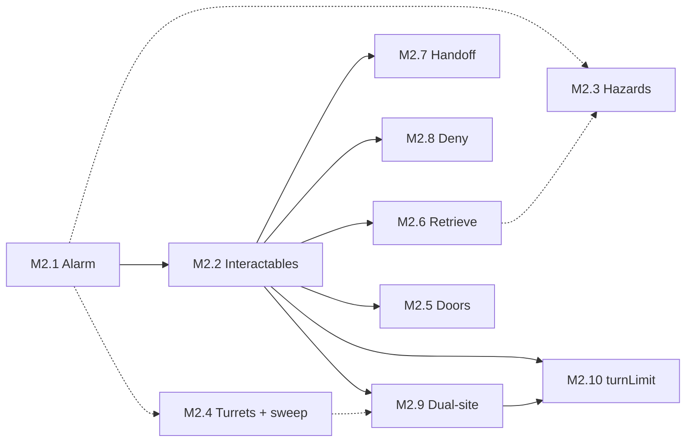

# Phase 2.5 Plan — Meatspace depth (pre–Cyberspace)

Living plan for the post–Phase 2 slice of Kernel Panic: **contract objectives**, **richer Meatspace combat and economy**, **campaign chronicle**, and **breaching / map memory** — all before the Phase 3 Matrix layer (jack-in, ICE, CCTV). **Target release: `v0.2.5`.** See [phase-2-plan.md](phase-2-plan.md) for the completed Phase 2 milestone set (M0–M8), [kernel-panic-v1-blueprint.md](kernel-panic-v1-blueprint.md) for the overall design vision, and [game-overview.md](game-overview.md) for the elevator pitch.

## Current status

| Milestone | Status |
|---|---|
| M1 — Contract objectives (label-driven run variety) | ✅ Done |
| M2 — Richer combat mechanics (objectives + pressure) | 🔲 Planned (see M2.1–M2.10) |
| M2.1 — Alarm cadence & feedback | ✅ Done |
| M2.2 — Interactables & terminal slice | ✅ Done |
| M2.3 — Environmental hazard tiles | 🔲 Planned |
| M2.4 — Corp stationary hostiles + sweep quota | 🔲 Planned |
| M2.5 — Locked doors & access gating | 🔲 Planned |
| M2.6 — Retrieve pickup objectives | 🔲 Planned |
| M2.7 — Handoff contact objectives | 🔲 Planned |
| M2.8 — Deny / destroy objectives | 🔲 Planned |
| M2.9 — Dual-site sync objectives | 🔲 Planned |
| M2.10 — `turnLimit` objective gating | 🔲 Planned |
| M3 — Campaign history / chronicle | 🔲 Planned |
| M4 — Salvage revision + typed salvage + field consumables | 🔲 Planned |
| M5 — Hub, economy, Rep, crew tuning | 🔲 Planned |
| M6 — Breaching, map mutation, location memory | 🔲 Planned |

**Phase 2.5** is complete when:

1. Every milestone in the table above is ✅ (M2 rolls up automatically when M2.1–M2.10 are all ✅).
2. Full campaign loop from Phase 2 remains playable offline on iOS Safari + Chrome desktop: Hub → contract selection → job deployment → combat → extract or flatline → return to Hub, with Finn shop, Rep meter, recruitment, and new systems (objectives, chronicle, salvage types, shop tabs, breaching, etc.) integrated per milestone specs.
3. `v0.2.5` tagged in git.

## Milestones — detail

### M1 — Contract objectives (label-driven run variety) ✅

**Goal:** Each contract already rolls a **label**, **difficulty**, and **reward**; add a **randomly assigned objective** (or objective *family*) so the same tactical map loop supports different completion pressures. Labels stay flavor-first; the Curator rolls an `objective` (and optional parameters) alongside `seed` / tier so saves stay deterministic. UI (`<contract-select>`, `<run-briefing>`) surfaces objective text, not only `// label`.

**Out of scope for this milestone’s spec:** exact AP costs, failure modes, and Rep hooks — those land when mechanics are implemented (see M2 / shop tuning). This section records **design intent** and label → objective mapping.

#### Objective families (how they play)

| Family | Player-facing loop | Reuses existing systems |
|--------|---------------------|-------------------------|
| **Retrieve** | Enter → find interactable **pickup** (cache, dossier, crate) → carry or “secured” flag → **exit** | Space interact, LOS, `loot`-style flags |
| **Handoff** | Enter → locate **faction-tagged contact** (neutral fence, fixer, dead-letter box as NPC) → interact to deliver / receive → **exit** | Hub-style interact; NEUTRAL / authored spawns |
| **Terminal / slice** | Enter → reach **one or more terminals** → interact (maybe multi-tick or alarm on fail) → **exit** | Interact, optional `alarm` tie-in |
| **Deny / destroy** | Enter → **destroy marked object(s)** or eliminate a quota → **exit** | Combat, possibly non-drone props |
| **Sweep / clear** | Enter → **clear threats** or tagged “nodes” (antennas, relays) before extraction counts | Drone count, optional secondary entities |
| **Dual-site / sync** | Enter → complete **A then B** (or either order) within same floor — e.g. mirror payroll | Two interactables; routing puzzle |
| **Timed pressure** (optional modifier) | Any family + **turn budget** or escalating spawns | Telemetry / shell timer; ties to difficulty |

#### Current `CONTRACT_LABELS` → suggested default objective

Labels are **suggestive**, not 1:1 locked forever — the table is the default thematic read so the first implementation can map `label` → `objectiveKind` without a second RNG if desired.

| Label | Natural read | Suggested objective family | In-game sketch |
|-------|----------------|---------------------------|-----------------|
| **Sublevel 3 cache** | Buried data stash | **Retrieve** | A **cache** interactable (sublevel tile cluster or hidden room); must **pick up / secure** before exit counts as clean completion (or gates full pay). |
| **Vuong Holdings server farm** | Corp data center | **Terminal / slice** | One or more **server racks / terminals** to interact with (“slice”); higher tiers could arm **CorpCivilian** alarm pressure. |
| **Black market dropoff — Pier 9** | Physical handoff | **Handoff** | Spawn a **named neutral contact** (or static “drop box” entity with contact flavor); **interact adjacent** to complete package transfer; exit. |
| **Glassed clinic data dump** | Salvage from a hit site | **Retrieve** (+ hazard flavor) | **Medical records** or **samples** pickup in a **risky zone** (smoke, broken LOS, or “glass” debris as palette); retrieve then exit. |
| **Spinning Fox warehouse** | Logistics / storage | **Retrieve** or **Deny** | Either **lift a crate** (retrieve) or **torch/disable shipment** (destroy interactable); tier picks weight. |
| **Matsuda payroll mirror** | Finance + redundancy | **Dual-site / sync** | **Two mirrors**: interact **payroll terminal** + **off-site mirror** (or two pads); order-free or “sync window” for critical tier. |
| **Transit authority dead drop** | TA blind handoff | **Retrieve** | **Dead drop** prop (concealed tile); **find + interact** once; then exit — same mechanical skeleton as cache, different fiction. |
| **Harbor node sweep** | Security sweep language | **Sweep / clear** | **All drones** or **N relay nodes** must be cleared; extraction allowed only when quota met (contrast with pure stealth exit). |

#### Additional label ideas (same pool style)

Additional `CONTRACT_LABELS` / families to build out:

- **Ransomware sinkhole — District 4** — Terminal / slice (isolate payload).
- **Cryo convoy manifest** — Retrieve (manifest pickup) or Handoff (deliver to journalist NPC).
- **Sentinel maintenance window** — Timed modifier + Terminal / slice (quiet window expires).
- **Yutani water table tap** — Dual-site (two sampling bores) or Retrieve.
- **Ghost auction ledger** — Retrieve (ledger) + optional Handoff exit contact.
- **Basement floodgate override** — Deny / destroy (valve or pump) or Terminal sequence.
- **Skybridge relay blind** — Sweep (relay entities) or Retrieve (blind drop on bridge).

#### Acceptance (when implemented)

- `Contract` carries `objective` beyond `reach-exit` (enum or tagged union), serialised in run snapshots.
- `generateContracts` assigns objective **deterministically** from `rng` + label (or explicit joint roll).
- Briefing + job board show **objective line**; completion logic in `Run` / shell respects objective before payout (exact rules refined in M2).
- Tests: Curator snapshot shape + persistence round-trip for new objective fields; at least one golden-path objective test per family (as mechanics land).

#### Implementation notes

- Contracts now carry `objective: { kind, title, briefing, params? }` instead of a flat objective string; old `"reach-exit"` saves migrate at restore.
- `Curator.generateContracts` maps each current label deterministically to an objective family, and throws if a future label lacks a mapping.
- `<contract-select>` shows the short objective title; `<run-briefing>` shows the longer briefing line.
- `Run` now gates extraction through `isObjectiveSatisfied(contract)`, currently permissive for all M1 families so M2 can replace it with family-specific state.

---

### M2 — Richer combat mechanics (objectives + pressure) 🔲

**Goal:** Build on M1 contract objectives with Meatspace systems called out in the pitch and blueprint: **noise / alarm cadence**, **terminal-slice tension**, **environmental hazards**, **new corp hostiles**, and **access gating** that sets up M6 breaching.

**M2 is complete when M2.1–M2.10 are all ✅.** Infrastructure slices (M2.1–M2.5) and objective-family slices (M2.6–M2.9) can interleave after M2.2; **M2.10** lands after the family owner for any contract that ships with `params.turnLimit` (see below). See dependency notes per slice.

#### `OBJECTIVES.*` ownership (Curator kinds → M2 slice)

Each row is the **owner** for replacing the permissive `isObjectiveSatisfied` branch and shipping at least one golden-path test. Slices may add optional params (hazards, doors) without owning the kind.

| `OBJECTIVES` kind | Owner slice | Notes |
|-------------------|-------------|-------|
| `terminal-slice` | **M2.2** ✅ | Slice + alarm; `turnLimit` enforced by **M2.10** |
| `retrieve` | **M2.6** | Pickup / `secured` loop; M2.3 adds hazard *flavor* only |
| `handoff` | **M2.7** | Contact or drop-box interact; M2.5 optional `doorId` gating |
| `deny` | **M2.8** | Destroy or disable marked prop(s) |
| `sweep` | **M2.4** | Drone quota and/or relay-node entities; documents quota types after ship |
| `dual-site` | **M2.9** | Two objective interactables (`params.count`); M2.5 optional routing |
| `reach-exit` | — | **Not in label pool**; save migration only — no M2 slice |

#### Param modifiers (not separate kinds)

| Param | Owner slice | Applies when |
|-------|-------------|--------------|
| `turnLimit` | **M2.10** | `contract.objective.params.turnLimit` is a positive number (e.g. **Sentinel maintenance window** → `terminal-slice` with `turnLimit: 15` in `Curator.ts`) |
| `hazardFlavor` | **M2.3** | Retrieve labels with risky-zone fiction |
| `doorId` / `requiresUnlock` | **M2.5** | Routing for M2.6–M2.9 contracts |

| Slice | Delivers | Objective kinds owned |
|-------|----------|-------------------------|
| **M2.1** | Tunable alarm pressure + feedback | (ambient — all families) |
| **M2.2** | `Interactable` base; **terminal-slice** loop | `terminal-slice` |
| **M2.3** | Hazard tiles on the grid | (modifier for `retrieve` + hazard params) |
| **M2.4** | Corp turrets + **sweep** completion | `sweep` |
| **M2.5** | Locked doors + unlock flags (no breach) | (routing modifier — not a kind owner) |
| **M2.6** | Pickup / cache / dead-drop retrieve | `retrieve` |
| **M2.7** | Neutral contact handoff | `handoff` |
| **M2.8** | Deny / destroy interactables or props | `deny` |
| **M2.9** | Dual-site pads / mirrors | `dual-site` |
| **M2.10** | **`turnLimit` deadline** on combat turns | (modifier — any kind with `params.turnLimit`) |

**Cross-cutting rule:** Each **owner** slice replaces the matching **permissive** branch in `isObjectiveSatisfied` (M1 placeholder returns `true`) when its mechanics land — avoid a single end-loaded “objectives” PR. M2.3 and M2.5 may tighten retrieve / handoff / dual-site further via params but do not satisfy M2 rollup without M2.6–M2.9. **M2.10** layers on top of family owners: when `turnLimit` is present, satisfaction also requires the objective to be complete **before** the budget expires (see M2.10).

**Remember for every subtask:** When you add new combat glyphs, add them to the key help overlay as well, so players know what to look for.

**Out of scope for all of M2:** breaching charges, destructible walls, location-keyed map reuse (**M6**); exact Rep/AP economy tuning (**M5**); new contract labels (**M1** pool only).

---

#### M2.1 — Alarm cadence & feedback ✅

**Goal:** Turn the M5 **binary alarm latch** into a **tunable pressure layer**: cooldowns, clearer escalation / de-escalation, and player-facing feedback — without yet requiring new map props.

**Scope:**

- Extend `world` alarm state beyond `alarmActive` boolean (e.g. level, cooldown ticks, or “quiet window” counter — pick one model at implementation).
- Corp turn / civilian behaviour respects the new model (drones still ENGAGE on alert; define whether partial de-escalation reduces spawn pressure or only UI).
- Log and/or diagnostics surface transitions (`> ALERT: …`, status bar, existing CRT tint hooks).

**Acceptance:**

- Unit tests for raise → hold → cool-down / deactivate transitions and snapshot round-trip.
- Pre-M5 saves still restore with safe defaults.
- No new procgen entities required in this slice.

**Implementation notes:**

- `World.alarm` now tracks `quiet → alert → cooldown → quiet`; `alarmActive` remains as a legacy/readability alias for the active alert phase.
- The cadence ticks once per full player/corp round from `TurnQueue.endTurn`: 2 rounds alert hold, then 2 rounds cooldown.
- `World.raiseAlarm()` suppresses duplicate alarms during the alert hold so Rep penalties do not stack every civilian tick; a new alarm can fire after the cadence returns quiet.
- Run snapshots persist the full alarm state and still migrate legacy `alarmActive` saves.
- Shell feedback now shows `[ALERT:n]` / `[COOL:n]` in combat status and logs alarm cooldown / quiet transitions.

---

#### M2.2 — Interactables & terminal slice ✅

**Depends on:** M2.1 (terminals should hook a real alarm model, not only the old latch).

**Goal:** Shared **interactable** entity type for objective props; first full loop for **Terminal / slice** contracts.

**Scope:**

- `Interactable` (or equivalent) base: adjacency interact, AP cost, serialised state (`secured`, `sliced`, `armed`, etc.).
- **Terminal** variant: interact can **raise alarm** (per M2.1 rules); **deactivate** via second terminal, slice completion flag, or timed quiet window (pick per prefab/objective params).
- At least one **prefab or procgen** placement tied to a `terminal-slice` contract golden path.
- Wire `OBJECTIVES.TERMINAL_SLICE` in `isObjectiveSatisfied` to real state (not permissive `true`).

**Acceptance:**

- Golden-path test: start terminal-slice contract → interact → objective satisfied only when slice rules met; alarm side effects assertable.
- Snapshot includes interactable ids + flags; restore round-trip.
- Handoff / retrieve / deny / dual-site families deferred to **M2.6–M2.9** (not M2.5 alone).

**Implementation notes:**

- Added `Interactable` base plus `Terminal` variant with adjacency checks, AP cost, serialised state (`sliced`, `armed`, `raisesAlarm`), and player-facing result copy.
- Terminal-slice contracts now place a deterministic but varied `terminal-0` objective prop during `Run.enterCombat`, biased away from spawn and extraction when the map allows it.
- Combat `Space` interaction still prioritises salvage, then adjacent interactables; terminal interaction slices the prop, trips the M2.1 alarm cadence, and can auto-advance on AP exhaustion.
- Combat status now includes the active objective title and `[TODO]` / `[DONE]` completion marker; blocked extraction logs a “complete objective first” message instead of silently refusing.
- `Run.isObjectiveSatisfied(contract, world)` now gates `OBJECTIVES.TERMINAL_SLICE` on sliced terminal count; other M1 objective families remain permissive until their slices land.
- Run snapshots round-trip terminal state and legacy/non-terminal saves remain unaffected.

---

#### M2.3 — Environmental hazard tiles 🔲

**Depends on:** M2.1 recommended (hazards may tick alarm or block “quiet” windows); can ship in parallel with M2.2 / M2.4.

**Goal:** Grid tiles (or tile-attached state) that change **LOS**, **movement cost**, and/or **damage** — supports M1 “risky zone” fiction (e.g. Glassed clinic).

**Scope:**

- Hazard representation on `Grid` / `World` (persistent vs turn-scoped — at least one).
- Integration with pathfinding, LOS, and optional end-of-turn damage.
- One hazard type in a **prefab or procgen** cluster (smoke, “glass” debris palette, or hot zone — name at implementation).
- At least one **retrieve** contract with `hazardFlavor` (or equivalent param) places a hazard cluster near the pickup (see **M2.6** for pickup placement). Does **not** own `OBJECTIVES.RETRIEVE` satisfaction — that is **M2.6**.

**Acceptance:**

- Tests: movement cost / LOS / damage on a fixed mini-map fixture.
- Snapshot hazard tile state; migration default for old saves = no hazards.
- Renderer shows hazard distinctly (glyph or tint) on at least one golden path.
- Golden path pairs with M2.6: retrieve pickup in a hazard-adjacent tile cluster (can land in same PR if both slices ready).

---

#### M2.4 — Corp stationary hostiles + sweep objectives 🔲

**Depends on:** M2.1 recommended (turret fire may respect alarm); can ship in parallel with M2.2 / M2.3. **Owns** `OBJECTIVES.SWEEP`.

**Goal:** **Corp-aligned stationary turrets** (distinct from player Tech deployables), minimal AI surface, and a real **sweep / clear** completion loop for contracts that use `sweep` (Harbor node sweep, Skybridge relay blind, etc.).

**Scope:**

- `CorpTurret` (or equivalent): fixed facing or sector LOS, corp faction, damage on player turn or corp turn (match existing turret cadence conventions).
- Placement in at least one **prefab** (e.g. server-farm / security checkpoint) or procgen rule.
- **Sweep quota model** (document after ship): at minimum one of —
  - **Drone quota:** all corp drones on the map eliminated before extract; or
  - **Relay nodes:** tagged interactable or destructible props (`params.target`, e.g. `relay-node`, `skybridge-relay`) cleared per count.
- Turret destruction counts toward sweep when `params` say so; otherwise turrets are pressure only.
- Wire `OBJECTIVES.SWEEP` in `isObjectiveSatisfied` to the chosen quota (not permissive `true`).
- Procgen or prefab placement for at least one `sweep` label golden path.

**Acceptance:**

- Unit tests: LOS, firing, destruction, blocks pathing if designed as blocking.
- `ARCHETYPE_FACTORY` + snapshot round-trip; drones do not treat turrets as civilians.
- One playtest map where alarm + turret pressure coexist without soft-lock.
- Golden-path test: `sweep` contract → quota met only after clears → extract allowed; partial clear blocks extract.
- Post-ship doc note in this section: which quota types exist (`drone-all`, `relay-count`, `turret-count`, etc.).

---

#### M2.5 — Locked doors & access gating 🔲

**Depends on:** M2.2 (door **unlock** via terminal interact or shared interactable flags).

**Goal:** **Locked doors** as pathing blockers with **unlock** paths; sets up M6 **breach** without shipping charges or wall deletion here.

**Scope:**

- `Door` entity or tile flag: closed = impassable for pathing; open = floor.
- Unlock sources: objective flag, keyed interactable, adjacent **hack terminal** (reuse M2.2 interactable).
- **No** breaching charges, **no** destructible geometry (**M6**).
- Prefab with at least one door gating a route (e.g. security checkpoint).
- Optional **routing modifier** for M2.6–M2.9 contracts: when `params` include `doorId` / `requiresUnlock`, objective props or extract path sit behind a locked door until unlock. Does **not** replace M2.6–M2.9 `isObjectiveSatisfied` branches by itself.

**Acceptance:**

- Pathfinding tests: closed door blocks, open door allows; A* invalidates when door toggles mid-run.
- Snapshot door open/locked state; restore round-trip.
- Golden path: door closed at start → unlock via interact → reach exit or reach a gated objective prop (paired with at least one M2.6–M2.9 contract in playtest).

---

#### M2.6 — Retrieve pickup objectives 🔲

**Depends on:** M2.2 (`Interactable` base, combat `Space` interact). M2.3 optional for hazard-flavored retrieve labels.

**Goal:** Full loop for **`OBJECTIVES.RETRIEVE`**: find pickup prop → interact to **secure** → extract. Covers Curator labels mapped to retrieve (cache, clinic records, dead drop, auction ledger, etc.) via `params.target`.

**Scope:**

- **Pickup** interactable variant (or `Interactable` with `secured` semantics): adjacency interact, AP cost, serialised `secured` flag; distinct glyph from terminals.
- `Run.enterCombat` places objective pickup from contract `params.target` (deterministic placement like `terminal-0`, biased away from spawn/extract when possible).
- Wire `OBJECTIVES.RETRIEVE` in `isObjectiveSatisfied`: satisfied when required pickup(s) secured (support `params.count` if ever > 1).
- At least one golden-path label (e.g. **Sublevel 3 cache** or **Transit authority dead drop**).

**Acceptance:**

- Golden-path test: retrieve contract → interact pickup → `[DONE]` only after secured → extract allowed.
- Snapshot pickup id + `secured`; restore round-trip.
- M1 acceptance: one golden-path test for **retrieve** family (closes deferred M1 bullet).
- New combat glyph in key help if pickup uses a new glyph.

---

#### M2.7 — Handoff contact objectives 🔲

**Depends on:** M2.2. M2.5 optional for door-gated contacts.

**Goal:** Full loop for **`OBJECTIVES.HANDOFF`**: locate neutral **contact** or drop-box entity → interact to complete transfer → extract. Covers Pier 9, Cryo convoy manifest, etc.

**Scope:**

- **Contact** interactable or thin NEUTRAL NPC: adjacency interact sets `handoffComplete` (or equivalent); may consume a carried item flag if retrieve+handoff chains are added later — out of scope unless a label requires it.
- Placement from `params.contact` / `params.target`; golden path for at least one handoff label.
- Wire `OBJECTIVES.HANDOFF` in `isObjectiveSatisfied` (not permissive `true`).

**Acceptance:**

- Golden-path test: handoff contract → interact contact → objective satisfied → extract.
- Snapshot contact state; restore round-trip.
- M1 acceptance: one golden-path test for **handoff** family.
- Key help entry if contact uses a new glyph.

---

#### M2.8 — Deny / destroy objectives 🔲

**Depends on:** M2.2 and/or combat damage on props. M2.4 optional if deny targets are turret-like.

**Goal:** Full loop for **`OBJECTIVES.DENY`**: find marked object → **destroy or disable** (interact or reduce HP to zero) → extract. Covers Spinning Fox shipment, Basement floodgate, etc.

**Scope:**

- **Deny target** prop: destructible interactable or entity with HP; interact may arm alarm (per M2.1) on some prefabs.
- `isObjectiveSatisfied` checks destroyed/disabled state from `params.target` (and `params.count` if multiple).
- At least one golden-path deny label in prefab or procgen.

**Acceptance:**

- Golden-path test: deny contract → disable/destroy target → extract gated until complete.
- Snapshot deny-target state; restore round-trip.
- M1 acceptance: one golden-path test for **deny** family.
- Key help if new deny-target glyph.

**Out of scope:** breaching charges / wall demolition (**M6** extends deny fiction only).

---

#### M2.9 — Dual-site sync objectives 🔲

**Depends on:** M2.2. M2.5 optional for routing between sites. M2.4 optional if a “site” is a relay node.

**Goal:** Full loop for **`OBJECTIVES.DUAL_SITE`**: interact **N** objective pads (`params.count`, default 2, order-free unless params specify sequence) → extract. Covers Matsuda payroll mirror, Yutani water table tap, etc.

**Scope:**

- Multiple objective interactables (`mirror-0`, `mirror-1`, …) placed per contract seed; shared `params.target` flavor.
- `isObjectiveSatisfied` counts secured/completed pads vs `params.count`.
- Golden path for at least one dual-site label.

**Acceptance:**

- Golden-path test: dual-site contract → both pads complete (any order unless param says otherwise) → extract.
- Snapshot all pad ids + flags; restore round-trip.
- M1 acceptance: one golden-path test for **dual-site** family.
- Key help if pad glyph differs from pickup/terminal.

---

#### M2.10 — `turnLimit` objective gating 🔲

**Depends on:** M2.2 (combat turn pipeline + `isObjectiveSatisfied` integration). For each contract label that ships with `params.turnLimit`, also depends on that label’s **family owner** slice (M2.2 for **Sentinel maintenance window** today; M2.6–M2.9 if future labels add `turnLimit` to retrieve, dual-site, etc.).

**Goal:** Enforce M1 **timed pressure** for contracts that set `objective.params.turnLimit`: the player must complete the family-specific objective within the budget; expiry **blocks** clean objective completion and extract gating (same path as incomplete objectives).

**Scope:**

- **Turn counter:** Persist combat **rounds elapsed** (or player turns — pick one at implementation and document in implementation notes; count must match player-facing “turns left” copy).
- Start budget from `contract.objective.params.turnLimit` when present and finite; omit param = no timer (unchanged behaviour).
- **`isObjectiveSatisfied`:** For timed contracts, return `false` if the family-specific checks fail **or** if the budget is exhausted before the family checks first become true. Once satisfied within the budget, remain satisfied for the rest of the run (wandering after completion does not re-arm the timer).
- **Extract / shell:** Status shows remaining budget (e.g. `[TURN:n]` alongside `[TODO]` / `[DONE]`); on expiry log a clear line (e.g. maintenance window closed) and keep extract blocked until objective is met — expired timed contracts cannot be “completed” retroactively.
- **Failure outcome on expiry:** Default = objective permanently failed for that run (extract blocked; payout rules follow existing incomplete-objective handling). Escalating spawns on expiry are **out of scope** unless trivial to hook from M2.1 alarm — document if deferred.
- Golden path: **Sentinel maintenance window** (`terminal-slice`, `turnLimit: 15`) — slice before limit → extract allowed; fixture test that simulates limit+1 rounds without slice → `isObjectiveSatisfied` false.
- When a non–terminal-slice label gains `turnLimit` in `Curator.ts`, add a matching golden-path test in the same PR as that label’s family owner (M2.6–M2.9) or in M2.10 if the family owner is already ✅.

**Acceptance:**

- Unit tests: under budget + family met → satisfied; over budget without family met → false; family met before expiry → still satisfied after expiry.
- Snapshot includes turn counter / expiry flag (or derivable rounds elapsed); restore round-trip; pre-M2.10 saves default to no timer.
- Briefing or contract-select surfaces turn limit when param present (one line, e.g. “Window: N rounds”).
- M1 **Timed pressure** row satisfied for at least one shipped label.

**Out of scope:** Rep penalties for slow jobs (**M5**); new `turnLimit` labels beyond the existing Curator pool (**M1**).

---

**M2 rollup acceptance (when all subs ✅):**

- Every **owner** row in the `OBJECTIVES.*` ownership table is ✅ (all kinds in the Curator pool except `reach-exit` have non-permissive `isObjectiveSatisfied` + golden-path test).
- **M2.10** ✅ for every Curator label that currently sets `params.turnLimit` (today: **Sentinel maintenance window**).
- Infrastructure: alarm cadence (M2.1), hazards in at least one prefab (M2.3), corp turrets (M2.4), locked doors on at least one routed path (M2.5).
- Snapshot-safe state for interactables (all variants), hazards, turrets, doors, per-kind objective flags, and turn-limit state.

---

### M3 — Campaign history / chronicle 🔲

**Goal:** Ground the pitch’s **resource + consequence** loop in something the player can **re-read**: a persisted **chronicle** of the active campaign, and a **durable summary** when a campaign ends.

**Scope:**

- **Active campaign:** Chronicle entries (jobs taken, outcomes, major Rep / payout deltas, objective families — field set TBD) stored **in the campaign save**.
- **Presentation:** Surfaced from the Hub **Terminal** alongside / inside the existing **crew** view (exact IA: tab, section, or shared scroll — TBD).
- **Campaign end:** On wipe or victory, roll up a **summary record** into a **persistent history** list (localStorage / DataStore — same durability pattern as runs/prefs), **high-scores–style**: scannable list the player can open from a **new Hub waypoint** (e.g. interactable or menu entry on the Hub map).

**Acceptance (when implemented):** New job appends chronicle; campaign load restores it; end-of-campaign produces one summary row; Hub can open history UI without an active campaign; tests for append + round-trip + cap/trim policy if the list is bounded.

---

### M4 — Salvage revision + typed salvage + field consumables 🔲

**Goal:** Align salvage with **spatial honesty** and **blueprint economy depth** ahead of Phase 3, and widen **combat pickups** beyond the Hub-bought inventory alone.

**Scope:**

- **Drone corpses:** **Salvaging a drone corpse removes it from the map** (no “phantom” tile once stripped). Closes the kaizen item on **corpse memory / lootability** — revisit [kaizen.md](./kaizen.md) when shipped and mark the line closed or superseded.
- **Typed salvage:** Bring **salvage component types** forward from the Phase 3 deferral (see kaizen “typed salvage”): multiple categories (names + schema TBD) that Finn and crafting-adjacent hooks can use in M5.
- **Collectable combat consumables:** **Spawn-on-map** pickups usable in the job, e.g. **smoke bombs**, **immediate-use stims**, **throwable incendiary bombs**. **Breaching charges** are **not** in M4 — they ship with **M6** (Finn + wall mutation).

**Acceptance (when implemented):** Salvage types in campaign snapshot; corpse removal after salvage; at least one pickup type per category above with serialization tests; migration path for saves that only had numeric salvage (define defaults or one-time conversion).

---

### M5 — Hub, economy, Rep, crew management tuning 🔲

**Goal:** Tie **Rep**, **crew attrition**, and **typed salvage** into a coherent Hub loop and shop UX without Cyberspace scope creep.

**Scope:**

- **Hub clinic:** A Hub-side way to recover HP or reduce attrition (exact economy: Creds, salvage, or per-visit limit — TBD). Addresses long-standing “no Hub heal” pressure from playtesting notes in [kaizen.md](./kaizen.md).
- **Finn’s shop:** **Richer economy** built around **salvage component types** from M4 (buy/sell/recipes or exchange rates TBD).
- **Shop UI:** **Salvage selling** is a **separate visual tab** from **consumable / gear purchases** (clearer mental model than a single scroll list).
- **Contract access:** Remove the **“better-contracts”** meta upgrade from the shop; replace with a **simple Rep-tier gate** (e.g. higher Rep unlocks **more lucrative** or **higher-tier** job rolls). Exact thresholds and tier names TBD.

**Acceptance (when implemented):** Clinic usable in Hub; Finn tabs + typed-salvage pricing; Rep gate drives contract generation or filtering; tests for gate boundaries and snapshot persistence of new prefs/campaign fields.

---

### M6 — Breaching, map mutation, location memory 🔲

**Goal:** Deliver blueprint **Meatspace destruction + persistence** and optional **return visits** to the same fiction location across a campaign.

**Scope:**

- **Breaching:** **Breaching charge** (or equivalent) sold via **Finn**; **destructible walls** (subset of tiles or tagged prefab regions); **new run objective** for **targeted demolition** (extends M1 Deny/destroy family with authored breach targets).
- **Persistence:** Wall/floor mutations **serialize** in the job snapshot as today; extend design so **maps tied to specific contract locations** can live in **localStorage for the duration of a campaign** so a **later job at the same site** can **reuse the same geometry** while varying **objectives, occupants, and pickups**.

**Acceptance (when implemented):** Breach item + at least one wall type destructible; demolition objective in contract roll; location-keyed map cache documented (key schema, eviction on campaign delete); tests for snapshot + cache hit/miss + corruption guard (crash over silent bad map).

---

## Recorded problems (deferred)

Open items that span Phase 2.5 and later work stay in [`docs/kaizen.md`](./kaizen.md). When M4 lands, update the **typed salvage** and **corpse memory** entries to point at shipped behavior or Phase 3 remainder.
