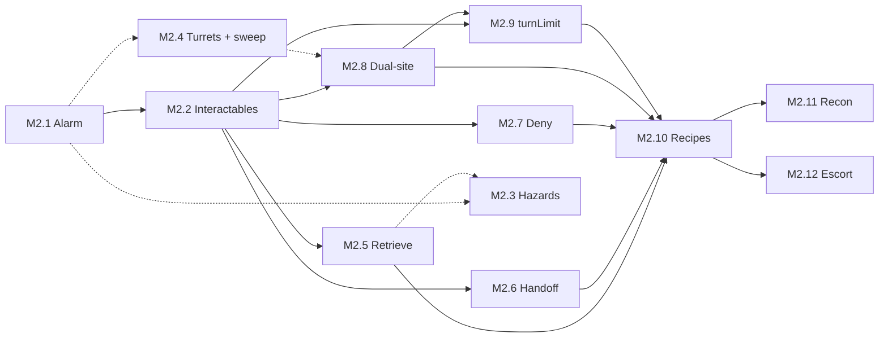

# Phase 2.5 Plan — Meatspace depth (pre–Cyberspace)

Living plan for the post–Phase 2 slice of Kernel Panic: **contract objectives**, **richer Meatspace combat and economy**, and **breaching / map memory** — building the Meatspace foundations that Phase 3 (campaign arc, Cyberspace, the Decker) will layer onto. **Target release: `v0.2.5`.** See [phase-2-plan.md](phase-2-plan.md) for the completed Phase 2 milestone set (M0–M8), [phase-3-plan.md](phase-3-plan.md) for the campaign arc and Cyberspace design, [kernel-panic-v1-blueprint.md](kernel-panic-v1-blueprint.md) for the overall design vision, and [game-overview.md](game-overview.md) for the elevator pitch.

## Current status

| Milestone | Status |
|---|---|
| M1 — Contract objectives (label-driven run variety) | ✅ Done |
| M2 — Richer combat mechanics (objectives + pressure) | ✅ Complete |
| M2.1 — Alarm cadence & feedback | ✅ Done |
| M2.2 — Interactables & terminal slice | ✅ Done |
| M2.3 — Environmental hazard tiles | ✅ Done |
| M2.4 — Corp stationary hostiles + sweep quota | ✅ Done |
| M2.5 — Retrieve pickup objectives | ✅ Done |
| M2.6 — Handoff contact objectives | ✅ Done |
| M2.7 — Deny / destroy objectives | ✅ Done |
| M2.8 — Dual-site sync objectives | ✅ Done |
| M2.9 — `turnLimit` objective gating | ✅ Done |
| M2.10 — Contract recipe generator | ✅ Done |
| M2.11 — Recon / exhaustive mapping objectives | ✅ Done |
| M2.12 — Escort / extract NPC objectives | ✅ Done |
| M3 — Campaign history / chronicle | ➡️ Deferred to Phase 3 |
| M4 — Salvage revision + typed salvage + field consumables | ✅ Complete |
| M4.1 — Drone corpse removal on salvage | ✅ Done |
| M4.2 — Typed salvage (Scrap / Chips / Bio / Data) | ✅ Done |
| M4.3 — Field consumables (smoke / stim / incendiary) | ✅ Done |
| M5 — Hub, economy, Rep, crew tuning | ✅ Complete |
| M5.1 — Rep tiers & contract access gate | ✅ Done |
| M5.2 — Finn shop tabs + per-type salvage selling | ✅ Done |
| M5.3 — Hub clinic NPC | ✅ Done |
| M5.4 — Progressive Hub reveals | ✅ Done |
| M6 — Locked doors & access gating | ✅ Complete |
| M6.1 — Prefab door entity + terminal unlock | ✅ Done |
| M6.2 — Decoupled terminal placement + KeyCard unlock path | ✅ Done |
| M6.3 — Dynamic corridor door placement (higher-tier) | ✅ Done |
| M7.1 — Breaching charges & demolition objectives | ✅ Done |
| M7.2 — Location memory & site roster | ✅ Done |
| M7 — Breaching + location memory | ✅ Complete |

**Phase 2.5** is complete when:

1. Every milestone in the table above is ✅ except M3 (deferred). M2 rolls up automatically when M2.1–M2.12 are all ✅. M6 rolls up when M6.1–M6.3 are all ✅. M7 rolls up when M7.1–M7.2 are both ✅.
2. Full campaign loop from Phase 2 remains playable offline on iOS Safari + Chrome desktop: Hub → contract selection → job deployment → combat → extract or flatline → return to Hub, with Finn shop, Rep meter, recruitment, and new systems (objectives, salvage types, shop tabs, breaching, etc.) integrated per milestone specs.
3. Phase 3 foundations in place: M2.10 recipe context supports future arc-awareness; M5 rep tiers leave room for Decker recruitment gating; M7 location schema accommodates a designated "Score target" site.
4. `v0.2.5` tagged in git.

## Milestones — detail

### M1 — Contract objectives (label-driven run variety) ✅

**Goal:** Each contract already rolls a **label**, **difficulty**, and **reward**; add a **randomly assigned objective** (or objective *family*) so the same tactical map loop supports different completion pressures. Labels stay flavor-first; the Curator rolls an `objective` (and optional parameters) alongside `seed` / tier so saves stay deterministic. UI (`<contract-select>`, `<run-briefing>`) surfaces objective text, not only `// label`.

**Out of scope for this milestone’s spec:** exact AP costs, failure modes, and Rep hooks — those land when mechanics are implemented (see M2 / shop tuning). This section records **design intent** and label → objective mapping.

#### Objective families (how they play)

| Family | Player-facing loop | Reuses existing systems |
|--------|---------------------|-------------------------|
| **Retrieve** | Enter → find interactable **pickup** (cache, dossier, crate) → carry or “secured” flag → **exit** | Space interact, LOS, `loot`-style flags |
| **Handoff** | Enter → locate **faction-tagged contact** (neutral fence, fixer, dead-letter box as NPC) → interact to deliver / receive → **exit** | Hub-style interact; NEUTRAL / authored spawns |
| **Terminal / slice** | Enter → reach **one or more terminals** → interact (maybe multi-tick or alarm on fail) → **exit** | Interact, optional `alarm` tie-in |
| **Deny / destroy** | Enter → **destroy marked object(s)** or eliminate a quota → **exit** | Combat, possibly non-drone props |
| **Sweep / clear** | Enter → **clear threats** or tagged “nodes” (antennas, relays) before extraction counts | Drone count, optional secondary entities |
| **Dual-site / sync** | Enter → complete **A then B** (or either order) within same floor — e.g. mirror payroll | Two interactables; routing puzzle |
| **Recon / map** | Enter → exhaustively reveal the location map → **exit** | Fog-of-war, `VisionField`, location memory |
| **Escort / extract** | Enter → find and activate an allied NPC → keep them following → leave with them at the exit | Interact, player aftermath turn, allied pathing |
| **Timed pressure** (optional modifier) | Any family + **turn budget** or escalating spawns | Telemetry / shell timer; ties to difficulty |

#### Current `CONTRACT_LABELS` → suggested default objective

Labels are **suggestive**, not 1:1 locked forever — the table is the default thematic read so the first implementation can map `label` → `objectiveKind` without a second RNG if desired.

| Label | Natural read | Suggested objective family | In-game sketch |
|-------|----------------|---------------------------|-----------------|
| **Sublevel 3 cache** | Buried data stash | **Retrieve** | A **cache** interactable (sublevel tile cluster or hidden room); must **pick up / secure** before exit counts as clean completion (or gates full pay). |
| **Vuong Holdings server farm** | Corp data center | **Terminal / slice** | One or more **server racks / terminals** to interact with (“slice”); higher tiers could arm **CorpCivilian** alarm pressure. |
| **Black market dropoff — Pier 9** | Physical handoff | **Handoff** | Spawn a **named neutral contact** (or static “drop box” entity with contact flavor); **interact adjacent** to complete package transfer; exit. |
| **Gassed clinic data dump** | Salvage from a hit site | **Retrieve** (+ hazard flavor) | **Medical records** or **samples** pickup in a **risky zone** (smoke, broken LOS, or gas clouds as palette); retrieve then exit. |
| **Spinning Fox warehouse** | Logistics / storage | **Retrieve** or **Deny** | Either **lift a crate** (retrieve) or **torch/disable shipment** (destroy interactable); tier picks weight. |
| **Matsuda payroll mirror** | Finance + redundancy | **Dual-site / sync** | **Two mirrors**: interact **payroll terminal** + **off-site mirror** (or two pads); order-free or “sync window” for critical tier. |
| **Transit authority dead drop** | TA blind handoff | **Retrieve** | **Dead drop** prop (concealed tile); **find + interact** once; then exit — same mechanical skeleton as cache, different fiction. |
| **Harbor node sweep** | Security sweep language | **Sweep / clear** | **All drones** or **N relay nodes** must be cleared; extraction allowed only when quota met (contrast with pure stealth exit). |

#### Additional label ideas (same pool style)

Additional `CONTRACT_LABELS` / families to build out:

- **Ransomware sinkhole — District 4** — Terminal / slice (isolate payload).
- **Cryo convoy manifest** — Retrieve (manifest pickup) or Handoff (deliver to journalist NPC).
- **Sentinel maintenance window** — Timed modifier + Terminal / slice (quiet window expires).
- **Yutani water table tap** — Dual-site (two sampling bores) or Retrieve.
- **Ghost auction ledger** — Retrieve (ledger) + optional Handoff exit contact.
- **Basement floodgate override** — Deny / destroy (valve or pump) or Terminal sequence.
- **Skybridge relay blind** — Sweep (relay entities) or Retrieve (blind drop on bridge).
- **Northstar site survey** — Recon (map the whole floor before extracting).
- **Clinic witness extraction** — Escort / extract (activate an allied NPC and bring them to the exit).

#### Acceptance (when implemented)

- `Contract` carries `objective` beyond `reach-exit` (enum or tagged union), serialised in run snapshots.
- `generateContracts` assigns objective **deterministically** from `rng` + label (or explicit joint roll).
- Briefing + job board show **objective line**; completion logic in `Run` / shell respects objective before payout (exact rules refined in M2).
- Tests: Curator snapshot shape + persistence round-trip for new objective fields; at least one golden-path objective test per family (as mechanics land).

#### Implementation notes

- Contracts now carry `objective: { kind, title, briefing, params? }` instead of a flat objective string; old `"reach-exit"` saves migrate at restore.
- `Curator.generateContracts` maps each current label deterministically to an objective family, and throws if a future label lacks a mapping.
- `<contract-select>` shows the short objective title; `<run-briefing>` shows the longer briefing line.
- `Run` now gates extraction through `isObjectiveSatisfied(contract)`, currently permissive for all M1 families so M2 can replace it with family-specific state.

---

### M2 — Richer combat mechanics (objectives + pressure) ✅

**Goal:** Build on M1 contract objectives with Meatspace systems called out in the pitch and blueprint: **noise / alarm cadence**, **terminal-slice tension**, **environmental hazards**, **new corp hostiles**, and **access gating** that sets up M6 breaching.

**M2 is complete when M2.1–M2.12 are all ✅.** Infrastructure slices (M2.1–M2.4) and objective-family slices (M2.5–M2.8, M2.11–M2.12) can interleave after their dependencies; **M2.9** lands after the family owner for any contract that ships with `params.turnLimit` (see below). **M2.10** replaces the fixed label registry with typed recipes and compatible token pools; **M2.11–M2.12** extend that recipe layer with two additional objective families. See dependency notes per slice.



#### `OBJECTIVES.*` ownership (Curator kinds → M2 slice)

Each row is the **owner** for replacing the permissive `isObjectiveSatisfied` branch and shipping at least one golden-path test. Slices may add optional params (hazards, doors) without owning the kind.

| `OBJECTIVES` kind | Owner slice | Notes |
|-------------------|-------------|-------|
| `terminal-slice` | **M2.2** ✅ | Slice + alarm; `turnLimit` enforced by **M2.9** |
| `retrieve` | **M2.5** | Pickup / `secured` loop; M2.3 adds hazard *flavor* only |
| `handoff` | **M2.6** | Contact or drop-box interact; M6 optional `doorId` gating |
| `deny` | **M2.7** | Destroy or disable marked prop(s) |
| `sweep` | **M2.4** | Drone quota and/or relay-node entities; documents quota types after ship |
| `dual-site` | **M2.8** | Two objective interactables (`params.count`); M6 optional routing |
| `recon` | **M2.11** | Exhaustively reveal the playable location before extract |
| `escort-extract` | **M2.12** | Activate an allied NPC, have them follow during player aftermath, extract together |
| `reach-exit` | — | **Not in label pool**; save migration only — no M2 slice |

#### Param modifiers (not separate kinds)

| Param | Owner slice | Applies when |
|-------|-------------|--------------|
| `turnLimit` | **M2.9** | `contract.objective.params.turnLimit` is a positive number (e.g. **Sentinel maintenance window** → `terminal-slice` with `turnLimit: 15` in `Curator.ts`) |
| `hazardFlavor` | **M2.3** | Retrieve labels with risky-zone fiction |
| `doorId` / `requiresUnlock` | **M6** | Routing for M2.5–M2.8 and M2.11–M2.12 contracts |

| Slice | Delivers | Objective kinds owned |
|-------|----------|-------------------------|
| **M2.1** | Tunable alarm pressure + feedback | (ambient — all families) |
| **M2.2** | `Interactable` base; **terminal-slice** loop | `terminal-slice` |
| **M2.3** | Hazard tiles on the grid | (modifier for `retrieve` + hazard params) |
| **M2.4** | Corp turrets + **sweep** completion | `sweep` |
| **M2.5** | Pickup / cache / dead-drop retrieve | `retrieve` |
| **M2.6** | Neutral contact handoff | `handoff` |
| **M2.7** | Deny / destroy interactables or props | `deny` |
| **M2.8** | Dual-site pads / mirrors | `dual-site` |
| **M2.9** | **`turnLimit` deadline** on combat turns | (modifier — any kind with `params.turnLimit`) |
| **M2.10** | Typed contract recipes + mad-libs label generation | (Curator generation layer — no new kind) |
| **M2.11** | Exhaustive mapping / recon completion | `recon` |
| **M2.12** | Allied NPC activation, following, and extraction | `escort-extract` |

**Cross-cutting rule:** Each **owner** slice replaces the matching **permissive** branch in `isObjectiveSatisfied` (M1 placeholder returns `true`) when its mechanics land — avoid a single end-loaded “objectives” PR. M2.3 may tighten retrieve further via hazard params; M6 (doors) may tighten handoff / dual-site / recon / escort via routing params — but neither satisfies M2 rollup without the owned objective slices. **M2.9** layers on top of family owners: when `turnLimit` is present, satisfaction also requires the objective to be complete **before** the budget expires (see M2.9).

**Remember for every subtask:** When you add new combat glyphs, add them to the key help overlay as well, so players know what to look for.

**Out of scope for M2.1–M2.12:** breaching charges, destructible walls, location-keyed map reuse (**M7**); exact Rep/AP economy tuning (**M5**); broad label-pool expansion beyond the recipes needed to prove the shipped objective families.

---

#### M2.1 — Alarm cadence & feedback ✅

**Goal:** Turn the M5 **binary alarm latch** into a **tunable pressure layer**: cooldowns, clearer escalation / de-escalation, and player-facing feedback — without yet requiring new map props.

**Scope:**

- Extend `world` alarm state beyond `alarmActive` boolean (e.g. level, cooldown ticks, or “quiet window” counter — pick one model at implementation).
- Corp turn / civilian behaviour respects the new model (drones still ENGAGE on alert; define whether partial de-escalation reduces spawn pressure or only UI).
- Log and/or diagnostics surface transitions (`> ALERT: …`, status bar, existing CRT tint hooks).

**Acceptance:**

- Unit tests for raise → hold → cool-down / deactivate transitions and snapshot round-trip.
- Pre-M5 saves still restore with safe defaults.
- No new procgen entities required in this slice.

**Implementation notes:**

- `World.alarm` now tracks `quiet → alert → cooldown → quiet`; `alarmActive` remains as a legacy/readability alias for the active alert phase.
- The cadence ticks once per full player/corp round from `TurnQueue.endTurn`: 2 rounds alert hold, then 2 rounds cooldown.
- `World.raiseAlarm()` suppresses duplicate alarms during the alert hold so Rep penalties do not stack every civilian tick; a new alarm can fire after the cadence returns quiet.
- Run snapshots persist the full alarm state and still migrate legacy `alarmActive` saves.
- Shell feedback now shows `[ALERT:n]` / `[COOL:n]` in combat status and logs alarm cooldown / quiet transitions.

---

#### M2.2 — Interactables & terminal slice ✅

**Depends on:** M2.1 (terminals should hook a real alarm model, not only the old latch).

**Goal:** Shared **interactable** entity type for objective props; first full loop for **Terminal / slice** contracts.

**Scope:**

- `Interactable` (or equivalent) base: adjacency interact, AP cost, serialised state (`secured`, `sliced`, `armed`, etc.).
- **Terminal** variant: interact can **raise alarm** (per M2.1 rules); **deactivate** via second terminal, slice completion flag, or timed quiet window (pick per prefab/objective params).
- At least one **prefab or procgen** placement tied to a `terminal-slice` contract golden path.
- Wire `OBJECTIVES.TERMINAL_SLICE` in `isObjectiveSatisfied` to real state (not permissive `true`).

**Acceptance:**

- Golden-path test: start terminal-slice contract → interact → objective satisfied only when slice rules met; alarm side effects assertable.
- Snapshot includes interactable ids + flags; restore round-trip.
- Handoff / retrieve / deny / dual-site families are covered by **M2.5–M2.8**; later objective families (`recon`, `escort-extract`) are covered by **M2.11–M2.12**.

**Implementation notes:**

- Added `Interactable` base plus `Terminal` variant with adjacency checks, AP cost, serialised state (`sliced`, `armed`, `raisesAlarm`), and player-facing result copy.
- Terminal-slice contracts now place a deterministic but varied `terminal-0` objective prop during `Run.enterCombat`, biased away from spawn and extraction when the map allows it.
- Combat `Space` interaction still prioritises salvage, then adjacent interactables; terminal interaction slices the prop, trips the M2.1 alarm cadence, and can auto-advance on AP exhaustion.
- Combat status now includes the active objective title and `[TODO]` / `[DONE]` completion marker; blocked extraction logs a “complete objective first” message instead of silently refusing.
- `Run.isObjectiveSatisfied(contract, world)` now gates `OBJECTIVES.TERMINAL_SLICE` on sliced terminal count; other M1 objective families remain permissive until their slices land.
- Run snapshots round-trip terminal state and legacy/non-terminal saves remain unaffected.

---

#### M2.3 — Environmental hazard tiles ✅

**Depends on:** M2.1 recommended (hazards may tick alarm or block “quiet” windows); can ship in parallel with M2.2 / M2.4.

**Goal:** Grid tiles (or tile-attached state) that change **LOS**, **movement cost**, and/or **damage** — supports M1 “risky zone” fiction (e.g. Gassed clinic).

**Scope:**

- Hazard representation on `Grid` / `World` (persistent vs turn-scoped — at least one).
- Integration with pathfinding, LOS, and optional end-of-turn damage.
- One hazard type in a **prefab or procgen** cluster (smoke, “glass” debris palette, or hot zone — name at implementation).
- At least one **retrieve** contract with `hazardFlavor` (or equivalent param) places a hazard cluster near the pickup (see **M2.5** for pickup placement). Does **not** own `OBJECTIVES.RETRIEVE` satisfaction — that is **M2.5**.

**Acceptance:**

- Tests: movement cost / LOS / damage on a fixed mini-map fixture.
- Snapshot hazard tile state; migration default for old saves = no hazards.
- Renderer shows hazard distinctly (glyph or tint) on at least one golden path.
- Golden path pairs with M2.5: retrieve pickup in a hazard-adjacent tile cluster (can land in same PR if both slices ready).

**Implementation notes:**

- `TILE.HAZARD = 5` — passable, does not block LOS; serializes as part of the grid's `Uint8Array` so old saves (no value 5 in tile data) default to no hazards with no migration.
- `HAZARD_DAMAGE = 1` constant (tuneable); glyph `▓` in `#d45a3a` (orange-red, distinct from smoke `░`). Added to `<key-help>` combat tile legend.
- Hazard damage resolves during **player aftermath** (Phase 3 of `runPlayerAftermathSteps`, after turrets and civilian reactions): every live entity on a `TILE.HAZARD` cell takes flat damage. Emits `ENTITY_DAMAGED` (source: `'hazard'`, attacker: `null`) for Run death-detection, plus a new `HAZARD_DAMAGE` event for presentation.
- `HazardAftermathStep` added to the `PlayerAftermathStep` union; log formatting and LOS-gated visibility follow the same patterns as turret autofire.
- `placeHazardCluster(world, center, rng)` stamps a 5–9 tile diamond/cross of HAZARD onto FLOOR-only unoccupied tiles. Called from `Run.#placeObjectiveInteractables` when `contract.objective.params.hazardFlavor` is present (today: “Gassed clinic data dump”). M2.5 will co-locate a retrieve pickup at or near this cluster.
- A* pathfinding (`Pathfinding.ts`) and LOS (`LineOfSight.ts`) needed no changes — `Grid.isPassable` already drives both, and HAZARD was added to the passable set.
- 19 new unit tests in `tests/unit/game/hazard.test.ts`: grid passability, LOS transparency, movement, damage per turn, kill, events, dead-entity skip, multi-entity, log formatting, visibility gating, cluster placement (including wall/entity/edge-of-map guards), snapshot round-trip, and palette glyph.

---

#### M2.4 — Corp stationary hostiles + sweep objectives ✅

**Depends on:** M2.1 recommended (turret fire may respect alarm); can ship in parallel with M2.2 / M2.3. **Owns** `OBJECTIVES.SWEEP`.

**Goal:** **Corp-aligned stationary turrets** (distinct from player Tech deployables), minimal AI surface, and a real **sweep / clear** completion loop for contracts that use `sweep` (Harbor node sweep, Skybridge relay blind, etc.).

**Scope:**

- `CorpTurret` (or equivalent): fixed facing or sector LOS, corp faction, damage on player turn or corp turn (match existing turret cadence conventions).
- Placement in at least one **prefab** (e.g. server-farm / security checkpoint) or procgen rule.
- **Sweep quota model** (document after ship): at minimum one of —
  - **Drone quota:** all corp drones on the map eliminated before extract; or
  - **Relay nodes:** tagged interactable or destructible props (`params.target`, e.g. `relay-node`, `skybridge-relay`) cleared per count.
- Turret destruction counts toward sweep when `params` say so; otherwise turrets are pressure only.
- Wire `OBJECTIVES.SWEEP` in `isObjectiveSatisfied` to the chosen quota (not permissive `true`).
- Procgen or prefab placement for at least one `sweep` label golden path.

**Acceptance:**

- Unit tests: LOS, firing, destruction, blocks pathing if designed as blocking.
- `ARCHETYPE_FACTORY` + snapshot round-trip; drones do not treat turrets as civilians.
- One playtest map where alarm + turret pressure coexist without soft-lock.
- Golden-path test: `sweep` contract → quota met only after clears → extract allowed; partial clear blocks extract.
- Post-ship doc note in this section: which quota types exist (`drone-all`, `relay-count`, `turret-count`, etc.).

**Implementation notes:**

- **`CorpTurret`** (`src/game/entities/CorpTurret.ts`): Extends `Hostile`, CORP faction, glyph `$`. Fires during the **corp turn** via `takeTurnSteps` (same corp turn driver as drones). Stationary — only acquires targets and fires, never moves. Uses `acquireTarget` (inherited from Hostile) for LOS + range checks, `resolveRanged` for shots. Constants: `CORP_TURRET_RANGE = 4`, `CORP_TURRET_DAMAGE = 1`, `CORP_TURRET_HP = 2`. Placed by `Run.#placeSweepTargets` for sweep contracts, and as ambient pressure.
- **`RelayNode`** (`src/game/entities/RelayNode.ts`): Extends `Entity` (not Hostile), CORP faction, glyph `~`. Destructible target for relay-node sweep quotas. `RELAY_NODE_HP = 1` — one shot takes it down. Player can target with ranged or melee attacks (CORP faction is a valid fire target via `canFireRanged`). Not targeted by player turrets (turrets only fire at `Hostile` instances).
- **Sweep quota types** (all three shipped):
  - `drone-all`: All `CorpDrone` entities on the map must be dead. Default fallback when `params.target` is unrecognized or absent.
  - `relay-node`: All `RelayNode` entities dead (or `params.count` if specified). Triggered by `params.target` = `'relay-node'` or `'skybridge-relay'`.
  - `turret`: All `CorpTurret` entities dead (or `params.count` if specified). Triggered by `params.target` = `'turret'` or `'corp-turret'`.
- **`isObjectiveSatisfied`**: `OBJECTIVES.SWEEP` case now dispatches to `isSweepSatisfied` which reads `sweepQuotaType(contract)` to select the correct quota check. No longer permissive.
- **Placement**: `Run.#placeSweepTargets` places entities based on quota type: relay-node → 3 RelayNodes + 1 CorpTurret; turret → 2 CorpTurrets; drone-all → 1 CorpTurret (drones already placed by `enterCombat`). Uses `findInteractableAnchor` for placement (same bias-away-from-spawn/exit logic as terminals).
- **Snapshot**: `RunEntitySnapshot` gains `corpTurret?: { range, attackDamage }` and `relayNode?: { label }`. `ARCHETYPE_FACTORY` entries for `'corp-turret'` and `'relay-node'` in `persistence.ts`.
- **Entity labels**: `kindFromId` recognizes `corp-turret-*` → `'Turret'` and `relay-node-*` → `'Relay'`. Combat log shows `[Corp]Turret` and `[Corp]Relay`.
- **Key help**: `$` (corp turret) and `~` (relay node) added to combat tile legend in `<key-help>`.
- 41 new unit tests in `CorpTurret.test.ts` and `sweep.test.ts`: construction, targeting, LOS, firing, destruction, snapshot round-trip, entity labels, all three sweep quota types (drone-all, relay-node, turret), count params, golden-path extract gating.

---

#### M2.5 — Retrieve pickup objectives ✅

**Depends on:** M2.2 (`Interactable` base, combat `Space` interact). M2.3 optional for hazard-flavored retrieve labels.

**Goal:** Full loop for **`OBJECTIVES.RETRIEVE`**: find pickup prop → interact to **secure** → extract. Covers Curator labels mapped to retrieve (cache, clinic records, dead drop, auction ledger, etc.) via `params.target`.

**Scope:**

- **Pickup** interactable variant (or `Interactable` with `secured` semantics): adjacency interact, AP cost, serialised `secured` flag; distinct glyph from terminals.
- `Run.enterCombat` places objective pickup from contract `params.target` (deterministic placement like `terminal-0`, biased away from spawn/extract when possible).
- Wire `OBJECTIVES.RETRIEVE` in `isObjectiveSatisfied`: satisfied when required pickup(s) secured (support `params.count` if ever > 1).
- At least one golden-path label (e.g. **Sublevel 3 cache** or **Transit authority dead drop**).

**Acceptance:**

- Golden-path test: retrieve contract → interact pickup → `[DONE]` only after secured → extract allowed.
- Snapshot pickup id + `secured`; restore round-trip.
- M1 acceptance: one golden-path test for **retrieve** family (closes deferred M1 bullet).
- New combat glyph in key help if pickup uses a new glyph.

**Implementation notes:**

- Added `Pickup` interactable variant with `!` glyph, adjacency/AP interaction, `secured` / `armed` state, repeat-interact guard, neutral entity label, and combat key-help legend entry.
- Retrieve contracts now place deterministic objective pickups during `Run.enterCombat`; `params.count` places and requires multiple pickups, while `params.target` drives the pickup label.
- `Run.isObjectiveSatisfied` now gates `OBJECTIVES.RETRIEVE` on secured `Pickup` count instead of the old permissive M1 branch; extraction remains blocked until the retrieve loop is complete.
- Hazard-flavored retrieve contracts co-locate the hazard cluster around the first pickup anchor, preserving the M2.3 risky-zone flavor while making the pickup the center of the play loop.
- Run snapshots serialize pickup label / secured / armed state and restore them as `Pickup` entities.
- New `tests/unit/game/retrieve.test.ts` covers construction, interaction, objective count gating, golden-path extraction gating, hazard adjacency, entity label, and persistence round-trip.

---

#### M2.6 — Handoff contact objectives ✅

**Depends on:** M2.2. M6 optional for door-gated contacts.

**Goal:** Full loop for **`OBJECTIVES.HANDOFF`**: locate neutral **contact** or drop-box entity → interact to complete transfer → extract. Covers Pier 9, Cryo convoy manifest, etc.

**Scope:**

- **Contact** interactable or thin NEUTRAL NPC, based on contract details: adjacency interact sets `handoffComplete` (or equivalent); may consume a carried item flag if retrieve+handoff chains are added later — out of scope unless a label requires it.
- Placement from `params.contact` / `params.target`; golden path for at least one handoff label.
- Wire `OBJECTIVES.HANDOFF` in `isObjectiveSatisfied` (not permissive `true`).

**Acceptance:**

- Golden-path test: handoff contract → interact contact → objective satisfied → extract.
- Snapshot contact state; restore round-trip.
- M1 acceptance: one golden-path test for **handoff** family.
- Key help entry if contact uses a new glyph.

**Implementation notes:**

- Added `Contact` interactable variant with `&` glyph, adjacency/AP interaction, `handoffComplete` state, repeat-interact guard, neutral entity label, and combat key-help legend entry.
- Handoff contracts now place deterministic neutral contacts during `Run.enterCombat`; `params.contact` supplies authored contact names and `params.target` is used as a fallback label source.
- `Run.isObjectiveSatisfied` now gates `OBJECTIVES.HANDOFF` on completed contact handoff count instead of the old permissive M1 branch; extraction remains blocked until the transfer is complete.
- Run snapshots serialize contact label / `handoffComplete` / armed state and restore them as `Contact` entities.
- New `tests/unit/game/handoff.test.ts` covers construction, interaction, objective count gating, Pier 9 golden-path extraction gating, target-derived labels, entity label, and persistence round-trip.

---

#### M2.7 — Deny / destroy objectives ✅

**Depends on:** M2.2 and/or combat damage on props. M2.4 optional if deny targets are turret-like.

**Goal:** Full loop for **`OBJECTIVES.DENY`**: find marked object → **destroy or disable** (interact or reduce HP to zero) → extract. Covers Spinning Fox shipment, Basement floodgate, etc.

**Scope:**

- **Deny target** prop: destructible interactable or entity with HP; interact may arm alarm (per M2.1) on some prefabs.
- `isObjectiveSatisfied` checks destroyed/disabled state from `params.target` (and `params.count` if multiple).
- At least one golden-path deny label in prefab or procgen.

**Acceptance:**

- Golden-path test: deny contract → disable/destroy target → extract gated until complete.
- Snapshot deny-target state; restore round-trip.
- M1 acceptance: one golden-path test for **deny** family.
- Key help if new deny-target glyph.

**Implementation notes:**

- Added `DenyTarget` destructible CORP-faction objective prop with `X` glyph, 2 HP, no AP/AI, and zero melee dodge so the existing combat rules can destroy it without a neutral-prop attack exception.
- Deny contracts now place deterministic deny targets during `Run.enterCombat`; `params.target` supplies the label and `params.count` places / requires multiple targets.
- `Run.isObjectiveSatisfied` now gates `OBJECTIVES.DENY` on destroyed `DenyTarget` count instead of the old permissive M1 branch; extraction remains blocked until the target is destroyed.
- Run snapshots serialize deny target labels and restore live/dead deny targets as `DenyTarget` entities.
- Added `X` to the combat key-help legend.
- New `tests/unit/game/deny.test.ts` covers construction, combat targetability, destruction, objective count gating, golden-path extraction gating, entity label, and persistence round-trip.

**Out of scope:** breaching charges / wall demolition (**M7** extends deny fiction only).

---

#### M2.8 — Dual-site sync objectives ✅

**Depends on:** M2.2. M6 optional for routing between sites. M2.4 optional if a “site” is a relay node.

**Goal:** Full loop for **`OBJECTIVES.DUAL_SITE`**: interact **N** objective pads (`params.count`, default 2, order-free unless params specify sequence) → extract. Covers Matsuda payroll mirror, Yutani water table tap, etc.

**Scope:**

- Multiple objective interactables (`mirror-0`, `mirror-1`, …) placed per contract seed; shared `params.target` flavor.
- `isObjectiveSatisfied` counts secured/completed pads vs `params.count`.
- Golden path for at least one dual-site label.

**Acceptance:**

- Golden-path test: dual-site contract → both pads complete (any order unless param says otherwise) → extract.
- Snapshot all pad ids + flags; restore round-trip.
- M1 acceptance: one golden-path test for **dual-site** family.
- Key help if pad glyph differs from pickup/terminal.

**Implementation notes:**

- Added `SyncPad` interactable variant with `§` glyph, adjacency/AP interaction, `synced` / `armed` state, repeat-interact guard, neutral entity label, and combat key-help legend entry.
- Dual-site contracts now place deterministic sync pads during `Run.enterCombat`; `params.count` places and requires N pads, while omitted `count` defaults to 2 for the family.
- `Run.isObjectiveSatisfied` now gates `OBJECTIVES.DUAL_SITE` on synced `SyncPad` count instead of the old permissive M1 branch; extraction remains blocked until every required pad is synced. Pad order is free-form.
- Hazard-flavored dual-site contracts co-locate the hazard cluster around the first sync pad, matching the existing retrieve hazard pattern.
- Run snapshots serialize sync pad label / `synced` / `armed` state and restore them as `SyncPad` entities.
- New `tests/unit/game/dualSite.test.ts` covers construction, interaction, objective count gating, Matsuda golden-path extraction gating, hazard adjacency, entity label, and persistence round-trip.

---

#### M2.9 — `turnLimit` objective gating ✅

**Depends on:** M2.2 (combat turn pipeline + `isObjectiveSatisfied` integration). For each contract label that ships with `params.turnLimit`, also depends on that label’s **family owner** slice (M2.2 for **Sentinel maintenance window** today; M2.5–M2.8 or M2.11–M2.12 if future labels add `turnLimit` to retrieve, dual-site, recon, escort, etc.).

**Goal:** Enforce M1 **timed pressure** for contracts that set `objective.params.turnLimit`: the player must complete the family-specific objective within the budget; expiry **blocks** clean objective completion but still permits extraction as an incomplete run.

**Scope:**

- **Turn counter:** Persist combat **rounds elapsed** (or player turns — pick one at implementation and document in implementation notes; count must match player-facing “turns left” copy).
- Start budget from `contract.objective.params.turnLimit` when present and finite; omit param = no timer (unchanged behaviour).
- **`isObjectiveSatisfied`:** For timed contracts, return `false` if the family-specific checks fail **or** if the budget is exhausted before the family checks first become true. Once satisfied within the budget, remain satisfied for the rest of the run (wandering after completion does not re-arm the timer).
- **Extract / shell:** Status shows remaining budget (e.g. `[TURN:n]` alongside `[TODO]` / `[DONE]`); on expiry log a clear line (e.g. maintenance window closed) and allow extraction as incomplete — expired timed contracts cannot be “completed” retroactively.
- **Failure outcome on expiry:** Default = objective permanently failed for that run (extract allowed, no full contract payout/recruit/clean-completion reward). Escalating spawns on expiry are **out of scope** unless trivial to hook from M2.1 alarm — document if deferred.
- Golden path: **Sentinel maintenance window** (`terminal-slice`, `turnLimit: 15`) — slice before limit → extract allowed; fixture test that simulates limit+1 rounds without slice → `isObjectiveSatisfied` false.
- When a non–terminal-slice label gains `turnLimit` in `Curator.ts`, add a matching golden-path test in the same PR as that label’s family owner (M2.5–M2.8, M2.11–M2.12) or in M2.9 if the family owner is already ✅.

**Acceptance:**

- Unit tests: under budget + family met → satisfied; over budget without family met → false; family met before expiry → still satisfied after expiry.
- Snapshot includes turn counter / expiry flag (or derivable rounds elapsed); restore round-trip; pre-M2.9 saves default to no timer.
- Briefing or contract-select surfaces turn limit when param present (one line, e.g. “Window: N rounds”).
- M1 **Timed pressure** row satisfied for at least one shipped label.

**Out of scope:** Rep penalties for slow jobs (**M5**); new `turnLimit` labels beyond the existing Curator pool (**M1**).

**Implementation notes:**

- Turn budget is counted in full combat rounds using `TurnQueue.turnNumber`: turn 1 starts with the full budget, and a `turnLimit: 15` window expires when the queue returns to player control on turn 16 without completion.
- `Run` now owns persisted `objectiveTimer` state (`completedWithinLimit`, `expired`, completion/expiry turn, and one-shot expiry announcement flag). Pre-M2.9 saves restore to a fresh timer state.
- `Run.isObjectiveSatisfied()` wraps the family-specific objective checks with timer gating. Completion inside the window latches clean success; expiry before completion latches failure, so later interaction cannot complete the contract retroactively.
- Expiry emits `objective:timer-expired`; the shell logs a clear “WINDOW CLOSED” line and then allows extraction with `objectiveComplete: false`, skipping contract payout, recruit reward, and clean-completion Rep bonus. Escalating spawns remain deferred.
- Job board and briefing copy surface timed windows, and combat status shows `[TURN:n]` while a timed objective is still pending.
- New `tests/unit/game/turnLimit.test.ts` covers remaining-turn math, pure timed satisfaction, under-budget completion persistence, post-expiry retroactive denial, expiry event emission, and snapshot/restore for completed and expired timer states.

---

#### M2.10 — Contract recipe generator ✅

**Depends on:** M1 objective shape; M2.5–M2.9 recommended so every generated recipe can point at a non-permissive objective family. Can start earlier behind tests if recipes initially cover only already-shipped families.

**Goal:** Replace fixed one-off `CONTRACT_LABELS` / exact label lookup with a typed, deterministic **recipe + lexicon** generator: `[Faction/Location] + [System/Asset] + [Action/Anomaly]`. Example reads: **Matsuda payroll mirror**, **Block 9 community power siphon**. The generated label is flavor; the recipe remains the source of objective mechanics.

**Principle:** Do **not** parse the final string back into gameplay. Generate the label, briefing, objective kind, and params from the same typed recipe context, then validate the resulting contract. Silent fallback is a bug: if a recipe cannot build a valid objective, `Curator` should throw in development/tests rather than ship a corrupt run.

**Scope:**

- Add a `ContractRecipe` layer in or near `Curator.ts` with objective kind, allowed token groups, params builder, title/briefing renderers, and optional difficulty/tier weights.
- Add a small `ContractLexicon` with tagged token pools:
  - actor/location tokens: corp, district, faction, infrastructure, street-level site.
  - system/asset tokens: payroll, clinic records, community power, transit relay, dead drop, water table, auction ledger.
  - action/anomaly tokens: mirror, siphon, blind, override, sinkhole, cache, handoff, burn.
- Generate contracts by deterministic pipeline: roll difficulty → pick compatible recipe → pick compatible tokens → build objective params → render label/title/briefing → assemble reward/threat as today.
- Store enough structured `context` metadata in the generated contract to make tests and future chronicle / arc copy inspectable without reverse-parsing `label`.
- Keep Curator board uniqueness: no duplicate rendered labels in one draw; if the pool is exhausted, fail loudly in development/tests and use a documented production strategy.

**Acceptance:**

- Unit tests cover every recipe: generated label is non-empty and unique within a seeded board; objective kind is valid; params pass existing objective validation; title and briefing render without unresolved template slots.
- Determinism test: same seed + same campaign state yields identical contracts; different seeds produce varied but compatible token combinations.
- Persistence compatibility: recipe-generated contracts snapshot/restore with required `context`; no `flavor` field migration shim is needed before release.
- Test at least one example per shipped objective family, including **Matsuda payroll mirror** for `dual-site` and **Block 9 community power siphon** or equivalent for a non-retrieve family.
- Curator registry sync tests are replaced or extended so adding a recipe without objective coverage fails the suite.

**Phase 3 awareness:** The recipe context (`ContractRecipe` + `ContractLexicon`) should accept an optional **campaign phase** or **arc stage** input so Phase 3 can bias contract generation toward the Score target site and arc-relevant objectives without rewriting the generator. M2.10 does **not** implement arc logic — it exposes the hook.

**Out of scope:** Large content expansion, Rep-tier economy tuning, arc-driven contract steering (Phase 3), and string-parsing gameplay inference. M2.10 may add enough tokens to prove the generator, but M5 owns access/tier gating and later phases can add deeper faction/location corpora.

**Implementation notes:**

- `Curator.generateContracts` now builds new jobs from `CONTRACT_RECIPES` plus `CONTRACT_LEXICON` token pools instead of fixed label → objective lookup. Rendered labels are flavor only; objective kind, title, briefing, and params all come from the typed recipe context.
- Recipe context axes are split into **principal** (corp / civic authority / rival faction), optional **site**, optional **site state**, **asset**, and **action**. This keeps labels like `Gassed clinic records recovery` from pretending the damaged clinic is an actor.
- Generated contracts carry required `context` metadata (`recipeId`, principal/site/siteState/asset/action token refs with ids, labels, and groups; `tags`; optional `arcStage`) so future chronicle / Phase 3 arc logic can inspect structured context without parsing `label`.
- The lexicon now includes additional corp principals (Kestrel Dynamics, Sable-Kline Systems, HelioDyne Combine, Orchid Vector, Northstar Civic, Marrowgate Logistics) plus civic / rival principals (Bayline Transit Authority, District Water Board, Civic Grid Office, Port Warden Bureau, Chrome Choir, Redline Union, Null Saints).
- The recipe context accepts `arcStage` today and preserves it in generated contract context. M2.10 does not bias on arc stage yet; Phase 3 owns that behavior.
- Board generation enforces unique rendered labels per visit and throws if the recipe/token pool cannot produce enough unique labels. `assertLabelObjectiveRegistryInSync()` now validates recipe coverage for every shipped non-`reach-exit` objective kind.
- Tests cover deterministic boards, token variation across seeds, one fixture per objective family, the named `Matsuda payroll mirror` and `Block 9 community power siphon` examples, incompatible-token failure, and generated context persistence through campaign snapshot/restore.

---

#### M2.11 — Recon / exhaustive mapping objectives ✅

**Depends on:** M2.10 (recipes and structured context). Uses the existing fog-of-war / `VisionField` model; M7 location memory can later persist the value of recon across repeat visits, but M2.11 must stand alone on a single run.

**Goal:** Full loop for **`OBJECTIVES.RECON`**: enter a location, reveal the required map area through normal exploration, then extract. This makes information itself the objective and gives stealth / movement builds a contract family that is not just "touch the prop."

**Scope:**

- Add an objective kind such as `recon` and at least one compatible Curator recipe / token path (e.g. **Northstar site survey**, **Port Warden blind map**, **Sublevel 3 layout trace**).
- Define "exhaustively map" in code as a deterministic percentage over eligible map cells, not as a vague visual state. Recommended baseline: all passable, non-hub combat cells that can reasonably be discovered by player LOS; walls may count only if they have been seen, but unreachable sealed voids must not soft-lock the contract. Eligible cells come from `reconEligibleCellKeys` → `explorationReachableKeys` (8-way flood, entity-aware — same graph impassable prop placement uses for chokepoint checks).
- Track recon progress from `VisionField.seen` or a run-level equivalent and expose a stable `reconMapped/required` counter for tests and UI.
- Wire `OBJECTIVES.RECON` in `isObjectiveSatisfied`: satisfied only when the required coverage threshold is met. Default threshold should be 100% of eligible cells for the "exhaustive" family; lower thresholds can be a future param if playtesting proves full clear too fussy.
- Surface progress in combat status and briefing copy (`MAP n/m` or equivalent) so the player can tell whether a dark corner still matters.
- Recipe context should carry enough site / asset metadata for future Phase 3 casing payoffs without parsing the rendered label.

**Acceptance:**

- Unit tests define eligible-cell counting on fixed maps: floors count, unreachable / non-playable voids do not, and seen-cell changes update progress deterministically.
- Golden-path test: recon contract → reveal all required cells → objective `[DONE]` → extraction grants normal completion.
- Partial-path test: reveal less than required coverage → extraction is incomplete or blocked according to the current objective-gating rule.
- Snapshot / restore preserves enough map knowledge to continue recon progress exactly after reload.
- Curator recipe tests include at least one recon fixture, and registry sync fails if `recon` exists without recipe coverage.

**Out of scope:** Campaign-level site intelligence bonuses and persistent casing benefits. M7 / Phase 3 can consume recon data later, but M2.11 only proves the objective family inside one job.

---

#### M2.12 — Escort / extract NPC objectives ✅

**Depends on:** M2.2 (interact/activation), M2.10 (recipes and structured context), and M2.11 recommended so the recipe pool already handles post-M2.10 objective additions. May reuse pathfinding from hostile AI, but the escorted NPC is player-aligned, not neutral or corp.

**Goal:** Full loop for **`OBJECTIVES.ESCORT_EXTRACT`**: locate a player-aligned NPC, activate them through interaction, keep them alive, and extract while they are at or adjacent to the exit with the player.

**Scope:**

- Add an objective kind such as `escort-extract` and at least one compatible Curator recipe / token path (e.g. **Clinic witness extraction**, **Transit whistleblower pickup**, **Redline courier exfil**).
- Add a new crew-aligned NPC entity (name TBD, e.g. `EscortNpc`, `AllyContact`, or `Extractee`) with:
  - PLAYER or crew-aligned faction semantics so corp hostiles can target them and player attacks do not treat them as an objective prop.
  - `activated: boolean` so they remain in place until the player interacts.
  - Serialised state for label, activation, HP/alive, and any follow target / last-known position fields needed after restore.
- Activation uses adjacency + `Space` interaction. Before activation, the NPC is stationary and does not follow; after activation, they act during the **player aftermath turn**.
- Follow behavior runs after the player's committed action and before corp turns: the NPC attempts to move one step toward a valid follow position near the player, using passable unoccupied tiles and existing pathfinding. If no legal step exists, they wait loudly enough for tests/logging to notice; no teleporting or silent fallback.
- Extraction requires both player and activated living NPC to be on, or adjacent to, the exit according to a documented rule. If the NPC dies, the objective cannot be completed retroactively.
- Wire `OBJECTIVES.ESCORT_EXTRACT` in `isObjectiveSatisfied`: satisfied only when the NPC is activated, alive, and in extraction position with the player / exit state.

**Acceptance:**

- Unit tests for construction, activation, non-follow before activation, follow-after-activation during player aftermath, blocked-path waiting, hostile targetability, death failure, and snapshot/restore.
- Golden-path test: escort contract → find NPC → activate → NPC follows across several turns → player reaches exit with NPC → objective complete.
- Failure-path test: player reaches exit without activated NPC or with NPC too far away → objective incomplete; NPC death makes completion impossible.
- Key help / tile legend includes the new allied NPC glyph if it is visually distinct.
- Curator recipe tests include at least one escort/extract fixture, and registry sync fails if `escort-extract` exists without recipe coverage.

**Open design choice:** Whether the escort NPC blocks the player's movement like a normal entity or allows a swap / "make room" action. Default should be normal occupancy until playtesting proves escorts are too sticky; if swap is added, it needs explicit tests.

---

**M2 rollup acceptance (when all subs ✅):**

- Every **owner** row in the `OBJECTIVES.*` ownership table is ✅ (all kinds in the Curator pool except `reach-exit` have non-permissive `isObjectiveSatisfied` + golden-path test).
- **M2.9** ✅ for every Curator label that currently sets `params.turnLimit` (today: **Sentinel maintenance window**).
- **M2.10–M2.12** ✅: Curator uses typed recipes + compatible token pools for new contract generation, with tests proving determinism, objective validity, and recipe coverage for recon and escort/extract.
- Infrastructure: alarm cadence (M2.1), hazards in at least one prefab (M2.3), corp turrets (M2.4). (Locked doors ship separately in M6.)
- Snapshot-safe state for interactables (all variants), hazards, turrets, recon map progress, escort NPCs, doors, per-kind objective flags, and turn-limit state.

---

### M3 — Campaign history / chronicle ➡️ Deferred to Phase 3

**Deferred.** The chronicle is the campaign’s narrative memory — it doesn’t pay off until the campaign has a narrative arc (acts, the Score, win/loss conditions). Moved to [Phase 3](phase-3-plan.md) as **P3.M6 — Chronicle**. Original scope preserved there.

Phase 2.5 milestones that follow (M4–M7) retain their original numbering for continuity.

---

### M4 — Salvage revision + typed salvage + field consumables ✅

**Goal:** Align salvage with **spatial honesty** and **blueprint economy depth** ahead of Phase 3, and widen **combat pickups** beyond the Hub-bought inventory alone.

**M4 is complete.** M4.1–M4.3 are all ✅. Slices shipped in order so each built on the last (typed salvage migration ran before consumables, since consumable drops/sales use the typed schema).

| Slice | Delivers |
|-------|----------|
| **M4.1** | Drone corpse removal on salvage |
| **M4.2** | Typed salvage (Scrap / Chips / Bio / Data) + one-time migration |
| **M4.3** | Field consumables: smoke bomb, stim, incendiary |

**Out of scope:** Breaching charges (ship with **M7** alongside wall mutation); Finn-shop UI tabs (**M5**); crafting recipes (Phase 3+).

---

#### M4.1 — Drone corpse removal on salvage ✅

**Goal:** **Salvaging a drone corpse removes it from the map** (no “phantom” tile once stripped). Closes the kaizen item on **corpse memory / lootability** for the post-salvage case (the pre-salvage memorised-corpses navigation problem remains M3 scope).

**Scope:**

- `Crew.collectSalvage` (or equivalent) removes the looted entity from `World.entities` after transferring loot, instead of leaving a zero-loot corpse on the tile.
- **Walk-onto-corpse auto-salvage:** Moving onto a tile that holds a lootable corpse triggers `collectSalvage` automatically as part of the move intent. Sets up the M4.3 walk-onto pickup pattern (consumables will reuse the same shape). If the player can't afford INTERACT AP after the move, the corpse stays and a hint is logged — Space-interact remains available next turn.
- Renderer and pathfinding see the tile as floor immediately on the next frame (no stale glyph, no blocking).
- Snapshot round-trip: salvaged corpses are absent from restored runs (already true if removed from `entities`).

**Acceptance:**

- Unit tests: salvage adjacent drone corpse → entity gone from `World.entities`, tile passable, renderer/log doesn't surface the corpse anymore.
- No regressions in existing corpse-based tests (e.g. damage-after-death already throws — corpse no longer accessible to that path).
- Kaizen entry updated/closed.

**Implementation notes:**

- After transferring loot and emptying `targetEntity.loot.salvage` (M4.2: typed wallet zeroed via `emptySalvage()`), `Crew.collectSalvage` now calls `world.removeEntity(targetEntity.id)`. The corpse JS object survives in the caller's scope (so any post-call assertions on the local reference still resolve) but the world map no longer indexes it — `anyEntityAt`, `lootableCorpseAt`, and the renderer all see the tile as empty.
- No changes needed in `lootableCorpseAt` (already filters by `loot.salvage > 0`) or in pathfinding (corpses never blocked movement). The only observable behavior change is the renderer no longer drawing the stripped corpse glyph and the tile being immediately available for another entity to step into.
- `applyIntent.doMove` now runs an auto-salvage step after a successful (non-EXIT) move: if the destination tile holds a lootable corpse and the player can afford `AP_COST.INTERACT`, `collectSalvage` runs and a `salvages +N` log line is emitted. If AP is insufficient, the corpse stays and a "stands on salvage" hint is logged so the player knows to wait or end turn. Space-interact via the shell still works for the lazy/explicit case.
- Two new tests in `tests/unit/game/Crew.test.ts` cover the removal invariant and the "freed tile can be moved into" follow-up; two new tests in `tests/unit/input/applyIntent.test.ts` cover walk-onto auto-salvage (success path) and the low-AP defer path.
- Existing Crew tests still pass — `loot.salvage = 0` zeroing happens before removal, so prior assertions on the local corpse reference are unaffected. Full suite: 894/894 green.

---

#### M4.2 — Typed salvage (Scrap / Chips / Bio / Data) ✅

**Goal:** Replace the single numeric `salvage` field with four typed buckets so Finn (M5) and later crafting hooks can price/spend distinct components.

**Scope:**

- **Types:**
  - **Scrap** — generic mechanical parts. Default drop from drones, turrets, breached props.
  - **Chips** — electronics. Drops from terminals (when sliced + salvaged), relay nodes, corp turrets.
  - **Bio** — organic samples. Drops from clinic/bio-flavor retrieve pickups and any future organic targets.
  - **Data** — informational. Drops from dossier/dead-drop retrieve, ledger handoffs, terminal slices.
- **Schema:** `TypedSalvage = { scrap: number; chips: number; bio: number; data: number }`. Replaces the single `salvage: number` on `Crew.inventory`, `Campaign`, and entity `loot`. Each is a non-negative integer.
- **Loot config:** `Entity.loot` carries a `TypedSalvage` (or partial — missing fields default to 0). Drones drop `{ scrap, chips }` mix; pickups carry context-specific types based on contract `params.target` or recipe action token.
- **Migration:** One-time conversion on campaign load. Old numeric `salvage: N` → `{ scrap: N, chips: 0, bio: 0, data: 0 }`. Member `inventory.salvage: N` similarly. Migration runs in `Campaign.fromSnapshot` / `Crew` restore; old snapshots without typed buckets convert deterministically and are saved back in the new shape on next persist. Crashes loudly if the legacy field is malformed (per CLAUDE.md — silent fallback is a bug).
- **Sell path:** `Campaign.sellSalvage` becomes type-aware (sell N of a given type); existing fixed price stays as default per-type until M5 sets distinct rates.
- **UI:** Status / Hub copy shows totals per type (compact, e.g. `S:12 C:3 B:0 D:1`). Real shop tabs land in M5.

**Acceptance:**

- All existing salvage tests updated; new tests for: type-aware `collectSalvage`, sell-by-type, migration from legacy numeric snapshot, snapshot round-trip preserves all four buckets, drone drops produce expected mix.
- Migration test: a saved campaign from before M4.2 loads, converts to typed, and re-snapshots in the new shape.
- No `salvage: number` remains on hot paths; `grep -r "salvage: number" src/` returns only the migration shim/types file.

**Implementation notes:**

- New `src/game/salvage.ts` module owns the `TypedSalvage` type plus helpers: `emptySalvage`, `makeSalvage`, `cloneSalvage`, `addSalvage`, `totalSalvage`, `isEmptySalvage`, `validateSalvage`, `migrateSalvage`, `formatSalvageCompact`. The `SALVAGE_TYPES` tuple pins the canonical bucket order (`scrap → chips → bio → data`) — also reused as the priority order for untyped `Campaign.sellSalvage` draws.
- `Crew.Inventory.salvage`, `Campaign.salvage`, and `LootableEntity.loot.salvage` all migrated to `TypedSalvage`. Pre-M4.2 saves still load: `migrateSalvage` accepts a legacy non-negative integer (buckets into `scrap`) or a structurally valid TypedSalvage. Malformed input crashes the load.
- `Run.#rollLoot` dispatches by entity class: `CorpDrone` → scrap drop (existing `[SALVAGE_DROP_MIN, SALVAGE_DROP_MAX]` range), `CorpTurret` → chips drop in the same range, other Hostiles → scrap default. Bio + data buckets land via objective pickups in M4.3 / future contract metadata.
- `Tech.improviseTurret` now gates on `inventory.salvage.scrap` and debits scrap specifically — mixed-bucket wallets without scrap can't improvise.
- `Campaign.sellSalvage(quantity, type?)` is the new signature. Existing single-arg callers (FinnShop `SELL 1 / 5 / ALL` buttons) keep working: when `type` is omitted, the call drains buckets in `SALVAGE_TYPES` order. When `type` is given, it sells exactly that bucket and crashes on insufficient stock — M5's per-type shop UI plugs straight in.
- UI surfaces split by role:
  - `<crew-roster>` and `<finn-shop>` show **total + compact typed breakdown** (e.g. `SALVAGE 12 [S:8 C:3 B:1 D:0]`) — these surfaces already use the wallet for purchase decisions, so a glance-friendly summary belongs inline.
  - `<item-inventory>` (press `i`) is the canonical wallet view with **full bucket names** (Scrap / Chips / Bio / Data) and counts per row. Available in both Hub and combat now: Hub shows the campaign wallet, combat shows the deployed crew member's job-scoped wallet plus their consumables. Zero-count buckets are dimmed but still visible so empty state is legible.
  - **Combat status bar** and **Hub identity line** no longer carry the salvage tag — it crowded the line and the compact initials (`S:0 C:0 B:0 D:0`) were too dense once typed salvage landed. The inventory overlay replaces them as the persistent wallet surface.
  - Auto-salvage and Space-interact log lines still use `formatSalvageCompact` so the player gets transient pickup feedback (immediate delta + post-pickup typed wallet) without opening the overlay.
- `restoreCampaign` validates the salvage field as either legacy number or typed shape, then defers structural validation to the constructor's `migrateSalvage` call. `restoreCrewMember` migrates `inventory.salvage` the same way.
- New `tests/unit/game/salvage.test.ts` (21 tests) pins primitive contracts + migration paths. Existing Campaign / Crew / Tech / Run / persistence test suites were updated in place to use `makeSalvage`/`totalSalvage` instead of raw numbers; a CorpTurret loot test in `Run.test.ts` locks in chips-only drops. Full suite: 916/916 green.

#### M4.3 — Field consumables (smoke / stim / incendiary) ✅

**Depends on:** M4.2 (typed salvage so pickup drops can grant typed components if/when consumables are also salvageable; pickup itself is an item, not salvage). M2.3 (hazards) for incendiary tile reuse.

**Goal:** **Spawn-on-map** consumable pickups usable in the job: **smoke bomb**, **stim**, **incendiary bomb**. Widens combat pickups beyond Hub-bought inventory.

**Scope:**

- **Consumable items:** existing `Crew.inventory.consumables: Item[]` slot already exists — extend with three types:
  - **Smoke bomb:** thrown at a target tile (range TBD, e.g. 4). Stamps a 5–9 tile cluster of **temporary smoke** that blocks LOS but not movement. Decays over N rounds (e.g. 3). Reuses M2.3 placement primitives (`placeHazardCluster`) inverted — new `TILE.SMOKE` or smoke-as-tile-overlay (pick at impl).
  - **Stim:** self-use, no target. Costs `AP_COST.INTERACT` (or new `AP_COST.USE_ITEM`). Restores HP up to a cap (e.g. +2 HP) or grants temporary AP — pick one at impl and document.
  - **Incendiary bomb:** thrown at a target tile. Stamps a HAZARD cluster (reuses M2.3 directly), persistent for the rest of the run.
- **Map pickups:** Combat maps can spawn consumable pickups (`Interactable` variant or simple `Item` on tile). Procgen places 0–2 per run based on tier/recipe; deterministic from seed.
- **Pickup interaction:** Walk onto the tile (or Space-interact, match existing pickup loop). Adds to `crew.inventory.consumables`. Pickup glyph distinct from objective `!` pickup.
- **Use UI:** Add a use-consumable action in combat. Targeting for thrown items uses existing range/LOS helpers.
- **Hub-bought parity:** If Finn already sells consumables, ensure newly added types serialize the same way (M5 handles shop UI).

**Acceptance:**

- Unit tests per consumable: smoke decays as designed and blocks LOS while active; stim restores HP within cap; incendiary creates persistent HAZARD; throw range / LOS-clear-target enforced.
- Pickup tests: spawn on map deterministically by seed; pick up adds to inventory; snapshot round-trip preserves both on-map pickups and inventory items.
- Renderer + key help updated for new tile/glyph (smoke if distinct from M2.3 `░`, incendiary reuses HAZARD `▓`, consumable pickup glyph).
- Golden path: enter run with smoke bomb in inventory → throw to break LOS → escape an aggro drone’s firing line in a way that fails without smoke.
- No regression in existing M2.3 hazard tests.

**Out of scope:** Breaching charges (M7); consumables crafted from typed salvage (deferred to Phase 3); AoE damage on throw impact for incendiary (it's a hazard-spawner, not a grenade).

**Implementation notes:**

- `ITEM_ID` now includes three job-scoped consumables: **Stim**, **Smoke Charge**, and **Incendiary Bomb**. Finn can sell them and map pickups grant the same item ids, so Hub-bought and field-found items serialize through the same `Crew.inventory.consumables` path.
- `Crew.addConsumable` initializes the inventory if needed and stores consumables as item records. `Crew.useConsumable` costs `AP_COST.INTERACT`, removes exactly one matching item, and crashes on missing inventory, insufficient AP, missing item, unknown item, or aim-shape mismatch.
- **Stim** is self-use: heals `STIM_HEAL = 2` HP without exceeding `maxHp`.
- **Smoke Charge** is self-centered: stamps a radius-`SMOKE_RADIUS = 2` `TILE.SMOKE` cloud around the user. Smoke is passable, blocks LOS, records original tiles, survives the following corp turn, and is cleared/restored at the start of the next player turn (`SMOKE_DURATION_TURNS = 1`).
- **Incendiary Bomb** uses the thrown-item aim flow: item inventory selects it, keyboard/touch enter `MODE.ITEM_AIM`, and the next unit direction throws exactly `INCENDIARY_THROW_DIST = 3` tiles. The shell enforces in-bounds + clear LOS before spending AP or consuming the item. On commit, it reuses `placeHazardCluster` to stamp persistent `TILE.HAZARD`; it is a terrain hazard, not impact damage.
- `ConsumablePickup` is a passable neutral entity with glyph `*`, distinct from objective `Pickup` (`!`). `Run.enterCombat` places 0–2 pickups deterministically from the contract seed, with weighted count `0/1/2 = 25%/50%/25%` and uniform item type from the shipped pool.
- `World.entityAt` remains movement/targeting occupancy and ignores passable pickups; `World.liveEntityAt` is the placement/restore occupancy guard and still sees them. This split prevents pickups from blocking movement while keeping snapshots from storing two live entities on one tile.
- `applyIntent.doMove` collects a consumable pickup for free when the player walks onto it, adds the item to inventory, removes the pickup entity, and logs the pickup. If a corpse and pickup share a tile, the pickup is collected even when the player lacks AP to salvage; corpse salvage only obeys the M4.1 `AP_COST.INTERACT` rule when triggered from an adjacent tile.
- Run snapshot/restore supports on-map consumable pickups via the `consumable-pickup` archetype and `consumablePickup` payload. Removed pickups are absent from later snapshots.
- Combat inventory UI (`<item-inventory>`) can use consumables. Non-aimed items resolve immediately; aimed items delegate through `use-item` intents. Touch controls and keymap both support the item aim mode. Key help / renderer include smoke, hazard, and consumable pickup glyphs.
- Tests added/updated across `items.test.ts`, `applyIntent.test.ts`, `Run.test.ts`, `World.test.ts`, persistence tests, and keymap/touch UI tests. Coverage pins stim healing cap, smoke passability/LOS/clear, incendiary descriptor + unit aim validation, walk-onto pickup collection, pickup/corpse co-location, deterministic Run placement, and pickup snapshot/restore.

---

### M5 — Hub, economy, Rep, crew management tuning 🔲

**Goal:** Tie **Rep**, **crew attrition**, and **typed salvage** into a coherent Hub loop and shop UX without Cyberspace scope creep.

**M5 is complete when M5.1–M5.4 are all ✅.** Slices ship in order so each builds on the last (Rep tiers drive contract access before shop UI needs to surface tier info; clinic lands after shop restructure; progressive reveals land last since they conditionally hide/show features the other slices ship).

| Slice | Delivers |
|-------|----------|
| **M5.1** | Rep tiers & contract access gate (replaces `better-contracts` meta upgrade) |
| **M5.2** | Finn shop tabs + per-type salvage selling with differentiated rates |
| **M5.3** | Hub clinic NPC — between-job healing for Creds |
| **M5.4** | Progressive Hub reveals (diegetic feature introduction) |

**Phase 3 awareness:** Rep tiers should define at least one **top tier** that is reachable but not trivially so in a typical campaign (~10–12 runs). Phase 3 will gate Decker recruitment and Score access at this tier. M5 does **not** implement arc gating — it establishes the tier thresholds that Phase 3 hooks into. The progressive Hub reveal system (M5.4) is reused by P3.M2 for Decker introduction.

**Out of scope for M5:** Crafting recipes, Cyberspace economy sinks, arc-driven contract steering (Phase 3), full NPC ally behaviour beyond clinic (Phase 3).

---

#### M5.1 — Rep tiers & contract access gate ✅

**Goal:** Replace the `better-contracts` meta upgrade with a **Rep-tier-driven** contract generation model. Higher standing with the street means better (harder, more lucrative) jobs — not a one-time shop purchase.

**Scope:**

- **Rep tier constants:** Formalise the existing `REP_LABEL` brackets into a tier enum with gameplay consequences. At least four tiers with defined thresholds:
  - **BURNED** (0–19): Only STANDARD contracts. Recruitment locked.
  - **UNKNOWN** (20–49): BASE_DIFFICULTY_POOL (5 STD / 3 ELV / 1 CRT). Current default.
  - **KNOWN** (50–79): Shifted pool (3 STD / 4 ELV / 2 CRT). Recruitment unlocked at 65 (existing gate).
  - **TRUSTED** (80–100): Top pool (2 STD / 3 ELV / 4 CRT). Phase 3 Decker recruitment + Score access gate.
- **BURNED penalty pool:** When Rep < 20, the Curator rolls only STANDARD difficulty — the player is too hot to get offered real work. This is the stick; the existing clean-completion Rep bonuses are the carrot.
- **Curator integration:** `generateContracts` reads `campaign.rep` (via the existing `ContractCampaign` type) to select the difficulty pool, replacing the `betterContracts` boolean check. The `BETTER_CONTRACTS_POOL` constant and `betterContracts` meta key are removed.
- **Reward scaling per tier:** The per-contract credit reward floor bump that `betterContracts` provided (`+2× SALVAGE_TO_CRED_RATE`) is now tied to the TRUSTED tier instead of a purchased flag.
- **`better-contracts` removal:** Remove from `ITEM_ID`, `CATALOG`, `SHOP_COST`, `metaKeyFor`, and `CampaignMeta`. Migration: old saves with `meta.betterContracts: true` simply ignore the flag (Rep already determines the pool). The meta field is harmless dead data — no migration shim needed.
- **`expanded-catalog` removal:** Also remove this meta upgrade — it gates nothing today and has no shipped rare tier. Clean up its `ITEM_ID`, `CATALOG`, `SHOP_COST`, `metaKeyFor`, and `CampaignMeta` entries.
- **Hub / briefing copy:** Status bar or contract-select surfaces the player’s current Rep tier label so the connection between standing and job quality is visible.

**Acceptance:**

- Unit tests: each tier maps to the correct difficulty pool; BURNED → all-STANDARD; TRUSTED → top pool + reward floor bump; tier boundaries (19→20, 49→50, 79→80) produce the expected pool transitions.
- `better-contracts` and `expanded-catalog` are absent from shop catalog, item registry, and meta key map. Existing saves with those meta flags load without error.
- Contract-select or Hub status shows the Rep tier label.
- `REP_LABEL` and tier constants are consistent (single source of truth for threshold → label → pool mapping).

**Implementation notes:**

- `REP_TIER` enum and `REP_TIERS` array added to `constants.ts`. Each `RepTierDef` carries `id`, `label`, `min` threshold, a 9-entry `pool` of `ContractDifficulty`, and `rewardFloorBump` (only TRUSTED has a non-zero bump of `2 * SALVAGE_TO_CRED_RATE`).
- `repTierForRep(rep)` scans `REP_TIERS` (sorted highest-to-lowest min) and returns the first match. Falls back to BURNED.
- `REP_LABEL` is now a compat alias for `REP_TIERS` — the shell's `REP_LABEL.find(b => rep >= b.min)?.label` continues to work unchanged.
- `Curator.generateContracts` reads `campaign.rep` (defaults to `REP.START` when absent) and calls `repTierForRep` to select the difficulty pool and reward floor bump. `ContractCampaign` type updated to carry `rep?: number` instead of `meta.betterContracts`.
- `BETTER_CONTRACTS_POOL` and `BASE_DIFFICULTY_POOL` removed from `Curator.ts` — pools now live on the tier definitions.
- `ITEM_ID.EXPANDED_CATALOG`, `ITEM_ID.BETTER_CONTRACTS`, and their `CATALOG` entries removed from `items.ts`. `SHOP_COST.EXPANDED_CATALOG` and `SHOP_COST.BETTER_CONTRACTS` removed from `constants.ts`. `metaKeyFor` now always returns `undefined`. `getShopCatalog` returns the full (static) catalog.
- `CampaignMeta` simplified to a plain `Record<string, unknown>` — old saves with `expandedCatalog` or `betterContracts` keys load without error (dead data ignored).
- 13 new tests in `repTiers.test.ts` cover tier lookup, boundary transitions, structural consistency, pool composition, reachability math, and `REP_LABEL` compat. 5 new tests in `Curator.test.ts` cover BURNED all-STANDARD, TRUSTED shift + Cred floors, KNOWN vs UNKNOWN, boundary transitions (19→20, 79→80), and null-campaign default.
- Existing Campaign/Finn/persistence tests updated to remove meta upgrade assertions. Full suite: 943/943 green.

---

#### M5.2 — Finn shop tabs + per-type salvage selling ✅

**Depends on:** M5.1 (meta upgrades removed; shop catalog is smaller and cleaner).

**Goal:** Split Finn’s shop into **tabbed UI** (SELL / BUY) and give each salvage type its own sell controls with **differentiated pricing** so typed salvage matters economically.

**Scope:**

- **Shop tabs:** `<finn-shop>` renders two tabs: **SELL** (salvage → Creds) and **BUY** (consumables + gear). Keyboard nav: Tab or L/R arrows to switch tabs; ↑/↓ to browse within. Touch: tab headers are tappable.
- **Per-type sell UI:** The SELL tab shows each salvage type (Scrap, Chips, Bio, Data) as a row with current stock, per-unit price, and sell controls (SELL 1 / SELL ALL per type). No more generic “SELL 5” — the player decides which bucket to liquidate.
- **Differentiated pricing:** Each salvage type has a distinct Cred-per-unit rate:
  - **Scrap:** 8 Cr/unit — common, lowest value. Drops from drones.
  - **Chips:** 12 Cr/unit — electronics from terminals, turrets, relay nodes.
  - **Bio:** 15 Cr/unit — rare organic samples from clinic/bio pickups.
  - **Data:** 18 Cr/unit — informational, from dossiers, ledgers, terminal slices.
- **`Campaign.sellSalvage` update:** The existing type-aware `sellSalvage(quantity, type?)` signature stays, but the untyped (no `type` arg) path uses the new per-type rates instead of the flat `SALVAGE_TO_CRED_RATE`. Add `SALVAGE_SELL_RATE: Record<SalvageType, number>` to constants.
- **Rep-gated item availability:** Each catalog item carries a `minRepTier`; the BUY tab only shows items whose tier ≤ the player's current Rep tier. Progression:
  - **BURNED:** Stim only.
  - **UNKNOWN:** + Smoke Charge, Incendiary Bomb.
  - **KNOWN:** + Armour Plating, Targeting Chip, Reflex Weave.
  - **TRUSTED:** all items (room for future expansion).
- **Buy tab:** Same grouped catalog as today (CONSUMABLES / CREW GEAR), minus the removed meta upgrades from M5.1, filtered by Rep tier. The target-selection flow for gear is unchanged.
- **Balance display:** Both tabs show the current Cred balance. The SELL tab also shows the per-type wallet breakdown.

**Acceptance:**

- Unit tests: per-type sell rates produce correct Cred amounts; selling 3 Chips at 12 Cr = 36 Cr; untyped sell draws from buckets in priority order at per-type rates.
- `<finn-shop>` renders two tabs; keyboard and touch navigation between them works.
- SELL tab shows per-type rows with stock, price, and sell controls; BUY tab shows grouped items.
- Snapshot round-trip: no new persistence fields (salvage wallet and credits already persist).

**Implementation notes:**

- `SALVAGE_SELL_RATE` added to `constants.ts`: `{ scrap: 8, chips: 12, bio: 15, data: 18 }`. `SALVAGE_TO_CRED_RATE` (10) retained for backward compat (TRUSTED tier rewardFloorBump, persistence migration).
- `Campaign.sellSalvage(quantity, type?)` now applies per-type rates. Typed sell: deducts from the specific bucket and credits `quantity * SALVAGE_SELL_RATE[type]`. Untyped sell: draws from buckets in `SALVAGE_TYPES` order, applying each type's rate as units are drawn (mixed-type sells yield correct mixed earnings).
- `<finn-shop>` rewritten with tabbed UI: SELL tab shows per-type rows (label, stock, rate, SELL 1 / SELL ALL per type); BUY tab shows grouped consumables + crew gear. Tab switching via ←/→ arrows, `a`/`d` keys, or Tab. Sell events now carry `{ quantity, type }` so the shell can pass the type through to `Campaign.sellSalvage`. Balance line simplified to `CREDS N` (wallet breakdown visible on SELL tab).
- Shell `sell-salvage` handler updated to pass `type` from event detail and report actual earned Creds (credits delta, not a fixed-rate estimate).
- **Rep-gated item availability:** Each catalog item now carries `minRepTier` — the minimum Rep tier at which it appears in Finn's shop. `getShopCatalog(rep)` filters by current tier:
  - BURNED → Stim only
  - UNKNOWN → + Smoke Charge, Incendiary Bomb
  - KNOWN → + Armour Plating, Targeting Chip, Reflex Weave
  - TRUSTED → all (future expansion)
  `Finn.catalog(rep)` and the shell pass numeric rep; the BUY tab renders only unlocked items. Tests cover all four tier gates.
- Tests updated: Campaign sell tests use `SALVAGE_SELL_RATE` instead of flat `SALVAGE_TO_CRED_RATE`; new test verifies differentiated rates and ordering (Data > Bio > Chips > Scrap). Finn/item tests verify Rep-gated catalog filtering at each tier. Full suite: 947/947 green.

---

#### M5.3 — Hub clinic NPC ✅

**Depends on:** M5.2 recommended (shop restructure clarifies Finn’s role vs. clinic’s role).

**Goal:** A dedicated **clinic NPC** on the Hub map where crew members can recover HP between jobs for Creds. Addresses the long-standing “no Hub heal” kaizen item — attrition is no longer purely punitive.

**Scope:**

- **Clinic NPC:** New NEUTRAL Hub entity (name: `Patch`, glyph `⧰`), placed at a new Hub waypoint. Same pattern as Curator/Finn/Terminal: immobile, no AI, interact to open UI.
- **Hub map expansion:** The current 12×8 Hub may need a small expansion (e.g. 14×8 or 12×9) to fit a fourth waypoint without crowding, or the clinic can occupy an existing open tile. Pick the option that keeps the spatial relationships clear.
  - Suggested placement: bottom-left quadrant (player enters from the right, Curator and Finn are top-center/left, Terminal is top-right — the clinic fills the remaining corner).
- **Clinic UI:** A small modal (similar to Finn’s shop panel) showing each living, non-full-HP crew member with their current HP, max HP, and a heal cost. One button per member: **PATCH UP — N Cr**. Keyboard-navigable (↑/↓ + Enter).
- **Heal mechanic:**
  - **Cost:** Flat per-HP rate (e.g. `CLINIC_COST_PER_HP = 15 Cr`). Healing 2 HP costs 30 Cr.
  - **Effect:** Restores the target crew member to full HP (`hp = maxHp`). Price is `(maxHp - hp) * CLINIC_COST_PER_HP`.
  - **Limit:** One heal per crew member per Hub visit (prevents infinite heal loops at the cost of walking back and forth). Track via a `healedThisVisit: Set<string>` on Campaign (reset in `enterHub`).
  - **Already-full and flatlined members:** Greyed out with a reason label (“FULL HP” / “FLATLINED”).
- **Campaign integration:** `Campaign.healMember(memberId)` deducts Creds, restores HP, adds to `healedThisVisit`, and persists. Throws on all illegal preconditions (insufficient Creds, already healed, unknown member, flatlined).
- **Crew HP persistence note:** Crew HP already persists across jobs (snapshot/restore preserves `member.hp`). The clinic is immediately useful — a crew member who extracts at 1 HP stays at 1 HP until healed.

**Acceptance:**

- Unit tests: heal cost calculation, Cred deduction, HP restoration, once-per-visit limit, flatlined/full rejection, snapshot round-trip of `healedThisVisit`.
- Golden path: crew member takes damage in job → extracts → Hub → clinic → heals to full → next job starts at full HP.
- Clinic NPC on Hub map with distinct glyph in key help.
- `<clinic-modal>` (or equivalent) renders, is keyboard-navigable, and dismisses on Esc.

**Implementation notes:**

- `CLINIC_COST_PER_HP = 15` in `constants.ts`. `Campaign.healMember(memberId)` restores `hp = maxHp`, deducts `(maxHp - hp) * CLINIC_COST_PER_HP` Creds, and records the member in `healedThisVisit`; throws on wrong state, unknown id, flatlined, full HP, already healed this visit, or insufficient Creds.
- **`Clinic`** (`src/game/hub/Clinic.ts`): NEUTRAL Hub entity, glyph `⧰`, id `clinic`, immobile (same pattern as Finn/Terminal). Shell copy refers to the NPC as **Patch**.
- **Hub map:** No grid resize — kept 12×8. `HUB_CLINIC_SPAWN = { x: 2, y: 5 }` (bottom-left floor tile); `buildHub()` exposes `clinicSpawn`. `Campaign.enterHub()` spawns `Clinic` at that waypoint; `#tearDownHubWorld()` clears `campaign.clinic`.
- **`healedThisVisit`:** `Set<string>` on Campaign, reset each `enterHub()`. `CampaignSnapshot.healedThisVisit?: string[]` serializes/restores as a set; pre-M5.3 saves default to `[]`. COMBAT/ENDED restore paths null `clinic` like other Hub NPC refs.
- **`<clinic-modal>`** (`components/ClinicModal.ts`): Shadow DOM panel (Finn-shop CRT aesthetic). `setPatients(crew, { credits, healedMemberIds })` builds rows with status labels **FULL HP**, **FLATLINED**, **HEALED**, **INSUFFICIENT CREDS**, or **PATCH UP — N Cr**. ↑/↓ + Enter on healable rows; Esc / backdrop → `dismiss`. Emits `heal` `{ memberId }`.
- **Shell** (`index.ts`, `index.html`): `presentClinic()` / `onClinicHeal` / `onClinicDismiss`; Space interact when Chebyshev-adjacent to `campaign.clinic`; modal blocks other Hub input while open; interact hint lists Patch alongside Finn/Curator/Terminal. `sw-core.js` precaches `ClinicModal.js`.
- **Key help:** `⧰` → `Clinic (Patch)` in Hub tile legend (`KeyHelp.ts`).
- **Tests:** 12 tests in `clinic.test.ts` (cost, restore, once-per-visit, multi-member, guards, `enterHub` reset, snapshot migration); `Campaign.test.ts` asserts clinic on Hub; `Finn.test.ts` asserts `clinicSpawn` walkable and distinct from other NPCs; `persistence.test.ts` round-trips `healedThisVisit`. Full suite: 963/963 green.

---

#### M5.4 — Progressive Hub reveals ✅

**Depends on:** M5.1–M5.3 (all features that will be conditionally shown/hidden must exist first).

**Goal:** Hub features are introduced **diegetically** via Curator messages as campaign state warrants — not all at once on the first visit. The Hub grows with the player.

**Scope:**

- **Hub reveal flags:** Campaign save gains a `hubReveals` record (e.g. `{ finnIntroduced?: boolean, terminalExplained?: boolean, clinicIntroduced?: boolean }`). Each flag is set once when its Curator message fires; messages never repeat. Persisted in campaign snapshot.
- **Reveal check on Hub entry:** `Campaign.enterHub` (or a new `Campaign.checkHubReveals`) evaluates trigger conditions against campaign state and fires the **first unseen** introduction that qualifies. **One message per Hub visit** (don’t stack — the player absorbs one new thing at a time).
- **Reveal definitions:**
  - **Finn introduction:** Trigger = player has returned from at least one run (campaign has > 0 completed jobs, or `credits > 0`, or `totalSalvage > 0`). Before this trigger, **Finn’s entity is absent from the Hub map** — `enterHub` skips spawning him. Curator message introduces Finn and explains salvage selling. After the flag is set, Finn spawns every visit.
  - **Terminal / recruitment introduction:** Trigger = `campaign.rep >= REP.RECRUIT_THRESHOLD` (65) or `campaign.pendingRecruitReward`. Terminal entity is **always present** on the Hub map (it’s plausible scenery), but the Curator message is the prompt to use it. Before the flag, interacting with the Terminal could show a “systems locked” or “access denied” flavor response (or simply not open the recruit UI).
  - **Clinic introduction:** Trigger = any crew member has `hp < maxHp` on Hub entry (the player has experienced attrition). Curator message introduces the Doc and explains the clinic. Before the flag, the clinic NPC is absent from the Hub map (same pattern as Finn).
- **Curator message delivery:** The Curator entity (or the shell’s Hub interaction handler) emits a `curator:message` event (or equivalent) with the reveal’s text. The shell displays it in the log or a brief overlay/modal — same feedback channel as existing Curator contract-board interactions. Messages are 1–3 lines of flavor text that double as system hints.
- **Pattern reuse (Phase 3):** The reveal system accepts new entries without modifying the check loop. Phase 3 adds Decker recruitment (trigger: top Rep tier, new flag `deckerRecruited`). M5 documents this extension point but does **not** implement the Decker reveal.
- **Migration:** Pre-M5.4 saves have no `hubReveals` field. On restore, default to `{}` (all reveals unseen). This means an existing campaign will see Finn/Terminal/Clinic introductions on the next Hub entry even if the player has been using those features — acceptable since the messages are short flavor text, not blocking UI.

**Acceptance:**

- Unit tests: each reveal’s trigger condition fires correctly; flags persist and prevent re-fire; only one reveal per Hub visit; Finn/Clinic absent from world when their flag is unset.
- Integration test: fresh campaign → first Hub (no Finn, no Clinic) → complete a run → return to Hub → Finn introduced → next Hub visit with damaged crew → Clinic introduced → next Hub visit with Rep ≥ 65 → Terminal explained.
- Campaign snapshot round-trip preserves `hubReveals`.
- Pre-M5.4 saves load with `hubReveals: {}` default and don’t crash.

**Implementation notes:**

- `src/game/hub/hubReveals.ts` owns reveal definitions in fixed order (Finn → Clinic → Terminal), trigger predicates, `applyFirstHubReveal`, and spawn/unlock helpers (`shouldSpawnFinn`, `shouldSpawnClinic`, `isTerminalRecruitmentUnlocked`). Clinic precedes Terminal so attrition healing is introduced before recruitment at Rep 65.
- `Campaign.hubReveals` + `completedJobs` persist in `CampaignSnapshot`; `normalizeHubReveals` on load; pre-M5.4 saves default to `{}` / `0`.
- `Campaign.enterHub()` applies at most one reveal (sets flag + `lastHubReveal`), then spawns Finn/Clinic only when their flags are set; Terminal always spawns.
- Finn trigger: `completedJobs > 0` OR `credits > 0` OR `totalSalvage > 0`. `onJobEnd` EXIT increments `completedJobs`.
- Terminal trigger: `rep >= REP.RECRUIT_THRESHOLD` (65) OR `pendingRecruitReward`. Shell blocks roster UI until `terminalExplained` (“access denied” flash).
- Clinic trigger: any living crew member with `hp < maxHp`. Clinic absent until `clinicIntroduced`.
- `<curator-briefing>` (`components/CuratorBriefing.ts`) — SystemStart-style full-screen modal; `setBriefing({ title, lines })` for diegetic copy. Hub reveals show here (titles per reveal in `hubReveals.ts`); status-line hint deferred until `[ CONTINUE ]` / Esc / Enter. Shell `presentHubRevealIfAny()` after `enterHubAndRender` and post-job `onNewRunRequested`; interact hints list only spawned NPCs.
- 13 tests in `hubReveals.test.ts`; Campaign/persistence tests updated. Full suite: 976/976 green.

---

**M5 rollup acceptance (when all subs ✅):**

- Clinic usable in Hub; Finn tabs + differentiated salvage pricing; Rep tiers drive contract difficulty pool; top Rep tier (TRUSTED, 80+) defined and reachable in ~10–12 clean runs from `REP.START` (20).
- Progressive Hub reveals fire correctly (Finn absent until first job return, Clinic absent until attrition, Terminal explained on recruit eligibility); Hub reveal flags persist and don’t re-fire.
- `better-contracts` and `expanded-catalog` meta upgrades removed from shop and item registry; old saves with those flags load cleanly.
- Tests for tier boundaries, per-type sell rates, clinic heal limits, reveal trigger conditions, and snapshot persistence of all new Campaign fields.

---

### M6 — Locked doors & access gating ✅

**Depends on:** M2.2 (door **unlock** via terminal interact or shared interactable flags). Sets up M7 **breaching** without shipping charges or wall deletion here.

**Goal:** **Locked doors** as pathing blockers with **unlock** paths; gates access routing for objective contracts and prepares geometry for M7 breaching.

**M6 is complete when M6.1–M6.3 are all ✅.** M6.1 ships the `Door` entity and prefab integration; M6.2 decouples terminal placement from door proximity and introduces KeyCard as an alternative unlock path with persistent inventory; M6.3 adds dynamic corridor placement so doors appear consistently in higher-tier runs rather than only when a door-bearing prefab happens to land.

| Slice | Delivers |
|-------|----------|
| **M6.1** | `Door` entity, terminal-linked unlock, prefab `\|` glyph, contract routing modifier |
| **M6.2** | Decoupled terminal placement + KeyCard pickup + persistent key-item inventory category |
| **M6.3** | Dynamic locked-door placement in corridor bottlenecks for ELEVATED/CRITICAL tier runs |

---

#### M6.1 — Prefab door entity + terminal unlock ✅

**Scope:**

- `Door` **entity** (not a tile flag): closed = impassable (`passable: false`); unlocked = passable (`passable: true`). Entity approach keeps door state in the entity snapshot alongside all other interactive props. Doors can be opened, closed, locked, unlocked, and (in M7.1) breached.
- Unlock sources: adjacent **hack terminal** (`Terminal.unlocksId` → `World.unlockDoor(doorId)`); objective flag (a contract recipe can link a terminal to a door via `params.doorId`). Direct key items are out of scope.
- **No** breaching charges, **no** destructible geometry (**M7.1**).
- Prefab with at least one door gating a route (e.g. security checkpoint: door between two rooms, terminal on the access side).
- Optional **routing modifier** for M2.5–M2.8 and M2.11–M2.12 contracts: when `params` include `doorId` / `requiresUnlock`, `Run.#placeObjectiveInteractables` places objective props behind the linked door. Does **not** replace owned `isObjectiveSatisfied` branches by itself.

**Acceptance:**

- Pathfinding tests: closed door blocks route; unlocked door allows route. A* adapts on next call (no cache — fresh every call already).
- Snapshot door open/locked state; restore round-trip.
- Pre-M6 saves restore without door entities, no crash.
- Golden path: terminal-slice + doorId contract → slice terminal → door opens → retrieve objective now reachable → extract.

**Implementation notes:**

- **`Door`** (`src/game/entities/Door.ts`): Extends `Entity`, NEUTRAL faction, glyphs `▪` (locked) / `▫` (open). `locked: boolean` controls `this.passable`. `doorId: string` is the stable key for terminal linking. `unlock()` sets `locked = false; this.passable = true`. No HP, no AI — purely a pathing blocker in M6; M7.1 gives doors HP so breaching charges can destroy them.
- **`Terminal.unlocksId?: string`**: When set, a successful slice calls `world.unlockDoor(this.unlocksId)`. `World.unlockDoor(id)` finds the matching `Door` entity by `doorId`; throws if no matching door (crash over silent fallback).
- **Prefab integration**: New `|` ASCII glyph in prefab strings → `TILE.FLOOR` tile + a `door` anchor in `ParsedPrefab.anchors`. `buildMap` translates door anchors to world coords; `Run.enterCombat` spawns `Door` entities with unique `doorId`s (`door-0`, `door-1`, …).
- **Contract routing**: When a recipe sets `params.doorId`, `Run.#placeObjectiveInteractables` places the objective prop behind the matching door and links an unlock terminal to that `doorId`.
- **Snapshot** (`persistence.ts`): New `EntityArchetypeId: 'door'`; `RunEntitySnapshot.door?: { doorId, locked }` payload; `ARCHETYPE_FACTORY['door']` entry. Pre-M6 saves have no door entities — no migration shim needed.
- **Key help**: `▪` (locked door) + `▫` (open door) in combat tile legend.
- **Implementation notes:**
  - `Door` landed as a NEUTRAL entity with stable `doorId`, locked/open glyphs (`▪` / `▫`), and passability tied directly to `locked`.
  - `World.unlockDoor(doorId)` throws on missing or duplicate ids; `Terminal.unlocksId` validates at construction/restore and unlocks before spending AP or marking the slice complete.
  - Prefab parser accepts `|` as floor plus `anchors.doors`; `checkpoint` is the first door-bearing prefab. `buildMap({ includePrefabDoors: true })` prefers door prefabs and returns door anchors. Normal maps leave prefab doors open/absent so M6.1 does not accidentally soft-lock non-door contracts.
  - Door-linked contracts (`params.doorId`, or `requiresUnlock` defaulting to `door-0`) spawn locked prefab doors, place an unlock terminal on the accessible side, and place retrieve / handoff / deny / dual-site / escort props behind the linked door when those objective families opt in.
  - **Curator auto-routing:** `Curator.applyDoorRoutingToObjective` (exported helper: `contractUsesDoorRouting`) sets `params.requiresUnlock: true` on **ELEVATED** and **CRITICAL** contracts whose objective kind is in the M6 routing set (`retrieve`, `handoff`, `deny`, `dual-site`, `recon`, `escort-extract`). Recipes can still set `doorId` explicitly; existing door params are not overwritten. STANDARD contracts never get door params from the Curator.
  - Snapshots now carry `EntityArchetypeId: 'door'` plus `door: { doorId, locked }`; terminal snapshots include `unlocksId`.
  - Key help includes locked/open door glyphs in the combat legend.
  - `tests/unit/game/door.test.ts` covers locked passability, glyph updates, `World.unlockDoor` missing/duplicate guards, terminal unlocks, pathfinding before/after unlock, snapshot round-trip for locked and open doors, and a door-linked retrieve golden path. Procgen tests cover `|` parsing and `buildMap` door-anchor opt-in.

---

#### M6.2 — Decoupled terminal placement + KeyCard unlock path ✅

**Depends on:** M6.1 (`Door` entity, terminal-linked unlock, contract routing modifier).

**Goal:** Two improvements to the door-unlock loop: (1) unlock terminals are no longer placed adjacent to the door — they can land **anywhere reachable from spawn** without crossing the locked door, turning "find the terminal" into a routing puzzle; (2) a **KeyCard** pickup is introduced as an alternative unlock path, with a 50/50 per-contract roll between terminal and keycard. KeyCards persist in campaign inventory as a new **key-item** category (not consumable, not salvage, not objective), paying off in M7.2 when the player revisits a location with a previously acquired card.

**Scope:**

- **Decoupled terminal placement:** When a door-locked contract rolls terminal-unlock, the paired `Terminal` (with `unlocksId`) is placed on any reachable floor tile on the spawn side of the locked door — not necessarily within 1–2 tiles. Reachability is validated via `findPath(spawn, terminalTile)` treating the locked door as impassable; if no valid placement exists, fall back to the M6.1 near-door placement.
- **KeyCard pickup:** New `KeyCard` entity (extends `Pickup` or `Interactable`; glyph TBD, e.g. `⚿` or `κ`). Placed on a reachable floor tile on the spawn side of the locked door (same reachability constraint as decoupled terminals). Carries a `doorId` that matches the locked door it opens.
- **KeyCard interaction with Door:** `Door.interact` gains a keycard check: if the interacting actor's campaign inventory contains a `KeyItem` with a matching `doorId`, the door unlocks (costs `AP_COST.INTERACT`). Both `Space`-interact and move-onto-door trigger this check. If the player lacks the matching keycard, the existing "locked — find an access terminal" message fires.
- **KeyCard pickup interaction:** Walking onto or `Space`-interacting with the `KeyCard` entity adds it to `Campaign.keyItems` (new persistent inventory slot) and removes the pickup from the map. Same pattern as `ConsumablePickup` collection but targeting the key-item inventory.
- **Persistent key-item inventory:** `Campaign.keyItems: KeyItem[]` — new array persisted in `CampaignSnapshot`. Each `KeyItem` carries `{ id: string, label: string, doorId: string, siteId?: string }`. `siteId` is nullable until M7.2 populates it; M7.2 location revisits can match keycards by `siteId` so doors rebuilt from the same seed are pre-unlockable.
- **Unlock method roll:** `Run.enterCombat` (or `Run.#placeObjectiveInteractables`) rolls 50/50 via the contract seed rng: terminal-unlock (decoupled placement) or keycard-unlock. The roll result is deterministic per seed. Leave an expansion seam (e.g. `unlockMethod: 'terminal' | 'keycard'` in contract params or recipe context) so future recipes or difficulty tiers can bias the split.
- **Key help:** KeyCard glyph added to combat tile legend.

**Acceptance:**

- Unit tests: decoupled terminal placement lands on a reachable tile (not adjacent to door); keycard placement lands on a reachable tile; both fail gracefully (no soft-lock) when map geometry is constrained.
- KeyCard pickup adds to `Campaign.keyItems`; pickup entity removed from map.
- Door interact with matching keycard: door unlocks, AP spent, keycard remains in inventory (not consumed).
- Door interact without keycard: existing locked message, no state change.
- Move-onto-door with matching keycard: same unlock behavior as Space-interact.
- 50/50 roll is deterministic per seed; different seeds produce both outcomes across a sample.
- `Campaign.keyItems` snapshot round-trip; pre-M6.2 saves default to `[]`.
- Golden path: keycard contract → pick up keycard → walk to locked door → door unlocks → complete objective behind door → extract. Keycard persists in campaign inventory after extraction.
- No regression in M6.1 terminal-linked door tests.

**Phase 3 / M7 awareness:** KeyCards carry an optional `siteId` field. M7.2 populates `siteId` when location memory is established; revisiting a roster site with a matching keycard lets the player skip the unlock puzzle for that door. M6.2 does **not** implement site-aware matching — it stores the field for forward compatibility.

**Implementation notes:**

- **`KeyCard`** (`src/game/entities/KeyCard.ts`): Extends `Entity`, NEUTRAL faction, glyph `κ` (kappa). Passable — `World.entityAt` skips it; walk-onto collection via `collectTileLoot`. Carries `doorId: string` and `label: string`. `KEYCARD_GLYPH` exported from `constants.ts`.
- **`KeyItem`** type added to `src/types.ts`: `{ id, label, doorId, siteId? }`. The persistent key-item record stored in `Campaign.keyItems`.
- **`Campaign.keyItems: KeyItem[]`**: New persistent array, defaults to `[]` for pre-M6.2 saves. `normalizeKeyItems` validates on load; malformed entries crash. `Campaign.addKeyItem(item)` validates, rejects duplicates, and persists. `Campaign.keyItemForDoor(doorId)` looks up a matching keycard.
- **`Door.interact`** gains optional third parameter `keyItems?: KeyItem[]`. When the door is locked and a matching keycard exists, spends `AP_COST.INTERACT`, calls `this.unlock()`, and returns success. Without a match, falls back to the locked message (now reads "find an access terminal or keycard").
- **Decoupled terminal placement**: New `findDecoupledTerminalAnchor()` in `Run.ts` — finds reachable tiles on the spawn side without biasing toward door proximity (unlike M6.1's `findAccessibleInteractableAnchor` which preferred `chebyshev ≤ 2` from door). Prefers remote tiles (`chebyshev > 2` from door, `manhattan ≥ 4` from exit, `manhattan ≥ 3` from player). Falls back to M6.1 near-door placement when no remote tile qualifies.
- **Unlock method roll**: `resolveUnlockMethod(contract, rng)` returns `'terminal' | 'keycard'`. Explicit `params.unlockMethod` takes precedence; otherwise 50/50 from the seed rng (deterministic per seed). Both terminal and keycard paths reuse `findDecoupledTerminalAnchor` for placement.
- **Walk-onto collection**: `collectTileLoot` in `applyIntent.ts` now checks `world.keycardAt(x, y)` after consumable pickups. Collected keycards are removed from the world and passed to `ctx.onKeycardCollected` for the shell to wire to `Campaign.addKeyItem`.
- **Bump-interact**: `doMove` now passes `ctx.keyItems` to `Door.interact` when the occupant is a `Door`, so bumping into a locked door with the matching keycard in the campaign inventory unlocks it.
- **Persistence**: `RunEntitySnapshot` gains `keycard?: { doorId, label }`; `EntityArchetypeId` includes `'keycard'`; `ARCHETYPE_FACTORY['keycard']` entry in `persistence.ts`. `CampaignSnapshot` gains `keyItems?: KeyItemSnapshot[]`. Pre-M6.2 saves default to `[]`.
- **Key help**: `κ` (access keycard) added to combat tile legend in `<key-help>`.
- 32 new tests in `tests/unit/game/keycard.test.ts`: KeyCard construction/validation, `World.keycardAt`, entity passability, Campaign `keyItems` CRUD + duplicate guard + siteId, snapshot round-trip (campaign + run entity), pre-M6.2 save default, Door keycard unlock (matching, non-matching, no keyItems, already open, insufficient AP, non-consumption), `collectTileLoot` keycard pickup, 50/50 roll determinism (both outcomes across 100 seeds), explicit `unlockMethod` terminal/keycard, decoupled placement reachability (terminal and keycard), golden-path end-to-end, campaign persistence, locked message copy, bump-interact with/without keycard. Full suite: 1046/1046 green.

---

#### M6.3 — Dynamic corridor door placement (higher-tier runs) ✅

**Depends on:** M6.1 (`Door` entity and unlock infrastructure exist). M6.2 (decoupled terminal placement + keycard unlock path) recommended so dynamic doors can use either unlock method.

**Goal:** ELEVATED and CRITICAL tier runs procedurally gain 1–2 locked corridor doors, ensuring players encounter access gating consistently — not only when a door-bearing prefab happens to land.

**Rationale:** Prefab-only door placement is too sparse to feel systemic. Corridor bottlenecks are natural choke points; gating them with locked doors (and a paired unlock terminal) creates routing pressure that scales with difficulty without requiring every prefab to be authored with doors.

**Not M6.3 (overlap with M6.1):** M6.1 follow-up wired the Curator to auto-set `params.requiresUnlock` on **ELEVATED/CRITICAL** contracts for the M6 routing objective kinds (`retrieve`, `handoff`, `deny`, `dual-site`, `recon`, `escort-extract`). That reuses the same difficulty tiers but is a **separate mechanism**: contract params → `Run.contractRequiresDoor` → checkpoint prefab door + objective routing. It does **not** implement this slice — no `placeDoors`, no corridor bottleneck scan, no connectivity validation, no 1–2 dynamic doors per tier. Sweep and terminal-slice jobs at ELEVATED/CRITICAL still get no doors until M6.3 lands. When implementing M6.3, treat Curator routing and procgen placement as **complementary**: prefab/objective-linked doors (M6.1) plus ambient corridor doors on tier alone (M6.3); dynamic doors are additive to any prefab doors already on the map.

**Scope:**

- `placeDoors(world, difficulty, rng)` step in `buildMap` (after corridors are carved, before entity placement): identifies candidate corridor bottleneck tiles, places `Door` entities with connectivity validation, and spawns a paired unlock terminal on the accessible side.
- **Bottleneck identification:** A corridor tile qualifies as a candidate if (a) it is `TILE.FLOOR`, (b) has exactly 2 floor neighbors in opposite directions (N/S or E/W — i.e. a single-tile-wide corridor segment), and (c) is not within N tiles of player spawn or exit (configurable buffer, e.g. 3).
- **Connectivity validation (required):** After tentatively placing a door, run `findPath` from player spawn to exit and from spawn to each objective anchor with the door treated as impassable. If any path fails, skip this candidate and try the next. Impassable unlock terminals must not land on exploration chokepoints (`mapConnectivity.js` — shared with M2.11 recon eligible-cell accounting). A placement that fails connectivity is a **no-op** (logged at debug level, not a crash — procgen randomness, not a bug). If no valid candidate exists, the run proceeds without a dynamic door.
- **Paired unlock terminal:** Each dynamically placed door spawns a `Terminal` with `unlocksId` set to the door's `doorId`, placed on the accessible side (spawn side) of the door — within 1–2 tiles, on a floor tile not otherwise occupied.
- **Difficulty gating:** STANDARD runs get 0 dynamic doors. ELEVATED runs get 1. CRITICAL runs get 1–2 (rng). Existing prefab doors are additive, not replaced.
- **Snapshot**: Dynamic doors use the same `'door'` archetype as prefab doors; their paired terminals serialize as normal `'terminal'` entries. No new snapshot fields.

**Acceptance:**

- Unit tests on a fixed narrow-corridor map fixture: bottleneck tile identified correctly; door placed; connectivity check passes; terminal spawned on accessible side.
- Connectivity guard test: door placement that severs spawn → exit path is skipped; run proceeds without door.
- Difficulty gate test: STANDARD map → 0 dynamic doors; ELEVATED → 1; CRITICAL → 1 or 2.
- Snapshot round-trip: dynamically placed doors restore correctly (same path as M6.1 doors).
- No regression in M6.1 prefab door tests.

**Implementation notes:**

- `placeDoors` is a pure `buildMap` step that takes the constructed `World` (after prefab stamping and corridor carving), the difficulty tier, and the seeded rng. It mutates `world` by adding `Door` + paired `Terminal` entities. Returns the number of doors placed (0 is valid).
- Bottleneck detection scans all FLOOR tiles for the N/S or E/W two-neighbor pattern. Candidates are shuffled with `rng` before iteration so placement is deterministic per seed.
- Connectivity check reuses `findPath` from `Pathfinding.ts` with `extraBlockers` set to the candidate door's `"x,y"` key — no new infrastructure required.
- Terminal placement for the dynamic unlock: walk up to 2 tiles from the door on the spawn side (BFS over FLOOR tiles not already occupied by an entity); first unoccupied floor tile wins. If no placement found within 2 tiles, skip the door candidate.
- `buildMap` return type gains optional `dynamicDoorCount` for tests/diagnostics; not persisted.
- Shipped in `src/game/procgen/mapBuild.ts` as `placeDoors(world, difficulty, rng, { spawn, exitTile })`, returning `dynamicDoors` plus `dynamicDoorCount` diagnostics. `Run.enterCombat` instantiates dynamic doors after prefab doors so objective-linked `door-0` remains stable; paired dynamic terminals serialize through the existing `terminal` archetype. Terminal-slice completion now ignores dynamic access terminals so ambient locks cannot satisfy the slice objective.
- Tests added in `tests/unit/game/procgen/mapBuild.test.ts` and `tests/unit/game/door.test.ts`: fixed-loop bottleneck placement, severed-corridor skip, difficulty gating, buildMap diagnostics, elevated non-routing run integration, snapshot round-trip, and terminal-slice access-terminal regression. Full suite: 1065/1065 green.

---

**M6 rollup acceptance (when all subs ✅):**

- `Door` entity, `unlockDoor`, prefab `|` glyph, snapshot archetype, and key help all shipped (M6.1).
- Unlock terminals placed anywhere reachable from spawn (not just adjacent to door); KeyCard pickup as alternative unlock path; persistent `Campaign.keyItems` inventory category; 50/50 terminal/keycard roll per door-locked contract (M6.2).
- Dynamic door placement fires for ELEVATED/CRITICAL runs with connectivity validation — no soft-lock possible from a dynamic door (M6.3).
- Contract routing modifier (`params.doorId`) works end-to-end: objective props behind a locked door, terminal or keycard on the accessible side, unlock → access.
- Tests for door entity, terminal-link unlock, keycard pickup + door interaction, decoupled placement reachability, bottleneck detection, connectivity guard, difficulty gating, key-item persistence, and snapshot round-trip.

---

### M7 — Breaching, map mutation, location memory 🔲

**M7 is complete when M7.1–M7.2 are both ✅.** Split into two independent slices: M7.1 (breaching + demolition, playable within a single run) ships first; M7.2 (cross-run site roster + location memory) builds on M7.1's mutation delta schema.

| Slice | Delivers |
|-------|----------|
| **M7.1** | Breaching charges + destructible walls + demolition objective + mutation delta schema |
| **M7.2** | Location memory: site roster, tiered persistence, Curator revisit biasing, run re-entry from roster |

---

#### M7.1 — Breaching charges & demolition objectives ✅

**Depends on:** M6 (doors are entities and can be breached). M7.2 consumes the mutation delta schema M7.1 establishes, but M7.1 is self-contained.

**Goal:** Player can buy a **breaching charge** from Finn, aim it at an adjacent wall or locked door, and destroy it. At least one Curator recipe generates a **demolition objective** that requires breaching a tagged target to complete.

**Scope:**

- `ITEM_ID.BREACHING_CHARGE`: Finn-sold item (UNKNOWN tier+); uses existing `ITEM_AIM` shell mode (same flow as M4.3 incendiary bomb); throw range 1 tile (adjacent only); AP cost `AP_COST.INTERACT`.
- Valid targets: `TILE.WALL` tiles OR a locked `Door` entity within range. Non-wall, non-door targets reject with a clear error (crash for malformed aim, user-facing message for wrong tile type).
- `World.breachWall(x, y)`: validates tile is `TILE.WALL`, throws otherwise; calls `grid.setTile(x, y, TILE.FLOOR)`; records `{ kind: 'tile', x, y, from: TILE.WALL, to: TILE.FLOOR }` in `World.mutationDeltas`. Door breach: `world.removeEntity(door.id)` + records `{ kind: 'entity-removed', id, x, y, archetype: 'door' }`.
- `World.mutationDeltas: TileDelta[]` (new field): accumulated record of all wall/door mutations during the run. Serialized in `RunSnapshot.mutationDeltas?: TileDelta[]`; pre-M7.1 saves default to `[]`.
- **Demolition objective**: Extend the `deny` family with `params.method: 'breach'` and `params.requiresBreach: true` on the matching `DenyTarget`. A `requiresBreach` deny target can only be destroyed by a breaching charge (combat attacks have no effect); `isObjectiveSatisfied` for deny is unchanged — it still checks destroyed DenyTarget count, but the destruction path is gated to breach only. Contract recipe adds a `breach`/`demolish` action token → generates `deny` + `requiresBreach` params (e.g. "Basement floodgate override" → breach).

**Acceptance:**

- `breachWall`: valid wall → FLOOR + delta recorded; non-wall throws; out-of-range throws.
- Door breach: entity removed, mutation delta recorded.
- `requiresBreach` DenyTarget: combat damage does nothing; breach destroys and satisfies objective.
- Demolition objective gating in `isObjectiveSatisfied`.
- Mutation deltas round-trip in `RunSnapshot`; pre-M7.1 saves default to `[]`.
- Pathfinding before/after breach adapts automatically.
- Finn sells breaching charge at UNKNOWN tier and above.

**Implementation notes:**

- `TileDelta` union type:
  ```typescript
  type TileDelta =
    | { kind: 'tile'; x: number; y: number; from: TILE; to: TILE }
    | { kind: 'entity-removed'; id: string; x: number; y: number; archetype: EntityArchetypeId }
  ```
  Lives in `src/types.ts`. Only terrain-relevant entity removals (doors) are recorded — drone/entity kills are not.
- `Crew.useConsumable` for breaching charge validates the aimed tile: in-bounds, Chebyshev distance ≤ 1, `TILE.WALL` or `Door` entity present. Calls `world.breachWall(x, y)` or `world.removeEntity(door.id)` + mutation delta. AP spent after validation succeeds (crash over state corruption on bad aim).
- `DenyTarget` gains optional `requiresBreach: boolean` (default false). When true, `Entity.damage()` is no-op'd with a log message ("reinforced — use breach"); the objective entity is only destroyed by the breach path.
- Prefab or procgen places one breach-marked DenyTarget for demolition contracts using `findInteractableAnchor` (same bias logic as other objective props).
- Breaching charge added to `getShopCatalog` with `minRepTier: 'UNKNOWN'`.
- New `tests/unit/game/breach.test.ts`: breachWall valid/invalid, door breach, delta accumulation, requiresBreach combat no-op, demolition isObjectiveSatisfied, snapshot delta round-trip, pre-M7.1 save default.

**Implementation plan (pre-coding breakdown):**

*Step 1 — Types & constants (`src/types.ts`, `src/game/constants.ts`, `src/game/items.ts`)*

- `src/types.ts`: add `TileDelta` union type (see scope above).
- `src/game/constants.ts`: add `BREACHING_CHARGE_RANGE = 1`.
- `src/game/items.ts`: add `ITEM_ID.BREACHING_CHARGE = 'breaching-charge'`; catalog entry with `isAimed: true`, `minRepTier: REP_TIER.UNKNOWN`.

*Step 2 — `World.mutationDeltas` + `breachWall` (`src/game/World.ts`)*

- Add `mutationDeltas: TileDelta[] = []` in constructor.
- `breachWall(x, y)`: throw if out-of-bounds or not `TILE.WALL`; `grid.setTile(x, y, TILE.FLOOR)`; push tile delta.
- `breachDoor(doorId)`: find by doorId (throw if not found); push `entity-removed` delta; `removeEntity(door.id)`. Mirror of existing `unlockDoor`.

*Step 3 — `DenyTarget.requiresBreach` (`src/game/entities/DenyTarget.ts`)*

- Add `requiresBreach: boolean` (default `false`) to `DenyTargetInit` and constructor.
- Override `damage(amount)`: when `requiresBreach === true`, emit a log event (`"[Asset] reinforced — use a breaching charge"`) and return without mutating HP. No silent swallowing — must be assertable in tests.
- Persistence (`src/game/persistence.ts`): add `requiresBreach?: boolean` to the `denyTarget` snapshot payload; pass through in `ARCHETYPE_FACTORY['deny-target']`; absent field on pre-M7.1 saves defaults to `false`.

*Step 4 — `Crew.useConsumable` extension (`src/game/Crew.ts`)*

- Expand `isAimed` check: `ITEM_ID.INCENDIARY || ITEM_ID.BREACHING_CHARGE`.
- Add `case ITEM_ID.BREACHING_CHARGE:`: compute target `tx = x + dx, ty = y + dy`; validate Chebyshev ≤ `BREACHING_CHARGE_RANGE` and in-bounds (throw on malformed); deduct AP, remove item from inventory; return `{ type: 'breach', tx, ty }`.
- Shell (`index.ts`) resolves tile/door at `(tx, ty)` and calls `world.breachWall` or `world.breachDoor`. Tile-type validation (WALL-or-Door check) lives in the shell pre-check — same split as incendiary's LOS pre-check — so the item is not consumed for an invalid target.

*Step 5 — Catalog + Finn*

- Add breaching charge to `getShopCatalog` with `minRepTier: REP_TIER.UNKNOWN`.

*Step 6 — Curator demolition recipe (`src/game/hub/Curator.ts`)*

- Add `'demolish'` action token to the lexicon (`['deny']` group).
- Add one `deny` recipe where `params()` returns `{ target: 'floodgate', requiresBreach: true }` (e.g. "Basement floodgate override"). A second recipe can go in the same PR if trivial.
- `assertLabelObjectiveRegistryInSync` already covers `deny` — no new coverage needed.

*Step 7 — `Run` objective placement (`src/game/Run.ts`)*

- In `Run.#placeObjectiveInteractables`: for `deny` contracts, if `contract.objective.params?.requiresBreach === true`, spawn `new DenyTarget({ ..., requiresBreach: true })`.
- `isObjectiveSatisfied` deny path already counts dead DenyTargets — unchanged, breach just becomes the only destruction path for that variant.

*Step 8 — Persistence (`src/game/persistence.ts`)*

- Add `mutationDeltas?: TileDelta[]` to `RunSnapshot` type; serialize from `world.mutationDeltas`; restore by setting on the world post-construction; pre-M7.1 saves default to `[]`.
- Validate deltas on restore (throw on unrecognized `kind`, out-of-bounds, unknown `TILE` values).

*Step 9 — Shell (`index.ts`)*

- `applyConsumableResult` / `resolveAimedUseItem` handles `result.type === 'breach'`: check for Door entity first at `(tx, ty)`, then WALL tile, then surface user-facing "invalid target" message. Door breach uses `world.breachDoor`; wall breach uses `world.breachWall`; wrong tile → message only, item already not consumed (pre-checked).

*Step 10 — Tests (`tests/unit/game/breach.test.ts`)*

1. `breachWall` valid wall → FLOOR + delta recorded
2. `breachWall` non-wall tile → throws
3. Door breach → entity removed, delta recorded
4. `requiresBreach` DenyTarget: `damage()` no-ops (HP unchanged, event emitted)
5. Breach-only DenyTarget destroyed by breach path
6. Demolition `isObjectiveSatisfied` satisfied only after breach-destruction
7. Mutation deltas snapshot round-trip
8. Pre-M7.1 save restore defaults `mutationDeltas` to `[]`
9. Pathfinding: breach opens a route (A* finds path after `breachWall`)
10. Finn catalog includes breaching charge at UNKNOWN tier

**Resolved questions for M7.1:**

1. **Breach aim validation split:** Shell validates target type before committing `useConsumable`; `Crew.useConsumable` stays world-agnostic and reports the adjacent target descriptor.

2. **Demolition recipe count:** One recipe (`demolition-breach`) ships in M7.1, proving the mechanic without broadening the label pool more than needed.

**Implementation notes:**

- Added `ITEM_ID.BREACHING_CHARGE` as an UNKNOWN-tier Finn consumable using the existing aimed item flow. Plants a `ø` entity on any adjacent clear tile; detonates in **player aftermath** (Chebyshev-1 blast, `BREACH_BLAST_DAMAGE` to hostiles, friendly fire).
- `World.mutationDeltas` records breaches; `RunSnapshot.mutationDeltas` round-trips. `World.breachWall` / `World.breachDoor` leave `TILE.RUBBLE` (`%`, wall palette); `AP_COST.ENTER_RUBBLE` for movement onto rubble.
- `DenyTarget.requiresBreach` still no-ops combat damage; blast or `destroyByBreach()` completes demolition objectives when in radius.
- Tests: `tests/unit/game/breach.test.ts` covers placement, delayed detonation, rubble, blast damage, doors, deny radius, snapshots, Finn catalog.

---

#### M7.2 — Location memory & site roster ✅

**Depends on:** M7.1 (`TileDelta` schema established).

**Goal:** Campaign maintains a **site roster** (up to 6 named locations). When the Curator sends the player back to a roster site, the map loads with prior breach holes and tile mutations intact. One slot is reserved for Phase 3's Score target.

**Scope:**

- `LocationSite` type:
  ```typescript
  type LocationSite = {
    id: string              // stable seed-derived hash
    seed: string            // deterministic map seed
    label: string           // flavor label from contract
    tier: 'score' | 'roster'
    scoreTarget: boolean    // Phase 3 hook — always false in M7
    mutationDeltas: TileDelta[]
    lastVisitedJob: number  // campaign.completedJobs at last visit
  }
  ```
- `CampaignSnapshot.siteRoster: LocationSite[]` (max 6). Eviction: when at capacity, evict oldest non-score `roster` site. Corrupt entry (invalid delta, unknown tile value) throws on load (crash over silent bad map).
- **Curator revisit biasing**: 30–50% chance a generated contract targets an existing roster site instead of a fresh seed. When targeting a roster site, `contract.context.siteId` references the `LocationSite.id`. New sites added to roster on contract acceptance (or first `enterCombat` — pick one at impl).
- **Run re-entry from roster**: `Run.enterCombat` checks `contract.context.siteId` → if found in roster, builds map from the site seed, then applies mutation deltas via `applyMutationDeltas(grid, deltas)` before entity/objective/pickup placement. Fresh objectives, enemies, and pickups layered on top of persisted geometry. `applyMutationDeltas` is pure (no side effects beyond grid mutation); throws on corrupt delta.
- **On job end** (EXIT path): `world.mutationDeltas` merged into the roster entry for that site (`campaign.mergeSiteDeltas(siteId, deltas)`). Same-coordinate deltas: keep latest only.
- **Phase 3 hook**: `scoreTarget: boolean` in schema; M7 never sets it true. Phase 3 finds Score site via `campaign.siteRoster.find(s => s.scoreTarget)`.

**Acceptance:**

- Roster add/evict: new site added on first contract; oldest non-score evicted at capacity; score site preserved even if oldest.
- `applyMutationDeltas`: prior breaches restore as FLOOR on revisit; corrupt delta throws.
- Run re-entry: map starts with prior breach holes; fresh enemies/objectives over restored geometry.
- Curator biasing: seed-stable 30–50% revisit probability (deterministic from contract rng).
- `CampaignSnapshot` round-trip for full roster including deltas.
- Pre-M7.2 save loads with `siteRoster: []`, no crash.
- Campaign delete clears roster (eviction on explicit wipe path).

**Implementation notes:**

- `LocationSite` and `TileDelta` in `src/types.ts`. `applyMutationDeltas(grid, deltas)` in new `src/game/locations.ts` (pure function); helper `mergeSiteDeltas(existing, incoming)` deduplicates by coord.
- `Campaign.siteRoster` + `Campaign.completedJobs` already available (completedJobs added in M5.4). `Campaign.mergeSiteDeltas(siteId, deltas)` finds the roster entry and merges; throws if `siteId` not found.
- Curator revisit biasing: `generateContracts` uses the seeded rng to decide roster-vs-fresh before token picking. When roster pick chosen, a random existing roster entry is targeted; the contract's `context.siteId` is set. The biasing probability (30–50%) is a constant; pick 40% at impl and document.
- `normalizeLocationSite(raw)` validates each delta on campaign restore; throws on unrecognized `kind`, out-of-bounds coords, or unknown tile values.
- New `tests/unit/game/locations.test.ts`: roster add/evict, score site preserved, delta application (two breaches → two FLOOR tiles), corrupt delta throws, revisit map starts with holes, delta merge deduplication, Curator revisit rate across seeds, snapshot round-trip, pre-M7.2 save default.

**Implementation plan (pre-coding breakdown):**

*Step 1 — Types (`src/types.ts`, `src/game/hub/Curator.ts`)*

- `src/types.ts`: add `LocationSite` type (see scope above).
- `src/game/hub/Curator.ts`: extend `ContractContext` with `locationSiteId?: string` (references a `LocationSite.id` from the roster — distinct from the existing `context.site` lexicon token). Update `normalizeContractContext` to validate this optional field (empty string throws).

*Step 2 — `src/game/locations.ts` (new file)*

Pure utility module — no side effects beyond grid mutation in `applyMutationDeltas`:
- `applyMutationDeltas(grid, deltas)`: replay deltas in order; throw on unrecognized `kind`, out-of-bounds coords, or unknown tile values.
- `mergeSiteDeltas(existing, incoming)`: concat, dedup by coordinate key (`"x,y"`), keep latest for each coord.
- `normalizeLocationSite(raw)`: structural validation; throws on bad delta, unknown `tier`, non-boolean `scoreTarget`, etc.
- `generateSiteId(seed)`: deterministic ID from map seed (simple stable hash — `String(seed)` is sufficient for the current pool size).

*Step 3 — `Campaign` extensions (`src/game/Campaign.ts`)*

- Add `siteRoster: LocationSite[] = []`.
- `addSiteToRoster(site)`: if `site.id` already present, update `lastVisitedJob`; if at capacity (6), evict oldest `tier === 'roster'` by `lastVisitedJob`; score-tier sites are never evicted. If roster is full of score sites (degenerate — only one score slot in M7), log and skip.
- `mergeSiteDeltas(siteId, deltas)`: find entry, apply `mergeSiteDeltas`, throw if not found.
- `findRosterSite(siteId)`: simple lookup.
- `CampaignSnapshot` gains `siteRoster?: LocationSiteSnapshot[]`; normalized via `normalizeLocationSite` on restore; pre-M7.2 saves default to `[]`.

*Step 4 — Curator revisit biasing (`src/game/hub/Curator.ts`)*

- Add `siteRoster?: LocationSite[]` to `ContractCampaign` type.
- In `generateContracts`: per slot, roll 40% revisit chance from seeded rng. If roster is non-empty and roll hits: pick random roster entry (seeded), use `site.seed` as contract seed, set `context.locationSiteId = site.id`. Fresh objective/principal/asset tokens still generated — same geometry, new job.
- Shell passes `campaign.siteRoster` when calling `generateContracts`.

*Step 5 — `Run.enterCombat` delta application (`src/game/Run.ts`)*

- After `buildMap`, before entity/objective placement: check `contract.context.locationSiteId`.
- If found in campaign roster: call `applyMutationDeltas(world.grid, site.mutationDeltas)`.
- On first visit (no `locationSiteId` or site not yet in roster): add to roster via `campaign.addSiteToRoster` with the run's seed, label, and `lastVisitedJob = campaign.completedJobs`.
- Expose `run.mutationDeltas` getter: `return this.world.mutationDeltas`.

*Step 6 — Job-end delta merge (shell `index.ts`)*

On EXIT path in `onJobEnd`:
```ts
const deltas = run.mutationDeltas;
const locationSiteId = run.contract.context.locationSiteId;
if (locationSiteId && deltas.length > 0) {
  campaign.mergeSiteDeltas(locationSiteId, deltas);
}
```

*Step 7 — KeyCard `siteId` population*

When placing a `KeyCard` in `Run.#placeObjectiveInteractables` for a door-locked contract: if `contract.context.locationSiteId` is set, assign `keycard.siteId = contract.context.locationSiteId`. Upgrades the keycard from run-scoped to campaign-scoped; existing M6.2 `onKeycardCollected` routing handles the rest.

*Step 8 — Persistence (`src/game/persistence.ts`)*

- `RunSnapshot.mutationDeltas` already handled in M7.1.
- `CampaignSnapshot.siteRoster?: LocationSiteSnapshot[]`: serialize/restore via `normalizeLocationSite`; validate each delta on load (throw on corruption).

*Step 9 — Tests (`tests/unit/game/locations.test.ts`)*

1. Roster add: new site appears in roster
2. Roster evict: oldest non-score evicted at capacity (6)
3. Score-slot preservation: score-tier site is never evicted
4. `applyMutationDeltas`: two breaches → two FLOOR tiles
5. Corrupt delta (unknown `kind`) → throws
6. Corrupt delta (out-of-bounds coord) → throws
7. `mergeSiteDeltas` dedup: two same-coord deltas → only latest survives
8. Run re-entry: FLOOR where WALL was; fresh entities spawn over restored geometry
9. Curator revisit rate: across 100 seeds with non-empty roster, ~40% carry `locationSiteId`
10. `CampaignSnapshot` round-trip preserves full roster including deltas
11. Pre-M7.2 save restore: `siteRoster` defaults to `[]`
12. Campaign delete clears roster

**Resolved questions for M7.2** (all confirmed before coding):

1. **`siteId` naming collision:** ✅ Added `locationSiteId?: string` to `ContractContext` (distinct from the existing `site` lexicon token), validated in `normalizeContractContext`.

2. **Site entry timing:** ✅ Sites are remembered at the **deploy seam** (`Campaign.deployCrewMember`), the concrete realization of "enter the job" — the full `LocationSite` shape (seed, label) is already known from the contract there, and deploy is the commit point (no cancel-at-briefing path). This also keeps `Run` decoupled from `Campaign` (see implementation notes).

3. **Site ID generation:** ✅ `generateSiteId(seed)` returns `String(seed)`. A fresh contract that happens to reuse a remembered seed therefore picks up that site's prior geometry — a useful side effect.

4. **Revisit biasing when roster is stale:** ✅ Revisit biasing is **independent of difficulty** — geometry is reused, difficulty and objective are freshly rolled. The map memory is the payoff, not a difficulty gate.

**Implementation notes (as shipped):**

- **Types:** `LocationSite` in `src/types.ts`; `ContractContext.locationSiteId?` in `Curator.ts`. `cloneContract` / snapshot round-trip the field for free via `normalizeContractContext`.
- **`src/game/locations.ts`** (new, pure): `applyMutationDeltas(grid, deltas)` mutates **only** the grid (never `World.mutationDeltas`, so a run's *new* breaches stay separate from history); `mergeSiteDeltas(existing, incoming)` dedups by `"x,y"` coord keeping the latest; `normalizeLocationSite(raw)` structural-validates (bounds are enforced later by `applyMutationDeltas` against the rebuilt grid); `generateSiteId(seed)` = `String(seed)`.
- **Breaches restore as `RUBBLE`, not `FLOOR`.** This section's prose/test sketch predated M7.1, which shipped `TILE.RUBBLE` as the breach result. The deltas carry `to: RUBBLE`, so revisits restore rubble (passable, costs `AP_COST.ENTER_RUBBLE`). Tests assert the real `to` value.
- **`Run` stays decoupled from `Campaign`.** Rather than `Run.enterCombat` calling `campaign.addSiteToRoster` (Run has no campaign reference), `Run` gains a `priorMutationDeltas` constructor option; `enterCombat` replays it right after world creation, before entity/door placement. A door whose cell became `RUBBLE` on a prior visit is **skipped** during re-placement (the companion tile delta drives this), so breached doors stay breached. `Run.mutationDeltas` getter exposes `world.mutationDeltas` for the merge.
- **`Campaign` owns the roster:** `siteRoster: LocationSite[]` (cap `SITE_ROSTER_CAP = 6`), `addSiteToRoster` (refresh-if-present; evict oldest `roster`-tier; never evict `score`-tier; warn+skip the degenerate all-score case), `findRosterSite`, `mergeSiteDeltas(siteId, deltas)`, plus helpers `locationSiteIdForContract`, `priorDeltasForContract`, and private `#rememberLocation` / `#mergeRunDeltasIntoRoster`. `deployCrewMember` seeds the run's prior deltas and remembers the location; `onJobEnd` merges this run's deltas into the roster on **any EXIT** (clean or aborted) — the `#mergeRunDeltasIntoRoster` path heals a missing entry (mid-upgrade saves) rather than crashing.
- **Resume safety:** a run reloaded mid-`BRIEFING` re-enters via `enterCombat` without re-running `deployCrewMember`, so `restoreCampaign` re-derives `priorMutationDeltas` from the (already-restored) roster for `BRIEFING`-state runs. `COMBAT`/`RESULT` runs restore their full grid snapshot and need no re-seeding.
- **Curator biasing & location identity:** `SITE_REVISIT_CHANCE = 0.4`, rolled **per slot only when the roster is non-empty** (empty-roster generation draws no extra rng, preserving pre-M7.2 determinism). A location's *identity* is its **principal (+ site)** — those tokens are stored on the `LocationSite` on first visit and **pinned** on revisit: `generateRevisitContract` filters to recipes the pinned principal/site can satisfy, rolls a fresh objective/asset/action, and re-renders a **principal-led label** (`// <principal> — <site> <asset> <action>`, no transient site-state prefix). So the owner and place stay constant across visits while the job varies, and the rendered label always agrees with `context.principal`/`context.site` (fixing the earlier label↔principal divergence). A board-uniqueness guard prevents a site/label appearing twice per board; combined with the "needs a compatible recipe + unique label + stored identity" preconditions, the *effective* tagged rate is ~0.35 (below the 0.40 roll). Legacy roster entries without identity tokens are simply never offered as revisits (they backfill identity the next time they're deployed). `<contract-select>` shows the principal-led name plus the `// known site` tag.
- **KeyCard `siteId`:** on a revisit contract, the placed `KeyCard` is stamped with `context.locationSiteId`, promoting it to campaign-scoped (M6.2 routing) so a future revisit can pre-unlock the door.
- **Location UI:** a persistent **location chip** is painted top-left of the map canvas (`AsciiRenderer` `locationLabel` draw option) — the site flavor label in combat, `// Safe House //` in the Hub — training the player to read the corner as "where am I". `<contract-select>` flags revisit contracts (those carrying `context.locationSiteId`) with a `// known site` tag so the player can anticipate prior breach holes / mapped geometry.
- **Shell wiring is minimal:** `generateContracts(campaign.rng, campaign)` already passes the campaign (now carrying `siteRoster`); the delta merge lives in `Campaign.onJobEnd`; the shell only computes the chip label (`currentLocationLabel`).
- **Tests:** `tests/unit/game/locations.test.ts` (38 cases) covers the pure module, roster add/evict/score-preservation, snapshot round-trip + pre-M7.2 default + corrupt-entry crash, Curator revisit rate (~40%) + determinism + seed reuse, run re-entry (RUBBLE under fresh entities) + the resume-restore path, the deploy/job-end seams, and KeyCard `siteId` stamping.

---

**M7 rollup acceptance (when both subs ✅):**

- Breach item sold by Finn; at least one wall type destructible; demolition objective in contract roll with at least one golden-path test.
- Site roster with tier-1 (score slot) / tier-2 (opportunistic) persistence documented; location-keyed map cache with key schema, eviction on campaign delete, roster cap enforced.
- Tests: snapshot + cache hit/miss + corruption guard (crash over silent bad map); mutation delta round-trip for at least one breached wall; run re-entry proves prior geometry is intact.

---

## Recorded problems (deferred)

Open items that span Phase 2.5 and later work stay in [`docs/kaizen.md`](./kaizen.md). When M4 lands, update the **typed salvage** and **corpse memory** entries to point at shipped behavior or Phase 3 remainder.
